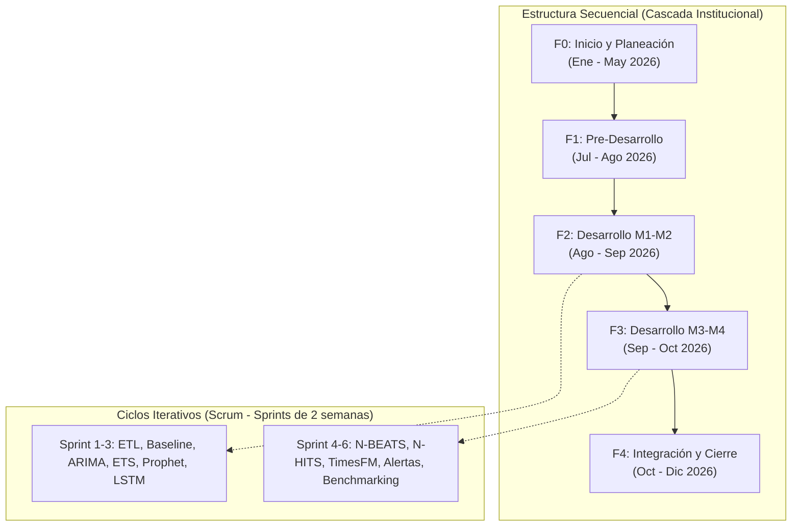
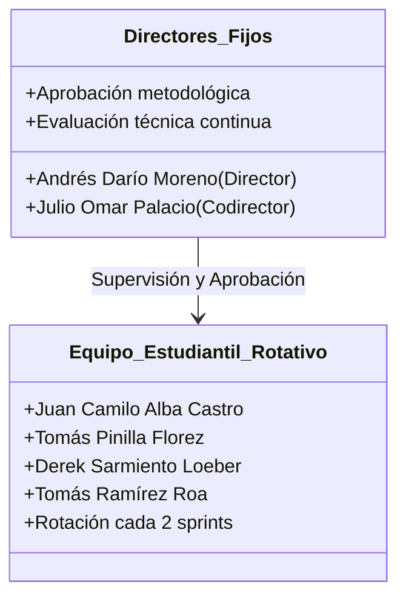
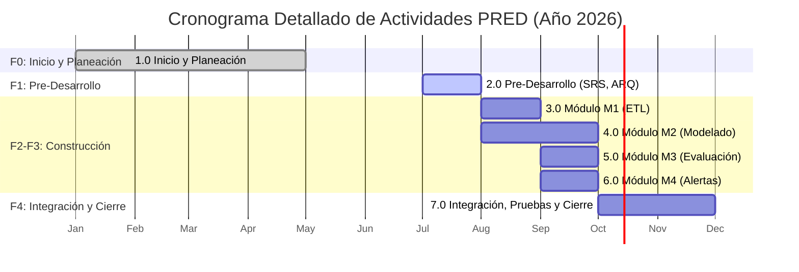
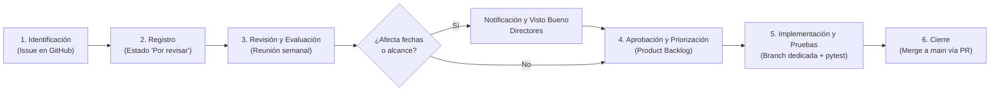

# Plan de Administración de Proyecto (SPMP)
## Sistema Analítico PRED: Evaluación Comparativa de Modelos de Inteligencia Artificial y Estadística para el Pronóstico de Demanda en Inventarios

---

## Historial de Cambios

| Versión | Fecha | Descripción del Cambio | Autor(es) |
| :--- | :--- | :--- | :--- |
| **1.0** | 05/05/2026 | Creación inicial del documento. Cubre secciones Portada a 9. | Alba, Pinilla, Sarmiento, Ramírez |
| **1.1** | 10/05/2026 | Adición de secciones 10, 11 y 12 (Monitoreo, Entrega del Producto, Procesos de Soporte). | Alba, Pinilla, Sarmiento, Ramírez |

*Cuadro 1: Historial de cambios del documento.*

---

## Prefacio

Este documento es el Plan de Administración de Proyecto (SPMP) de **PRED** (*Predictive Demand Evaluation*), un trabajo de grado desarrollado por cuatro estudiantes de Ingeniería de Sistemas de la Pontificia Universidad Javeriana, bajo la dirección del profesor Andrés Darío Moreno Barbosa y la codirección del profesor Julio Omar Palacio Niño.

El plan tiene dos propósitos concretos:
1. **Marco de Gestión:** Define cómo se gestionará el proyecto durante los semestres 2026-I y 2026-II: el ciclo de vida adoptado, la organización del equipo, el cronograma de entregables y los mecanismos de control de calidad y trazabilidad.
2. **Referencia Operativa:** Funciona como un instrumento de consulta viva y actualización continua para el equipo de desarrollo.

En cuanto al producto, PRED compara el desempeño de modelos estadísticos clásicos (ARIMA, ETS) frente a modelos de inteligencia artificial y aprendizaje profundo (Prophet, LSTM, N-BEATS, N-HITS, TimesFM) en el pronóstico de demanda en inventarios, empleando datos reales gestionados en el ERP de código abierto Odoo. El objetivo final es determinar bajo qué perfiles y condiciones de demanda resulta óptimo adoptar cada familia técnica.

Este documento está dirigido principalmente al equipo ejecutor y a los directores, sirviendo además como referencia metodológica para los evaluadores académicos de la Facultad de Ingeniería y equipos que busquen replicar el framework.

---

## Glosario de Acrónimos

| Acrónimo / Término | Definición |
| :--- | :--- |
| **ARIMA** | *AutoRegressive Integrated Moving Average*. Modelo estadístico paramétrico para series de tiempo estacionarias. |
| **ERP** | *Enterprise Resource Planning*. Sistema de Planificación de Recursos Empresariales (utiliza Odoo 17 CE). |
| **ETS** | *Error, Trend, Seasonality*. Familia de modelos de suavización exponencial para series temporales. |
| **ETL** | *Extract, Transform, Load*. Pipeline de extracción, transformación y carga desde Odoo/PostgreSQL. |
| **IA** | Inteligencia Artificial. En este proyecto engloba redes neuronales profundas y modelos fundacionales. |
| **LSTM** | *Long Short-Term Memory*. Red neuronal recurrente con celdas de compuerta y memoria explícita. |
| **MAE** | *Mean Absolute Error*. Error Absoluto Medio. |
| **MASE** | *Mean Absolute Scaled Error*. Error Absoluto Medio Escalado frente a baseline estacional. |
| **N-BEATS** | *Neural Basis Expansion Analysis for Time Series*. Arquitectura profunda de bloques residuales. |
| **N-HITS** | *Neural Hierarchical Interpolation for Time Series*. Arquitectura neuronal con muestreo multirrate. |
| **PRED** | *Predictive Demand Evaluation*. Nombre del sistema analítico y framework desarrollado. |
| **Prophet** | Modelo aditivo descomponible bayesiano desarrollado por Meta AI. |
| **RMSE** | *Root Mean Squared Error*. Raíz del Error Cuadrático Medio. |
| **SARIMA** | *Seasonal ARIMA*. Variante de ARIMA que modela componentes estacionales. |
| **SKU** | *Stock Keeping Unit*. Unidad de Mantenimiento de Inventario / Código de producto. |
| **SMAPE** | *Symmetric Mean Absolute Percentage Error*. Error porcentual absoluto simétrico. |
| **SPMP** | *Software Project Management Plan*. Plan de Administración del Proyecto de Software. |
| **WBS** | *Work Breakdown Structure*. Estructura de Descomposición del Trabajo. |

---

## 1. Vista General del Proyecto

### 1.1. Visión del Producto
PRED es un sistema analítico de código abierto que compara siete modelos de pronóstico de demanda estadísticos y de inteligencia artificial sobre datos operativos extraídos de Odoo, generando alertas de agotamiento y reabastecimiento de inventarios. Su propósito es permitir que organizaciones medianas fundamenten sus políticas de reposición en evidencia cuantitativa reproducible, prescindiendo de software BI propietario de alto costo o proyecciones manuales en hojas de cálculo.

### 1.2. Propósito, Alcance y Objetivos

#### 1.2.1. Propósito
Demostrar la viabilidad técnica y operativa de integrar modelos predictivos avanzados con un ERP open-source, evaluando empíricamente la relación costo-beneficio de la complejidad algorítmica frente a modelos estadísticos tradicionales en un entorno de inventario realista.

#### 1.2.2. Alcance

##### Elementos Incluidos:
- Pipeline ETL desde Odoo/PostgreSQL hacia estructuras estandarizadas de series temporales.
- Implementación y entrenamiento de siete modelos: ARIMA, SARIMA, ETS, Prophet, LSTM, N-BEATS, N-HITS y TimesFM.
- Módulo de evaluación comparativa con métricas $MAE$, $RMSE$, $MASE$, $sMAPE$ y prueba de significancia Diebold-Mariano.
- Módulo de alertas de agotamiento y reabastecimiento para al menos cinco SKUs representativos.
- Manual de uso y despliegue del sistema para operadores.
- Informe comparativo final con recomendaciones metodológicas.

##### Elementos No Incluidos:
- Integración síncrona en tiempo real con la base transaccional de Odoo en producción.
- Interfaz gráfica de usuario web o de escritorio (la interacción se realiza mediante notebooks y scripts reproducibles).
- Despliegue en la infraestructura física de producción del cliente final.
- Pronósticos de series temporales ajenas al inventario de demanda.

#### 1.2.3. Objetivo General
Desarrollar un sistema analítico que compare modelos estadísticos e inteligencia artificial para evaluar su desempeño en el pronóstico de demanda en inventarios, sobre datos operativos de Odoo, y que genere alertas preventivas de utilidad práctica.

#### 1.2.4. Objetivos Específicos
1. Construir un pipeline ETL robusto que extraiga y limpie series de demanda desde Odoo.
2. Implementar y entrenar los siete modelos de pronóstico seleccionados.
3. Diseñar un protocolo de evaluación comparativa reproducible basado en *walk-forward validation*.
4. Desarrollar un módulo de alertas que consuma las predicciones y notifique umbrales críticos.
5. Documentar el proceso y resultados en un informe académico que pueda ser replicado.

---

### 1.3. Supuestos y Restricciones

#### 1.3.1. Supuestos
- Acceso continuo a una instancia operativa de Odoo 17 CE con historial suficiente ($\ge 3$ años).
- Dedicación semanal de 10 a 15 horas-persona por cada uno de los cuatro integrantes del equipo.
- Disponibilidad quincenal de los directores para ceremonias de revisión técnica.
- Capacidad computacional en la nube (Google Colab Pro con GPUs T4/A100) suficiente para el entrenamiento de LSTM y la inferencia de TimesFM.

#### 1.3.2. Restricciones
- Ejecución temporal estricta en dos semestres académicos (enero a diciembre de 2026).
- Presupuesto máximo disponible para infraestructura externa: **\$625.000 COP**.
- Apego a las normas y formatos documentales institucionales de la Pontificia Universidad Javeriana.
- Publicación del código fuente bajo licencia de código abierto MIT en el repositorio oficial.

---

### 1.4. Entregables

| ID | Descripción | Destinatario | Fecha Estimada |
| :--- | :--- | :--- | :--- |
| **PRED-PP-v1.0** | Plan de Administración de Proyecto (SPMP) | Directores / Depto. | Mayo 2026 |
| **PRED-SRS-v1.0** | Especificación de Requerimientos de Software | Directores | Agosto 2026 |
| **PRED-ARQ-v1.0** | Documento de Arquitectura de Software | Directores | Agosto 2026 |
| **PRED-M1** | Código módulo ETL + pruebas unitarias | Directores | Septiembre 2026 |
| **PRED-M2** | Código módulo Modelado + pruebas | Directores | Octubre 2026 |
| **PRED-M3** | Código módulo Evaluación + pruebas | Directores | Octubre 2026 |
| **PRED-M4** | Código módulo Alertas + pruebas | Directores | Noviembre 2026 |
| **PRED-MAN-v1.0** | Manual de uso y despliegue del sistema | Cliente / Directores | Noviembre 2026 |
| **PRED-INF-v1.0** | Informe comparativo final de resultados | Directores / Depto. | Diciembre 2026 |
| **PRED-DEF** | Defensa oral del trabajo de grado | Jurado evaluador | Diciembre 2026 |

*Cuadro 1.1: Entregables del proyecto PRED y fechas estimadas.*

---

### 1.5. Resumen de Calendarización y Presupuesto

#### 1.5.1. Fases e Hitos Principales

| Fase | Período | Hitos Principales |
| :--- | :--- | :--- |
| **F0: Inicio y Planeación** | Ene. – May. 2026 | SPMP aprobado; ambiente base configurado. |
| **F1: Pre-Desarrollo** | Jul. – Ago. 2026 | SRS y arquitectura aprobados; product backlog inicial priorizado. |
| **F2: Desarrollo M1-M2** | Ago. – Sep. 2026 | ETL y 5 primeros modelos funcionando (Sprints 1–3). |
| **F3: Desarrollo M3-M4** | Sep. – Oct. 2026 | Evaluación comparativa, modelos restantes y alertas completos (Sprints 4–6). |
| **F4: Integración y Cierre** | Oct. – Dic. 2026 | Sistema integrado de punta a punta; informe final y defensa oral. |

*Cuadro 1.2: Fases e hitos principales del proyecto PRED.*

#### 1.5.2. Resumen de Presupuesto

| Ítem | Tipo | Costo Estimado (COP) |
| :--- | :--- | :--- |
| **Servidor Cloud Odoo (DigitalOcean VM básica, 6 meses)** | Operacional | \$175.000 |
| **Google Colab Pro (Suscripción Semestre 2, 6 meses)** | Operacional | \$110.000 |
| **Materiales, empaste e impresión de informe final** | Cierre | ~\$35.000 |
| **Total Costos Externos Estimados** | **Directo** | **~\$320.000** |
| Costo de oportunidad del equipo ($1.120\text{ h-p} \times \$30.000\text{ COP/h}$) | Referencial | \$33.600.000 |

*Cuadro 1.3: Resumen de presupuesto del proyecto PRED.*

### 1.6. Evolución del Plan
Este documento se actualiza al inicio de cada fase formal. Cualquier integrante puede plantear modificaciones, las cuales se evalúan por consenso en las reuniones semanales de seguimiento. Una vez aprobadas, el responsable de QA/Documentación actualiza el historial bajo el formato `PRED_SPMP_Vx.x`. Si un cambio incide en el alcance contractual, presupuesto o fechas límite, se requiere visto bueno previo de los directores.

---

## 2. Contexto del Proyecto

### 2.1. Modelo de Ciclo de Vida

#### 2.1.1. Descripción del Modelo
Se adopta un modelo híbrido **Cascada + Scrum**. A nivel macro (Fases F0 a F4), el avance sigue hitos secuenciales para asegurar el cumplimiento del calendario académico institucional. A nivel micro (Fases de desarrollo F2 y F3), el trabajo se estructura en sprints iterativos de dos semanas para responder a la naturaleza empírica del entrenamiento y ajuste de modelos.

| Fase | Período | Contenido y Alcance Técnico |
| :--- | :--- | :--- |
| **F0: Inicio y Planeación** | Ene. – May. 2026 | Planificación, definición de estándares y normas, preparación del entorno. |
| **F1: Pre-Desarrollo** | Jul. – Ago. 2026 | Levantamiento formal de requerimientos, diseño arquitectural UML y backlog inicial. |
| **F2: Desarrollo M1-M2** | Ago. – Sep. 2026 | Pipeline ETL, modelos ARIMA, ETS, Prophet, LSTM (Sprints 1–3). |
| **F3: Desarrollo M3-M4** | Sep. – Oct. 2026 | Modelos N-BEATS, N-HITS, TimesFM, módulo de alertas (Sprints 4–6). |
| **F4: Integración y Cierre** | Oct. – Dic. 2026 | Integración end-to-end, pruebas globales, benchmarking final, informe y sustentación. |

*Cuadro 2.1: Estructura macro del ciclo de vida híbrido Cascada + Scrum.*

#### 2.1.2. Prácticas Específicas
- **Control de Versiones:** Git centralizado en GitHub con branching model basado en ramas por módulo y PRs hacia `main`.
- **Pruebas Unitarias Automatizadas:** Implementadas con `pytest`, exigiendo cobertura mínima del $70\%$ como criterio de aceptación de cada User Story.
- **Daily Standup Asincrónico:** Reporte diario en Slack/Teams respondiendo: ¿Qué hice ayer?, ¿Qué haré hoy?, ¿Existen bloqueos?
- **Sprint Review Quincenal:** Demostración del incremento funcional en vivo a los directores técnicos.
- **Burndown Chart:** Actualización y seguimiento semanal en GitHub Projects a cargo del Scrum Master.
- **Walk-Forward Validation:** Protocolo obligatorio de particionado temporal para todo experimento del benchmark.

#### 2.1.3. Análisis de Alternativas y Justificación del Ciclo de Vida

| Modelo Evaluado | Descripción | Ventajas | Desventajas |
| :--- | :--- | :--- | :--- |
| **Cascada Pura** | Secuencia lineal clásica [13] | Estructura predecible, hitos y auditoría documental claros. | Rigidez frente a la incertidumbre experimental del modelado. |
| **Scrum Puro** | Marco ágil e iterativo continuo [12] | Adaptabilidad inmediata y despliegues frecuentes. | Hitos académicos institucionales difusos y menor rigor documental previo. |
| **Cascada + Scrum (Seleccionado)** | Modelo híbrido balanceado [2] | Concilia el rigor de entregables académicos con la flexibilidad de experimentación. | Demanda disciplina estricta para coordinar la gobernanza de ambas capas. |

*Cuadro 2.2: Comparación de modelos de ciclo de vida evaluados.*

---

### 2.2. Lenguajes y Herramientas

| Categoría | Herramienta | Versión | Uso en el Proyecto |
| :--- | :--- | :--- | :--- |
| **Lenguaje Principal** | Python | 3.11+ | Desarrollo modular de los componentes M1 a M4. |
| **Control de Versiones** | Git + GitHub | 2.x | Versionado de código, ramas por módulo y Pull Requests. |
| **ERP / Base de Datos** | Odoo + PostgreSQL | Odoo 17 CE | Repositorio transaccional y fuente de datos operativos. |
| **Forecasting Estadístico** | statsmodels | 0.14+ | Implementación de modelos ARIMA, SARIMA y ETS. |
| **Forecasting Híbrido** | Prophet (Meta) | 1.1+ | Modelo aditivo estructural con efectos de calendario. |
| **Deep Learning** | PyTorch + neuralforecast | 2.x | Implementación de LSTM, N-BEATS y N-HITS. |
| **Modelo Fundacional** | TimesFM (Google) | 1.0 | Pronóstico zero-shot preentrenado. |
| **Machine Learning / Métricas** | scikit-learn / scipy | 1.4+ | Preprocesamiento, transformaciones y pruebas de hipótesis. |
| **Pruebas Unitarias** | pytest + pytest-cov | 8.x | Verificación de suites unitarias y cobertura de código. |
| **Gestión de Proyecto** | GitHub Projects | Cloud | Gestión de Product Backlog, Sprints y Burndown charts. |
| **Análisis de Datos (EDA)** | pandas / matplotlib / seaborn | 2.x / 3.x | Manipulación de series de tiempo y visualizaciones. |
| **Entorno de Cómputo** | Google Colab Pro | Cloud | Entrenamiento e inferencia acelerada por hardware (GPU). |
| **Servidor Odoo** | DigitalOcean Droplet | Basic 2 GB RAM | Entorno centralizado accesible por el equipo vía red. |
| **Modelado UML / BPMN** | draw.io / PlantUML | Cloud / Plugin | Diagramas de componentes, secuencia y flujos de procesos. |
| **Documentación Formal** | LaTeX / Overleaf | TeX Live 2024 | Redacción formal de memorias, SPMP, SRS, ARQ e informes. |

*Cuadro 2.3: Herramientas y lenguajes del proyecto PRED.*

#### 2.2.1. Análisis de Alternativas de Herramientas
- **Deep Learning (PyTorch vs. TensorFlow):** Se seleccionó PyTorch debido a que la suite `neuralforecast` de Nixtla está nativamente optimizada sobre dicho entorno, ofreciendo soporte eficiente para N-BEATS y N-HITS.
- **Gestión de Sprints (GitHub Projects vs. Jira vs. Trello):** Se eligió GitHub Projects por su integración directa con los repositorios, ramas y PRs, eliminando la duplicidad operativa que introduciría una herramienta externa como Jira.
- **Entorno de Cómputo (Google Colab Pro vs. AWS SageMaker):** Colab Pro brinda acceso flexible a GPUs Nvidia T4/A100 a una fracción del costo y con menor complejidad administrativa respecto a una infraestructura dedicada en SageMaker.

---

### 2.3. Plan de Aceptación del Producto

| Entregable | Criterio de Aceptación | Técnica de Verificación | Responsable |
| :--- | :--- | :--- | :--- |
| **PRED-PP-v1.0** | Cubre todas las secciones del estándar; aprobado por directores. | Revisión documental. | Directores |
| **PRED-SRS-v1.0** | Incluye $>15\text{ RF}$ y $\ge 5\text{ RNF}$; criterios verificables según IEEE 830. | Revisión por pares + directores. | Equipo + Directores |
| **PRED-ARQ-v1.0** | Contiene diagramas de componentes, secuencia y despliegue en UML 2.x. | Inspección técnica arquitectural. | Equipo + Directores |
| **Módulo M1 (ETL)** | Extrae, limpia y mapea al esquema $\ge 3$ series; cobertura pytest $\ge 70\%$. | Ejecución de suite y cálculo de cobertura. | Equipo |
| **Módulo M2 (Modelado)** | Los 7 modelos entrenan y pronostican sin fallos; cómputo $<4\text{ h}$ en Colab. | Ejecución de scripts + logs de ejecución. | Equipo |
| **Módulo M3 (Evaluación)** | Las 4 métricas calculadas para todos los modelos; reproducible con semilla fija. | Ejecución del notebook de validación. | Equipo + Directores |
| **Módulo M4 (Alertas)** | Generación de alertas para $\ge 5$ SKUs representativos sin excepciones. | Pruebas funcionales con casos de prueba. | Equipo |
| **PRED-MAN-v1.0** | Un usuario nuevo despliega y ejecuta el pipeline en $\le 30\text{ min}$ sin asistencia. | Prueba de usabilidad con usuario externo. | Equipo |
| **PRED-INF-v1.0** | Selecciona el modelo óptimo con respaldo de significancia estadística. | Revisión documental y metodológica. | Directores |

*Cuadro 2.4: Criterios de aceptación del producto por entregable.*

---

### 2.4. Organización del Proyecto y Comunicación

#### 2.4.1. Interfaces Externas

| Entidad / Actor | Descripción | Responsabilidades | Canal de Contacto |
| :--- | :--- | :--- | :--- |
| **Director** | Prof. Andrés Darío Moreno Barbosa | Aprobación de entregables y gobernanza metodológica. | `ad.morenob@javeriana.edu.co` |
| **Codirector** | Prof. Julio Omar Palacio Niño | Soporte en machine learning, series de tiempo y validación experimental. | `palacio_julio@javeriana.edu.co` |
| **Depto. Ingeniería de Sistemas** | Ente evaluador institucional | Coordinación de hitos formales, jurados y sustentaciones. | Coordinación de Trabajos de Grado |
| **Organización Caso de Estudio** | Empresa B2B / Fuentes de inventario | Suministro de registros de inventario o validación de datos. | A definir en fase F0/F1 |

*Cuadro 2.5: Interfaces externas del proyecto PRED.*

#### 2.4.2. Organigrama y Descripción de Roles
El equipo estudiantil opera bajo un esquema de **roles rotativos cada dos sprints**, con el objetivo de nivelar las competencias técnicas, de calidad y de gestión de todos los miembros. Los directores ocupan roles de supervisión fija.

| Rol | Ocupante Inicial | Responsabilidades Principales |
| :--- | :--- | :--- |
| **Product Owner (Rotativo)** | Juan Camilo Alba Castro | Gestión del Product Backlog, priorización funcional, definición y validación de criterios de aceptación de historias de usuario. |
| **Scrum Master (Rotativo)** | Tomás Ramírez Roa | Facilitación de ceremonias ágiles, remoción de impedimentos, monitoreo de métricas de proceso y burndown charts. |
| **Desarrollador (Rotativo)** | Derek Sarmiento Loeber | Implementación de historias del sprint, diseño y codificación de pruebas unitarias (`pytest`), mantenimiento de ramas. |
| **QA / Documentador (Rotativo)** | Tomás Pinilla Florez | Control de calidad cruzado, revisión de estándares documentales, cobertura de pruebas y redacción de actas de sprint. |
| **Director (Fijo)** | Andrés Darío Moreno Barbosa | Orientación metodológica global y aprobación final de entregables. |
| **Codirector (Fijo)** | Julio Omar Palacio Niño | Asesoría en arquitecturas de machine learning y rigor estadístico. |

*Cuadro 2.6: Roles y responsabilidades del equipo del proyecto PRED.*

---

## 3. Administración del Proyecto

### 3.1. Métodos y Herramientas de Estimación
- **Esfuerzo de Software:** Planning Poker con la escala modificada de Fibonacci ($1, 2, 3, 5, 8, 13$). Se fijó una velocidad base del equipo de **20 story points por sprint** (asumiendo de 10 a 15 horas de dedicación semanal por estudiante y la curva de aprendizaje de nuevos frameworks).
- **Tamaño de Software:** Técnica de Puntos de Función simplificados [1]. Dimensionado en 4 módulos principales con un estimado de $500$ a $800$ líneas de código Python por módulo.
- **Tiempo y Costos:** Estimación por analogía técnica basada en antecedentes de trabajos de grado afines del Departamento de Ingeniería de Sistemas.

---

### 3.2. Inicio del Proyecto

#### 3.2.1. Plan de Entrenamiento del Personal

| Área de Conocimiento / Herramienta | Integrantes | Fuente de Aprendizaje | Ventana Temporal |
| :--- | :--- | :--- | :--- |
| **Integración Odoo vía XML-RPC / PostgreSQL** | Todos | Documentación oficial Odoo 17; taller técnico interno. | F0–F1 (2 semanas) |
| **Modelos Fundacionales: TimesFM** | Todos | Publicaciones de Google Research (2024) y repositorios oficiales. | F1–F2 (3 semanas) |
| **Deep Learning con `neuralforecast` (N-BEATS/N-HITS)** | Todos | Documentación Nixtla, papers originales ICLR/AAAI. | F2 (2 semanas) |
| **Walk-Forward Validation en Series Temporales** | Todos | Hyndman & Athanasopoulos (2018); librerías de validación temporal. | F1 (1 semana) |
| **Prueba de Hipótesis Diebold-Mariano** | Todos | Paper Diebold-Mariano (1995); implementaciones en `statsmodels`. | F3 (1 semana) |
| **Gestión Ágil con GitHub Projects** | Todos | The Scrum Guide [12]; sesión práctica interna de equipo. | F0 (1 semana) |

*Cuadro 3.1: Plan de entrenamiento del personal del proyecto PRED.*

#### 3.2.2. Plan de Infraestructura

| Tarea de Configuración | Descripción Técnica | Responsable | Fase |
| :--- | :--- | :--- | :--- |
| **Instancia Odoo 17 CE** | Despliegue en VM de DigitalOcean, parametrización de PostgreSQL y carga de datasets iniciales. | Alba | F1 |
| **Repositorio GitHub** | Creación de organización, branches protegidas, templates de PR/Issue y tablero Kanban. | Sarmiento | F1 |
| **Entorno Python 3.11+** | Creación de archivos `requirements.txt`, control de dependencias e instrucciones de despliegue. | Pinilla | F1 |
| **Google Colab Pro** | Configuración de suscripción para aceleración por GPU y conexión a almacenamiento Drive. | Ramírez | F1 |
| **Mantenimiento Continuo** | Actualización de dependencias y resolución de conflictos de entorno. | Todos | F0–F4 |

*Cuadro 3.2: Plan de infraestructura del proyecto PRED.*

---

### 3.3. Planes de Trabajo del Proyecto

#### 3.3.1. Estructura de Descomposición del Trabajo (WBS)

```mermaid
flowchart TD
    WBS["Proyecto PRED"]
    WBS --> W1["1.0 Inicio y Planeación (F0)"]
    WBS --> W2["2.0 Pre-Desarrollo (F1)"]
    WBS --> W3["3.0 Ingestión M1 (F2)"]
    WBS --> W4["4.0 Modelado M2 (F2-F3)"]
    WBS --> W5["5.0 Evaluación M3 (F3)"]
    WBS --> W6["6.0 Alertas M4 (F3)"]
    WBS --> W7["7.0 Integración y Cierre (F4)"]

    W1 --> W1_1["1.1 Adaptación estándares"]
    W1 --> W1_2["1.2 Redacción SPMP"]
    W1 --> W1_3["1.3 Caso de negocio"]
    W1 --> W1_4["1.4 Entorno de trabajo"]

    W2 --> W2_1["2.1 Requerimientos"]
    W2 --> W2_2["2.2 SRS"]
    W2 --> W2_3["2.3 Arquitectura UML"]
    W2 --> W2_4["2.4 Product Backlog"]

    W3 --> W3_1["3.1 Config Odoo"]
    W3 --> W3_2["3.2 Pipeline ETL"]
    W3 --> W3_3["3.3 EDA y limpieza"]
    W3 --> W3_4["3.4 Pruebas M1"]

    W4 --> W4_1["4.1 ARIMA y ETS"]
    W4 --> W4_2["4.2 Prophet y LSTM"]
    W4 --> W4_3["4.3 N-BEATS, N-HITS, TimesFM"]
    W4 --> W4_4["4.4 Pruebas M2"]

    W5 --> W5_1["5.1 Walk-forward"]
    W5 --> W5_2["5.2 Métricas de error"]
    W5 --> W5_3["5.3 Test Diebold-Mariano"]
    W5 --> W5_4["5.4 Matriz de convergencia"]

    W6 --> W6_1["6.1 Diseño de reglas"]
    W6 --> W6_2["6.2 Alertas agotamiento"]
    W6 --> W6_3["6.3 Alertas reabastecimiento"]
    W6 --> W6_4["6.4 Pruebas M4"]

    W7 --> W7_1["7.1 Integración total"]
    W7 --> W7_2["7.2 Pruebas de integración"]
    W7 --> W7_3["7.3 Benchmarking final"]
    W7 --> W7_4["7.4 Informe PRED-INF"]
    W7 --> W7_5["7.5 Defensa de grado"]
```

| ID | Actividad Principal | Subactividades Principales | Fase | Entregable Asociado |
| :--- | :--- | :--- | :--- | :--- |
| **1.0** | **Inicio y Planeación** | 1.1 Adaptación de estándares; 1.2 Redacción SPMP; 1.3 Formalización del caso de negocio; 1.4 Configuración de ambiente. | F0 | `PRED-PP-v1.0` |
| **2.0** | **Pre-Desarrollo** | 2.1 Elicitación de requerimientos; 2.2 Redacción SRS; 2.3 Arquitectura UML; 2.4 Product Backlog inicial. | F1 | `PRED-SRS-v1.0` `PRED-ARQ-v1.0` |
| **3.0** | **M1: Ingestión de Datos** | 3.1 Configuración Odoo; 3.2 Pipeline ETL; 3.3 EDA de series de tiempo; 3.4 Pruebas unitarias M1. | F2 | Código M1 (`pytest`) |
| **4.0** | **M2: Modelado** | 4.1 ARIMA y ETS; 4.2 Prophet y LSTM; 4.3 N-BEATS, N-HITS, TimesFM; 4.4 Pruebas unitarias M2. | F2–F3 | Código M2 (`pytest`) |
| **5.0** | **M3: Evaluación Comparativa** | 5.1 Motor Walk-forward validation; 5.2 Módulo de métricas; 5.3 Prueba Diebold-Mariano; 5.4 Análisis de convergencia. | F3 | Código M3 (`pytest`) |
| **6.0** | **M4: Alertas Operativas** | 6.1 Diseño de reglas lógicas; 6.2 Alertas de agotamiento; 6.3 Alertas de reabastecimiento; 6.4 Pruebas unitarias M4. | F3 | Código M4 (`pytest`) |
| **7.0** | **Integración y Cierre** | 7.1 Integración de módulos; 7.2 Pruebas de integración; 7.3 Benchmarking final; 7.4 Redacción de informe final; 7.5 Defensa oral. | F4 | `PRED-INF-v1.0` `PRED-DEF` |

*Cuadro 3.3: Estructura de Descomposición del Trabajo (WBS) del proyecto PRED.*

#### 3.3.2. Calendarización (Gantt)

| Actividad | Ene | Feb | Mar | Abr | May | Jun | Jul | Ago | Sep | Oct | Nov | Dic |
| :--- | :---: | :---: | :---: | :---: | :---: | :---: | :---: | :---: | :---: | :---: | :---: | :---: |
| **F0: Inicio y Planeación** | $\bullet$ | $\bullet$ | $\bullet$ | $\bullet$ | $\bullet$ | | | | | | | |
| **F1: Pre-Desarrollo** | | | | | | | $\bullet$ | $\bullet$ | | | | |
| **F2: Módulos M1-M2** | | | | | | | | $\bullet$ | $\bullet$ | | | |
| **F3: Módulos M3-M4** | | | | | | | | | $\bullet$ | $\bullet$ | | |
| **F4: Integración y Cierre** | | | | | | | | | | $\bullet$ | $\bullet$ | $\bullet$ |
| **Reuniones quincenales directores** | $\bullet$ | $\bullet$ | $\bullet$ | $\bullet$ | $\bullet$ | | $\bullet$ | $\bullet$ | $\bullet$ | $\bullet$ | $\bullet$ | $\bullet$ |
| **Sprint Reviews (F2–F3)** | | | | | | | | $\bullet$ | $\bullet$ | $\bullet$ | | |
| **Entrega Final / Sustentación** | | | | | | | | | | | | $\bullet$ |

*Cuadro 3.4: Carta Gantt de alto nivel del proyecto PRED (2026).*

#### 3.3.3. Asignación de Recursos

| ID WBS | Recursos Humanos Asignados | Herramientas y Recursos Tecnológicos | Esfuerzo Estimado |
| :--- | :--- | :--- | :--- |
| **1.0** | Todos (4 estudiantes) + Directores | LaTeX, Git, GitHub Projects | $120\text{ h-p}$ |
| **2.0** | Todos (4 estudiantes) + Directores | draw.io, LaTeX, GitHub Projects | $\sim 160\text{ h-p}$ |
| **3.0** | Todos (4 estudiantes) | Python, Odoo, PostgreSQL, pandas | $\sim 120\text{ h-p}$ |
| **4.0** | Todos (4 estudiantes) | statsmodels, Prophet, PyTorch, Colab Pro | $\sim 320\text{ h-p}$ |
| **5.0** | Todos (4 estudiantes) | Python, scipy, statsmodels (DM test) | $\sim 120\text{ h-p}$ |
| **6.0** | Todos (4 estudiantes) | Python, pytest, lógica de reglas | $\sim 80\text{ h-p}$ |
| **7.0** | Todos (4 estudiantes) + Directores | Entorno completo, VM Cloud, informe | $\sim 200\text{ h-p}$ |
| **Total** | | | **$\sim 1.120\text{ h-p}$** |

*Cuadro 3.5: Asignación de recursos por actividad del WBS ($h\text{-}p = \text{horas-persona}$).*

#### 3.3.4. Asignación de Presupuesto y Flujo de Caja

| Ítem Presupuestal | Período de Ejecución | Tipo de Costo | Costo Estimado (COP) |
| :--- | :--- | :--- | :--- |
| **Configuración de Infraestructura Base** | Ene. – Feb. 2026 | Inversión inicial | \$0 |
| **Servidor Cloud Odoo (VM 2 GB, 6 meses)** | Jun. – Dic. 2026 | Operacional recurrente | ~\$175.000 |
| **Google Colab Pro (GPU Semestre 2, 6 meses)** | Jun. – Dic. 2026 | Operacional recurrente | ~\$110.000 |
| **Materiales, empaste e impresiones finales** | Nov. – Dic. 2026 | Cierre administrativo | ~\$35.000 |
| **Total Costos Externos Directos** | | | **~\$320.000** |

*Cuadro 3.6: Flujo de caja y presupuesto del proyecto PRED.*

El esfuerzo estimado total de $1.120\text{ horas-persona}$, valorado a una tasa referencial de desarrollador junior en Colombia ($\sim \$30.000\text{ COP/hora}$), representa un costo de oportunidad de **\$33.600.000 COP**. Los desembolsos reales en caja quedan acotados a los costos de infraestructura computacional externa (~**\$320.000 COP**).

---

## 4. Monitoreo y Control del Proyecto

### 4.1. Administración de Requerimientos

#### 4.1.1. Artefactos Generados
- `PRED-SRS-v1.0`: Especificación detallada de requerimientos funcionales (RF) y no funcionales (RNF) bajo el estándar ISO/IEC/IEEE 29148.
- **Matriz de Trazabilidad:** Cruce bidireccional entre cada RF, el módulo de software asociado y los casos de prueba unitarios correspondientes.
- **Product Backlog:** Repositorio priorizado de historias de usuario gestionado de forma transparente en GitHub Projects.

#### 4.1.2. Proceso de Administración y Control de Cambios

1. **Identificación:** Cualquier miembro del equipo o director técnico propone un ajuste mediante un issue en GitHub.
2. **Registro:** El Product Owner clasifica la solicitud bajo el estado `Por revisar`.
3. **Revisión:** En la sesión semanal se evalúa impacto técnico, viabilidad y dependencias.
4. **Aprobación:** Si afecta el alcance o fechas contractuales, se obtiene el visto bueno de los directores antes de priorizarlo en el backlog del sprint.
5. **Implementación y Verificación:** Se desarrolla en una rama independiente y se valida contra los criterios de aceptación formales.
6. **Cierre:** Se integra a `main` tras superar la suite de `pytest` y la revisión por pares, cerrando formalmente el issue asociado.

---

### 4.2. Monitoreo y Control de Progreso

#### 4.2.1. Unidades de Medición de Progreso
- **Story Points completados por sprint:** Monitoreados en el Burndown Chart para contrastar el avance real contra el planificado.
- **Cobertura de pruebas automatizadas:** Porcentaje reportado por `pytest-cov`, exigiendo un mínimo estricto del $70\%$ por módulo.
- **Velocidad del equipo:** Promedio móvil de puntos de historia consolidados en las dos últimas iteraciones.
- **Tasa de historias aceptadas:** Proporción de historias de usuario aprobadas formalmente al cierre del sprint.

#### 4.2.2. Actividades de Reporte y Seguimiento
- **Daily Standup Asincrónico:** Registro diario individual de avances e impedimentos en el canal interno.
- **Actualización de Tablero:** Mantenimiento y actualización semanal del Burndown Chart en GitHub Projects cada lunes por el Scrum Master.
- **Sprint Review Quincenal:** Demostración del incremento de software funcional ante los directores.
- **Sincronización Semanal:** Reunión interna de 30 minutos orientada a la resolución ágil de bloqueos técnicos.

#### 4.2.3. Acciones Correctivas
Si al concluir una iteración se logra **menos del 70%** de los story points planificados, se dispara el protocolo correctivo:
1. Convocatoria a retrospectiva extraordinaria dentro de las 48 horas siguientes.
2. Análisis de causa raíz técnica u operativa bajo enfoque sistémico y de responsabilidad compartida.
3. **Opción A (Redistribución Interna):** Reasignación temporal de integrantes con menor carga al desbloqueo de tareas pendientes en el sprint subsiguiente.
4. **Opción B (Replanificación del Backlog):** Repriorización del alcance con visto bueno explícito de los directores si el retraso obedece a subestimación estructural.
5. Registro obligatorio de los acuerdos en el acta de retrospectiva y actualización del SPMP.

---

### 4.3. Cierre del Proyecto
Al término de cada fase secuencial (F0 a F4), se deben agotar las siguientes actividades de cierre:
1. **Post-Mortem de Fase:** Sesión de una hora para extraer lecciones aprendidas y oportunidades de mejora, consignadas en el repositorio.
2. **Auditoría de Entregables:** Verificación formal de que cada artefacto comprometido fue revisado, probado y aprobado por los directores.
3. **Reporte Gerencial:** Resumen ejecutivo de 1 a 2 páginas con el balance de cronograma, presupuesto consumido, mapa de riesgos actualizado y metas de la siguiente etapa.
4. **Actualización de Línea Base:** Incremento de la versión oficial del SPMP en el sistema de control de configuración.

---

## 5. Entrega del Producto

Al concluir la fase F4 (diciembre de 2026), se entregarán formalmente los siguientes productos:

1. **Código Fuente del Sistema PRED (`PRED-M1` a `PRED-M4`):**
   - Repositorio oficial en GitHub con arquitectura modular integrada.
   - Archivo `README.md` exhaustivo con guías paso a paso de instalación, configuración del entorno y ejecución de experimentos.
   - *Responsable:* Derek Sarmiento Loeber. *Fecha:* Noviembre 2026.
2. **Manual de Usuario y Despliegue (`PRED-MAN-v1.0`):**
   - Documento descriptivo para la parametrización del pipeline de pronóstico y configuración de alertas de reposición sin requerir asistencia técnica.
   - Su aprobación exige una prueba de usabilidad exitosa con un usuario externo en $\le 30\text{ minutos}$.
   - *Responsable:* Tomás Pinilla Florez. *Fecha:* Noviembre 2026.
3. **Informe Comparativo Final (`PRED-INF-v1.0`):**
   - Memoria técnica con los resultados del benchmark, matrices de convergencia estadística ($sMAPE$, $MASE$, Diebold-Mariano) y guía de selección por perfil de SKU.
   - *Responsable:* Todo el equipo estudiantil. *Fecha:* Diciembre 2026.
4. **Sustentación Oral (`PRED-DEF`):**
   - Exposición pública y defensa técnica ante el jurado calificador asignado por el Departamento de Ingeniería de Sistemas.
   - *Responsable:* Todo el equipo estudiantil. *Fecha:* Diciembre 2026.

---

## 6. Procesos de Soporte

### 6.1. Ambiente de Trabajo

El equipo se rige por los acuerdos consignados en el *Team Canvas* [14]:

- **Valores Fundamentales:** Calidad de solución, Transparencia, Compromiso, Compañerismo e Innovación.  
  *Lema Operativo:* *"Calidad sobre rapidez, Funcionalidad sobre perfección, Documentar sobre intuir"*.
- **Conductas Inaceptables:**
  - Desconexión del canal de comunicación sin notificación ni causa justificada.
  - Modificación o eliminación de artefactos compartidos (código o memorias) sin previo consenso.
  - Impuntualidad recurrente en ceremonias y reuniones acordadas.
- **Expectativas Clave:**
  - Documentar exhaustivamente cada solución antes de cerrar la tarea correspondiente.
  - Colaboración proactiva hacia compañeros bloqueados una vez finalizado el trabajo individual.
  - Notificación temprana de impedimentos que comprometan los plazos del sprint.
- **Toma de Decisiones:** Consenso democrático en reuniones ordinarias. En empates técnicos, el voto decisorio corresponde al responsable de la implementación de la característica. En caso de conflicto, el enfoque se orienta a identificar causas raíz sistémicas sin recurrir a señalamientos personales.
- **Mecánica de Reuniones:** Mínimo una reunión semanal de seguimiento técnico y una sesión quincenal de Sprint Planning/Review vía Microsoft Teams o presencial. Cada sesión genera un acta formal archivada en el repositorio.

---

### 6.2. Análisis y Administración de Riesgos

#### 6.2.1. Plan de Gestión de Riesgos
La gobernanza del riesgo es coordinada por el Scrum Master (rol rotativo) con participación de todos los miembros:
- **Identificación:** Al inicio de cada fase y durante el Sprint Planning.
- **Valoración:** Estimación cualitativa de Probabilidad ($1\text{ a }3$) e Impacto ($1\text{ a }3$).
- **Priorización:** Cálculo del índice de criticidad mediante el producto $\text{Prioridad} = \text{Probabilidad} \times \text{Impacto}$. Todo riesgo con puntaje $\ge 4$ exige un plan de mitigación obligatorio; riesgos con índice $\ge 6$ se consideran críticos.
- **Monitoreo:** Revisión periódica en las sincronizaciones semanales.

#### 6.2.2. Tabla de Riesgos Identificados (Fase F0)

| ID | Descripción del Riesgo | Prob. (1–3) | Imp. (1–3) | Prioridad ($P \times I$) |
| :--- | :--- | :---: | :---: | :---: |
| **R01** | Datos de demanda histórica insuficientes o con severos vacíos de calidad en Odoo. | 2 | 3 | **6 (Crítico)** |
| **R02** | Capacidad computacional insuficiente en Google Colab para entrenar LSTM o inferir TimesFM. | 2 | 2 | **4 (Prioritario)** |
| **R03** | Retraso académico imprevisto de integrantes que reduzca drásticamente la dedicación horaria. | 2 | 2 | **4 (Prioritario)** |
| **R04** | Incompatibilidad o conflicto entre versiones de librerías de deep learning que quiebre el pipeline. | 2 | 2 | **4 (Prioritario)** |
| **R05** | Resultados del benchmarking no concluyentes estadísticamente (ausencia de significancia en DM). | 1 | 3 | **3 (Aceptable)** |

*Cuadro 6.1: Riesgos preliminares del proyecto PRED (F0).*

#### 6.2.3. Acciones de Mitigación para Riesgos Prioritarios ($\text{Prioridad} \ge 4$)

| ID | Riesgo | Estrategia de Prevención | Estrategia de Mitigación | Responsable |
| :--- | :--- | :--- | :--- | :--- |
| **R01** | Datos insuficientes en ERP | Perfilar y validar fuentes en F0; estructurar dataset alterno de respaldo (*M5 Competition*). | Emplear datasets benchmark de referencia si el ERP carece de profundidad histórica. | Pinilla |
| **R02** | Cómputo insuficiente | Suscribir Google Colab Pro desde F1; dimensionar batch sizes y longitudes de contexto. | Reducir épocas de entrenamiento; utilizar variantes cuantizadas o podadas de TimesFM. | Pinilla |
| **R03** | Reducción de disponibilidad | Cruzar cronogramas académicos y distribuir responsabilidades críticas de forma cruzada. | Activar protocolo correctivo (§4.2); redistribuir historias en backlog con directores. | Scrum Master |
| **R04** | Conflicto de librerías | Congelar versiones en `requirements.txt` con hashes estrictos; no actualizar dependencias sin consenso. | Rollback inmediato al commit funcional; aislar entornos mediante contenedores o virtualenvs. | Sarmiento |

*Cuadro 6.2: Acciones de mitigación para riesgos con prioridad $\ge 4$.*

---

### 6.3. Administración de Configuración y Documentación

#### 6.3.1. Ítems de Configuración
- **Código Fuente:** Módulos M1 a M4, scripts de validación, suites de pruebas unitarias y notebooks demostrativos.
- **Documentos Formales:** SPMP, SRS, ARQ, informes de evaluación final y manuales operativos.
- **Datos y Modelos:** Datasets anonimizados de demanda, pesos de checkpoints y archivos de parámetros.
- **Infraestructura:** Archivos `requirements.txt`, variables de entorno y configuraciones de despliegue.

#### 6.3.2. Esquema de Versiones
Los artefactos formales adoptan una nomenclatura unificada:

$$\text{PRED\_}\langle\text{NOMBRE\_TRABAJO}\rangle\text{\_V}x.y$$

- $x$: Versión mayor (cambios de alcance, rediseño arquitectural o adición de módulos).
- $y$: Versión menor (correcciones tipográficas, refinamiento de texto o resolución de defectos menores).  
*Ejemplos:* `PRED_SPMP_V1.1`, `PRED_SRS_V1.0`, `PRED_M1_ETL_V2.0`.

#### 6.3.3. Proceso de Control de Cambios
1. Creación de un issue en GitHub con el tag `config-change` detallando justificación técnica.
2. Discusión y aprobación en sesión ordinaria semanal.
3. Desarrollo del cambio en rama independiente de acuerdo al flujo de trabajo Git.
4. Revisión obligatoria por pares (*Code Review* o lectura documental cruzada).
5. Merge a `main` y actualización formal del correlativo de versión.
6. Registro obligatorio del cambio en el historial del documento o mensaje de commit.

#### 6.3.4. Ciclo de Vida de Artefactos del Proyecto

| Artefacto | Tipo de Ítem | Fase de Creación | Fase de Refinamiento Continuo |
| :--- | :--- | :---: | :---: |
| **PRED-PP (SPMP)** | Documento | F0 | F1, F2, F3, F4 |
| **PRED-SRS** | Documento | F1 | F2 |
| **PRED-ARQ** | Documento | F1 | F2, F3 |
| **Código M1 (ETL)** | Código Fuente | F2 | F3, F4 |
| **Código M2 (Modelado)** | Código Fuente | F2–F3 | F4 |
| **Código M3 (Evaluación)** | Código Fuente | F3 | F4 |
| **Código M4 (Alertas)** | Código Fuente | F3 | F4 |
| **PRED-MAN (Manual de Usuario)** | Documento | F4 | F4 |
| **PRED-INF (Informe Final)** | Documento | F4 | F4 |
| **Product Backlog** | Artefacto de Gestión | F1 | F2, F3, F4 |

*Cuadro 6.3: Artefactos del proyecto y fases de creación y refinamiento.*

---

### 6.4. Métricas y Proceso de Medición

#### 6.4.1. Métricas Utilizadas
- **Métricas de Proceso:**
  - *Story Points completados:* Cuantifica el ritmo de entrega y la capacidad del equipo por iteración.
  - *Cobertura de pruebas unitarias (`pytest-cov`):* Umbral mínimo obligatorio del $70\%$ por módulo.
  - *Defectos abiertos:* Conteo de bugs pendientes al cierre del sprint.
- **Métricas de Producto (Desempeño de Pronóstico):**
  - $MAE$: Error Absoluto Medio.
  - $RMSE$: Raíz del Error Cuadrático Medio.
  - $MASE$: Error Absoluto Medio Escalado frente a baseline estacional.
  - $sMAPE$: Error Porcentual Absoluto Medio Simétrico.

#### 6.4.2. Proceso de Recolección y Consolidación
- El Scrum Master consolida semanalmente los story points y defectos desde GitHub Projects, graficando el Burndown Chart.
- El líder de QA audita las ejecuciones del pipeline de integración continua verificando la cobertura de pruebas de cada pull request.
- Las métricas de producto son computadas automáticamente por el módulo M3 sobre la ventana de validación temporal y consolidadas en el informe final.

---

### 6.5. Control de Calidad

#### 6.5.1. Resumen de Procesos de Control de Calidad

| Proceso de Calidad | Descripción Operativa | Momento de Aplicación | Responsable |
| :--- | :--- | :--- | :--- |
| **Revisión Individual de Documentos** | Inspección documental independiente por cada estudiante antes de consolidar el texto para mitigar sesgos de conformidad. | Previo a cada entrega formal | Todos los miembros |
| **Code Review por Pares** | Revisión obligatoria del código antes de hacer merge a la rama principal `main`. | En cada Pull Request | Revisor asignado + Autor |
| **Pruebas Unitarias Automatizadas** | Ejecución de tests con `pytest` exigiendo cobertura mínima $\ge 70\%$. | Por commit / Pull Request | Desarrollador |
| **Pruebas de Integración End-to-End** | Validación del acople secuencial de los módulos M1 a M4 sobre datasets consolidados. | Fase F4 | Todo el equipo |
| **Sprint Review con Directores** | Demostración técnica del incremento de software funcional. | Quincenal (Fases F2–F3) | Scrum Master + Equipo |
| **Aprobación de Entregables** | Evaluación formal y validación de conformidad de los artefactos del proyecto. | Al cierre de cada hito | Directores técnicos |

*Cuadro 6.4: Procesos de control de calidad del proyecto PRED.*

#### 6.5.2. Detalle de Procesos de Calidad
- **Revisión Documental Aislada:** Cada integrante lee y anota observaciones sobre los entregables en solitario. La consolidación grupal se efectúa únicamente una vez concluidas las revisiones individuales, evitando el sesgo de anclaje o complacencia grupal.
- **Lista de Chequeo para Code Review:**
  1. Corrección lógica y sintáctica del algoritmo.
  2. Cumplimiento de la suite unitaria con cobertura $\ge 70\%$.
  3. Ausencia total de credenciales, tokens o datos sensibles *hardcodeados*.
  4. Presencia de docstrings normalizados y comentarios en funciones críticas.
- **Pruebas de Integración:** En F4 se encadenan los módulos: extracción desde Odoo (M1) $\rightarrow$ entrenamiento e inferencia multimodelo (M2) $\rightarrow$ cómputo de métricas y contrastes Diebold-Mariano (M3) $\rightarrow$ generación de alertas parametrizadas de reposición (M4).

---

## Bibliografía

- **[1] Albrecht, A. J. (1979).** *Measuring Application Development Productivity*. Proceedings of the IBM Application Development Symposium.
- **[2] Boehm, B., & Turner, R. (2003).** *Balancing Agility and Discipline: A Guide for the Perplexed*. Addison-Wesley.
- **[3] Challu, C., Olivares, K. G., & Oreshkin, B. N. (2023).** *N-HITS: Neural Hierarchical Interpolation for Time Series Forecasting*. AAAI Conference on Artificial Intelligence.
- **[4] Chopra, S., & Meindl, P. (2016).** *Supply Chain Management: Strategy, Planning, and Operation* (6.ª ed.). Pearson.
- **[5] Das, A., Kong, W., Sen, R., & Zhou, Y. (2024).** *A decoder-only foundation model for time-series forecasting (TimesFM)*. arXiv:2310.10688.
- **[6] Diebold, F. X., & Mariano, R. S. (1995).** *Comparing Predictive Accuracy*. Journal of Business & Economic Statistics, 13(3), 253–263.
- **[7] Hyndman, R. J., & Athanasopoulos, G. (2018).** *Forecasting: Principles and Practice* (2.ª ed.). OTexts.
- **[8] ISO/IEC 12207:2008.** *Systems and Software Engineering — Software Life Cycle Processes*. International Organization for Standardization.
- **[9] ISO/IEC/IEEE 16326-2009.** *Systems and Software Engineering — Life Cycle Processes — Project Management*. IEEE Computer Society.
- **[10] Makridakis, S., Spiliotis, E., & Assimakopoulos, V. (2020).** *The M4 Competition: 100,000 time series and 61 forecasting methods*. International Journal of Forecasting, 36(1), 54–74.
- **[11] Oreshkin, B. N., Carpov, D., Chapados, N., & Bengio, Y. (2020).** *N-BEATS: Neural basis expansion analysis for interpretable time series forecasting*. International Conference on Learning Representations (ICLR).
- **[12] Schwaber, K., & Sutherland, J. (2020).** *The Scrum Guide*. Scrum.org.
- **[13] Sommerville, I. (2016).** *Software Engineering* (10.ª ed.). Pearson.
- **[14] Equipo PRED Grupo 9 (2026).** *Canvas de Equipo — Trabajo de Grado Grupo 9*. Pontificia Universidad Javeriana. [Artefacto interno PAFP].