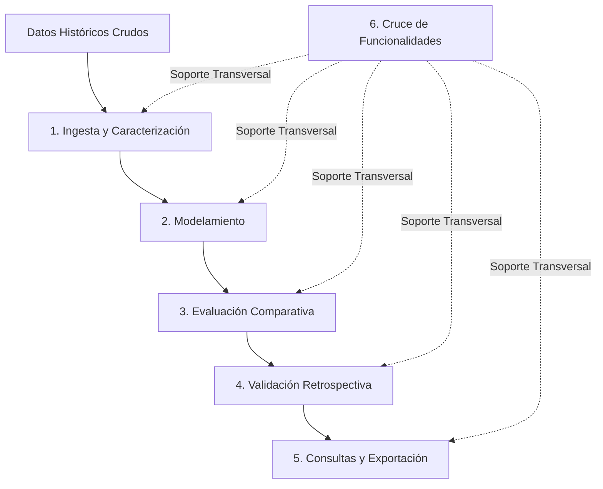

# Especificación de Requerimientos de Software (SRS)

**Sistema:** Framework de Evaluación Comparativa de Modelos de Inteligencia Artificial y Estadística para el Pronóstico de Demanda en Inventarios (PRED)  
**Institución:** Pontificia Universidad Javeriana – Facultad de Ingeniería  
**Fecha:** 25 de mayo de 2026  
**Versión:** 1.0  
**Autores:**
- Juan Camilo Alba Castro
- Tomás Pinilla Florez
- Derek Sarmiento Loeber
- Tomás Ramírez Roa

**Errata v1.1:** las correcciones vigentes a esta especificación se registran en [ERRATA-v1.1.md](ERRATA-v1.1.md).

---

## Historial de Cambios

En esta sección se registra la evolución del documento desde su creación hasta la versión actual entregada al cliente. Cada entrada describe la versión, la fecha, la sección modificada, un resumen del cambio realizado y la persona responsable.

| Versión | Fecha | Sección Modificada | Descripción del Cambio | Responsable |
| :--- | :--- | :--- | :--- | :--- |
| **1.0** | 25/05/2026 | Todas | Versión inicial de línea base del SRS, con todas las secciones definidas y los requerimientos funcionales y no funcionales aprobados por los directores. | Equipo de proyecto |

---

## Tabla de Contenido

- [1. Introducción](#1-introducción)
  - [1.1 Propósito](#11-propósito)
  - [1.2 Alcance](#12-alcance)
  - [1.3 Definiciones, Acrónimos y Abreviaciones](#13-definiciones-acrónimos-y-abreviaciones)
  - [1.4 Referencias](#14-referencias)
  - [1.5 Apreciación Global](#15-apreciación-global)
- [2. Descripción Global](#2-descripción-global)
  - [2.1 Perspectiva del Producto](#21-perspectiva-del-producto)
    - [2.1.1 Interfaces con el sistema](#211-interfaces-con-el-sistema)
    - [2.1.2 Interfaces con el usuario](#212-interfaces-con-el-usuario)
    - [2.1.3 Interfaces con el Hardware](#213-interfaces-con-el-hardware)
    - [2.1.4 Interfaces con el Software](#214-interfaces-con-el-software)
    - [2.1.5 Interfaces de Comunicación](#215-interfaces-de-comunicación)
    - [2.1.6 Restricciones de Memoria](#216-restricciones-de-memoria)
    - [2.1.7 Operaciones](#217-operaciones)
    - [2.1.8 Requerimientos de Adaptación del Sitio](#218-requerimientos-de-adaptación-del-sitio)
  - [2.2 Funciones del Producto](#22-funciones-del-producto)
  - [2.3 Características del Usuario](#23-características-del-usuario)
  - [2.4 Restricciones](#24-restricciones)
  - [2.5 Modelo del Dominio](#25-modelo-del-dominio)
  - [2.6 Suposiciones y Dependencias](#26-suposiciones-y-dependencias)
  - [2.7 Distribución de Requerimientos](#27-distribución-de-requerimientos)
- [3. Requerimientos Específicos](#3-requerimientos-específicos)
  - [3.1 Requerimientos de Interfaces Externas](#31-requerimientos-de-interfaces-externas)
  - [3.2 Características del Producto de Software (Requerimientos Funcionales)](#32-características-del-producto-de-software)
    - [3.2.1 Ingesta y Caracterización (RF-ING)](#321-funcionalidad-ingesta-y-caracterización)
    - [3.2.2 Modelamiento (RF-MOD)](#322-funcionalidad-modelamiento)
    - [3.2.3 Evaluación Comparativa (RF-EVA)](#323-funcionalidad-evaluación-comparativa)
    - [3.2.4 Validación Retrospectiva (RF-VAL)](#324-funcionalidad-validación-retrospectiva)
    - [3.2.5 Consultas y Exportación de Resultados (RF-CON)](#325-funcionalidad-consultas-y-exportación-de-resultados)
    - [3.2.6 Cruce de Funcionalidades (RF-CRZ)](#326-funcionalidad-cruce-de-funcionalidades)
  - [3.3 Requerimientos de Desempeño (RNF-DES)](#33-requerimientos-de-desempeño)
  - [3.4 Restricciones de Diseño](#34-restricciones-de-diseño)
  - [3.5 Atributos del Sistema de Software (No Funcionales)](#35-atributos-del-sistema-de-software-no-funcionales)
    - [3.5.1 Confiabilidad (RNF-CONF)](#351-confiabilidad)
    - [3.5.2 Disponibilidad (RNF-DISP)](#352-disponibilidad)
    - [3.5.3 Seguridad (RNF-SEG)](#353-seguridad)
    - [3.5.4 Mantenibilidad (RNF-MAN)](#354-mantenibilidad)
    - [3.5.5 Portabilidad (RNF-POR)](#355-portabilidad)
    - [3.5.6 Usabilidad (RNF-USA)](#356-usabilidad)
    - [3.5.7 Trazabilidad (RNF-TRA)](#357-trazabilidad)
    - [3.5.8 Reproducibilidad (RNF-REP)](#358-reproducibilidad)
  - [3.6 Requerimientos de la Base de Datos](#36-requerimientos-de-la-base-de-datos)
- [4. Proceso de Ingeniería de Requerimientos](#4-proceso-de-ingeniería-de-requerimientos)
- [5. Proceso de Verificación](#5-proceso-de-verificación)

---

## 1. Introducción

### 1.1 Propósito
Este documento contiene la Especificación de Requerimientos de Software (SRS) del Framework de Evaluación Comparativa de Modelos de Inteligencia Artificial y Estadística para el Pronóstico de Demanda en Inventarios. Describe qué debe hacer el sistema, bajo qué criterios se verificará su comportamiento y qué restricciones aplican a su construcción.

Los destinatarios son el equipo de desarrollo, que lo usa como insumo para el diseño y la implementación, y los directores del proyecto, responsables de verificar que la especificación sea completa, consistente y coherente con los objetivos del trabajo de grado. El alcance cubre únicamente el prototipo funcional a construir durante los seis meses del proyecto; cualquier funcionalidad prevista para fases posteriores queda fuera de este documento.

### 1.2 Alcance
El producto es un framework experimental parametrizable que compara, bajo un mismo protocolo, distintas familias de modelos de pronóstico de demanda y entrega una recomendación sobre cuál de ellas se ajusta mejor al portafolio analizado.

El sistema se articula en cuatro módulos funcionales:
1. Ingesta y caracterización estadística de series de tiempo.
2. Modelamiento (entrenamiento e inferencia de modelos).
3. Evaluación comparativa con validación temporal y pruebas estadísticas.
4. Validación retrospectiva sobre demanda real no vista.

A estos se suma un módulo de consultas y exportación para acceder a los resultados.

El producto persigue tres objetivos concretos:
- Ofrecer una recomendación de modelo con sustento experimental.
- Mantener trazabilidad de las decisiones tomadas durante el benchmarking.
- Servir de base reutilizable para evaluaciones futuras cuando ingresen nuevos datos al histórico.

**Límites del alcance:** Quedan fuera del alcance la generación automática de órdenes de compra, la integración con sistemas ERP y la administración financiera del inventario.

### 1.3 Definiciones, Acrónimos y Abreviaciones

| Término / Acrónimo | Definición |
| :--- | :--- |
| **SRS** | *Software Requirements Specification*, es decir, especificación de requerimientos de software. |
| **RF** | Requerimiento funcional. Describe una acción que el sistema debe ser capaz de ejecutar. |
| **RNF** | Requerimiento no funcional. Describe una propiedad o cualidad que el sistema debe satisfacer. |
| **CU** | Caso de uso. Descripción narrativa de una interacción entre un actor y el sistema. |
| **Serie de tiempo** | Secuencia de observaciones de una variable registrada a intervalos uniformes. |
| **SKU** | *Stock Keeping Unit*. Código único que identifica de manera unívoca a cada producto del portafolio. |
| **Demanda intermitente** | Patrón de demanda con muchos períodos en cero intercalados con períodos de consumo. |
| **Demanda lumpy** | Patrón de demanda intermitente cuyos picos, cuando ocurren, son de tamaño muy variable. |
| **Efecto látigo** | Fenómeno por el cual pequeños cambios en la demanda observada generan variaciones desproporcionadas en los pedidos a lo largo de la cadena de suministro (*bullwhip effect*). |
| **Línea base** | Modelo de referencia simple contra el cual se comparan los demás modelos para verificar si aportan una mejora real. |
| **Modelo estadístico clásico** | Familia de modelos de series de tiempo basados en supuestos paramétricos sobre la estructura de la serie. |
| **Modelo híbrido** | Modelo que combina componentes estadísticos estructurales con elementos de aprendizaje, adecuado para series con múltiples estacionalidades. |
| **Modelo de aprendizaje profundo global** | Red neuronal entrenada para capturar patrones complejos en series de tiempo. |
| **Modelo fundacional de series de tiempo** | Modelo preentrenado sobre un gran corpus de series, capaz de generar pronósticos sin necesidad de ser reentrenado con los datos locales. |
| **Inferencia sin reentrenamiento** | Modo de operación en el que un modelo preentrenado produce pronósticos sobre datos nuevos sin actualizar sus parámetros internos (*zero-shot*). |
| **ABC-XYZ** | Clasificación bidimensional de productos: por importancia económica (A, B o C) y por regularidad de la demanda (X, Y o Z). |
| **CV** | Coeficiente de variación. Mide qué tan irregular es la demanda de un producto respecto a su promedio. |
| **ZVI** | *Zero Velocity Index*, o índice de velocidad cero. Mide con qué frecuencia la demanda fue cero durante un período. |
| **Caracterización estadística** | Cálculo del conjunto de indicadores que describen la forma de cada serie de tiempo del portafolio. |
| **Walk-forward** | Técnica de validación que avanza progresivamente en el tiempo, sin usar datos del futuro para predecir el pasado. |
| **Backtesting retrospectivo** | Prueba final en la que el modelo seleccionado se ejecuta sobre una ventana de demanda real previamente reservada y no utilizada durante el benchmarking. |
| **Fecha de corte** | Punto en el tiempo que separa la ventana de entrenamiento de la ventana de validación durante el backtesting ($t^*$). |
| **MAE** | *Mean Absolute Error*. Promedio del error absoluto entre el pronóstico y la demanda real. |
| **RMSE** | *Root Mean Squared Error*. Raíz del error cuadrático medio. |
| **sMAPE** | *Symmetric Mean Absolute Percentage Error*. Mide el error porcentual de forma simétrica respecto al pronóstico y al valor real. |
| **MASE** | *Mean Absolute Scaled Error*. Error absoluto promedio escalado respecto al error de la línea base. |
| **Prueba de Diebold-Mariano** | Prueba estadística que determina si la diferencia de rendimiento entre dos modelos es real y no producto del azar. |
| **Ljung-Box** | Prueba de bondad de ajuste que verifica si los residuos de un modelo presentan autocorrelación no modelada. |
| **Kolmogorov-Smirnov** | Prueba de bondad de ajuste que evalúa si los residuos de un modelo siguen una distribución dada. |
| **Holm-Bonferroni** | Corrección estadística que controla la tasa de error familiar cuando se realizan múltiples comparaciones simultáneas. |
| **Residuos** | Diferencias entre los valores observados y los pronosticados por un modelo ($e_t = Y_t - \hat{Y}_t$). |
| **Parsimonia** | Principio según el cual, entre modelos con desempeño equivalente, se prefiere el más simple. |
| **Benchmarking** | Comparación sistemática de rendimiento entre alternativas bajo un mismo protocolo experimental. |
| **Portafolio** | Conjunto de productos del inventario sobre los cuales se ejecuta el análisis. |
| **Histórico** | Conjunto de registros de demanda acumulados durante un período pasado, utilizados como insumo para el modelado. |

### 1.4 Referencias
- IEEE Std 830-1998. *Recommended Practice for Software Requirements Specifications*. Institute of Electrical and Electronics Engineers, 1998.
- ISO/IEC/IEEE 29148:2018. *Systems and software engineering — Life cycle processes — Requirements engineering*.
- ISO/IEC 29110:2016. *Software engineering — Lifecycle profiles for very small entities (VSE)*.
- ISO/IEC 12207:2008. *Systems and software engineering — Software life cycle processes*.
- OMG Unified Modeling Language (UML) Specification, Version 2.5.1.
- Documento de propuesta de proyecto de grado, versión vigente, del mismo equipo.

### 1.5 Apreciación Global
El documento se organiza en seis secciones:
- La **Introducción** establece el contexto, el alcance, el glosario y las referencias normativas.
- La **Descripción Global** ofrece una vista de alto nivel del producto, sus usuarios, las funciones que ofrece y el modelo del dominio.
- Los **Requerimientos Específicos** detallan en lenguaje técnico los requerimientos funcionales y no funcionales, con criterios de medición concretos.
- El **Proceso de Ingeniería de Requerimientos** explica cómo se construyó esta especificación y cómo se gestionarán los cambios.
- El **Proceso de Verificación** describe cómo se validará cada requerimiento.
- Los **Anexos** contienen el material complementario.

El orden avanza de lo general a lo particular. Quien solo necesita entender qué hace el sistema y para quién puede revisar las secciones 1 y 2. El detalle técnico de diseño e implementación se encuentra en la sección 3.

---

## 2. Descripción Global

### 2.1 Perspectiva del Producto
El producto es completamente nuevo. No reemplaza ningún sistema existente ni se integra a una plataforma previa. La organización destinataria carece actualmente de un mecanismo reproducible para comparar familias de modelos de pronóstico sobre sus propios datos, y tampoco dispone de trazabilidad sobre las decisiones que se toman en ese proceso.

El producto encapsula un protocolo experimental automatizado que un usuario operativo puede ejecutar sin implementar manualmente los modelos, las métricas ni las pruebas estadísticas. La decisión sobre qué familia de modelos adoptar deja de depender del criterio tecnológico del analista y pasa a sustentarse en evidencia empírica obtenida bajo condiciones controladas.

#### 2.1.1 Interfaces con el sistema
Al ser un producto nuevo, no interactúa con sistemas software preexistentes en la organización. Su única dependencia externa es la fuente de datos históricos de inventario, que puede provenir de archivos planos, hojas de cálculo o cualquier formato tabular acordado. El sistema no expone interfaces hacia sistemas externos en esta versión del prototipo; los resultados se acceden a través de sus propias funciones de consulta y exportación.

#### 2.1.2 Interfaces con el usuario
La interfaz operativa permite cargar datos, configurar y lanzar ejecuciones de benchmarking, monitorear su progreso y consultar los resultados. Su diseño obedece a dos criterios:
1. Que un usuario sin formación especializada en pronóstico estadístico pueda completar el flujo sin asistencia.
2. Que la información presentada sea clara y sin jerga técnica innecesaria.

Las pantallas principales son:
- Pantalla de autenticación.
- Pantalla de carga y validación de datos.
- Pantalla de configuración de ejecución.
- Pantalla de monitoreo de la ejecución en curso.
- Pantalla de consulta de resultados por SKU y por familia de modelos.
- Pantalla de administración (visible solo para el rol con privilegios elevados).

#### 2.1.3 Interfaces con el Hardware
El sistema opera sobre hardware estándar de oficina o una estación de trabajo dedicada. Al ejecutarse de forma completamente local, la interacción con el hardware se reduce a pantalla, teclado y ratón; no se requieren periféricos especializados ni adaptador de red. Las especificaciones técnicas detalladas se formalizarán en el Plan de Ingeniería.

#### 2.1.4 Interfaces con el Software
Esta sección no compromete tecnologías concretas, como corresponde a un SRS. El sistema requiere, en términos generales, un entorno de ejecución para el prototipo, un motor de persistencia para datos históricos y resultados, y opcionalmente un navegador si el despliegue lo contempla. La selección concreta se formaliza en los documentos de diseño e ingeniería.

#### 2.1.5 Interfaces de Comunicación
El sistema opera de forma completamente local en un único equipo, sin comunicación en red. No aplican interfaces de comunicación externas ni protocolos de red en ninguna configuración del prototipo.

#### 2.1.6 Restricciones de Memoria
En este nivel de especificación no se imponen restricciones de memoria concretas. Los recursos de cómputo dependen del tamaño del portafolio, la profundidad del histórico y la familia de modelos seleccionada. El dimensionamiento se establecerá en el documento de arquitectura, a partir de pruebas piloto sobre los datos del caso de estudio.

#### 2.1.7 Operaciones
El sistema distingue dos modos de operación:
1. **Modo de usuario operativo:** cubre carga de datos, configuración y ejecución de benchmarking, y consulta de resultados.
2. **Modo administrativo:** permite gestionar usuarios, configurar parámetros del framework, supervisar el repositorio histórico y depurar ejecuciones fallidas.

El sistema opera bajo demanda y no requiere disponibilidad continua. Las ejecuciones sobre portafolios amplios pueden tardar varias horas y se procesan en lotes; las operaciones interactivas (consulta de resultados, configuración) deben responder en tiempos cortos. El sistema debe contar con un mecanismo de recuperación que permita reanudar ejecuciones interrumpidas sin repetir el trabajo ya completado.

#### 2.1.8 Requerimientos de Adaptación del Sitio
El sistema se adapta a distintos perfiles de portafolio sin modificar el código fuente. La adaptación se realiza mediante archivos de configuración que controlan:
- Umbrales de clasificación ABC-XYZ.
- Umbrales de CV y ZVI para clasificar el perfil de demanda.
- Granularidad temporal de las series (diaria, semanal, mensual).
- Horizonte de pronóstico $h$.
- Pesos adaptativos del score compuesto $C_m$.

El cambio de portafolio no requiere reescribir lógica.

---

### 2.2 Funciones del Producto

1. **Ingesta y caracterización:** Cubre la carga de los datos históricos, su validación, su limpieza, y el cálculo de los indicadores que describen el perfil de demanda de cada serie.
2. **Modelamiento:** Cubre el entrenamiento de los modelos de las cuatro familias contempladas, así como la inferencia sin reentrenamiento para los modelos fundacionales.
3. **Evaluación comparativa:** Cubre la aplicación de validación temporal (*walk-forward*), el cálculo de métricas de error, la ejecución de pruebas estadísticas y la aplicación del protocolo de selección en cascada.
4. **Validación retrospectiva:** Cubre la ejecución del *backtesting* del modelo seleccionado sobre una ventana de demanda real previamente reservada.
5. **Consultas y exportación:** Cubre el acceso del usuario a los resultados generados en distintos niveles de detalle y la exportación de los mismos a formatos tabulares abiertos.
6. **Cruce de funcionalidades:** Cubre las funciones transversales: autenticación, gestión de usuarios, configuración global, monitoreo y respaldo/restauración de datos.

---

### 2.3 Características del Usuario

| Característica | Operador | Administrador |
| :--- | :--- | :--- |
| **Rol** | Operador del Framework | Administrador del Sistema |
| **Privilegios** | Cargar datos, validar calidad, configurar ejecuciones de benchmarking, lanzar ejecuciones, monitorear progreso, consultar resultados y exportarlos. | Acceso a todas las funciones del operador, más gestión de cuentas, configuración global de parámetros del framework, supervisión del repositorio, depuración de ejecuciones fallidas y gestión de copias de respaldo. |
| **Nivel de formación** | Formación técnica o universitaria, no necesariamente en ciencia de datos o estadística avanzada. El sistema permite ejecutar el flujo sin codificar modelos. | Perfil técnico con conocimientos básicos de administración de sistemas y gestión de aplicaciones de análisis de datos. |
| **Frecuencia de uso** | Periódica (por ciclos definidos, p. ej., trimestralmente, o ante la incorporación de nuevos datos al histórico). | Ocasional (modificación de configuración global, resolución de incidencias o mantenimiento del sistema). |

---

### 2.4 Restricciones

#### Restricciones Generales
- El sistema debe ser parametrizable mediante archivos de configuración, sin requerir cambios en el código fuente para adaptarse a portafolios distintos.
- El sistema debe respetar la causalidad temporal en todas las operaciones de evaluación; ningún cálculo de pronóstico puede usar información posterior al instante que se está prediciendo.
- El sistema debe operar en español como idioma principal de interfaz y de mensajes.
- El sistema debe ofrecer tolerancia a fallos para ejecuciones largas, de modo que una interrupción no obligue a repetir desde cero el trabajo completado.
- El sistema debe registrar de forma trazable cada decisión que afecte el resultado final del benchmarking: configuración usada, datos consumidos, modelos evaluados y pruebas estadísticas aplicadas.
- El sistema debe alinearse con los estándares del proyecto: ISO/IEC/IEEE 29148:2018 (SRS), IEEE 830, UML 2.5.1, ISO/IEC 12207:2008, ISO/IEC 29110 e iteraciones Scrum.

#### Restricciones de Software
- Debe construirse exclusivamente con software cuya licencia permita uso académico y posterior uso operativo por parte de la organización destinataria, sin generar obligaciones contractuales adicionales.
- Debe organizarse en módulos independientes, con responsabilidades claras y acoplados únicamente a través de interfaces definidas.
- Debe utilizar formatos abiertos y ampliamente soportados para el intercambio de datos de entrada y salida, evitando formatos propietarios.
- Debe documentar todas las dependencias externas de software, especificando versión, licencia y motivo de uso.

#### Restricciones de Hardware
- Debe poder ejecutarse sobre una estación de trabajo de gama media, sin requerir aceleradores gráficos dedicados de gama alta para las funciones básicas del prototipo.
- Las interfaces de usuario deben adaptarse razonablemente a resoluciones de pantalla a partir de $1366 \times 768$ píxeles.
- El sistema opera de forma local en un único equipo (monolítico/local), sin esquema cliente-servidor distribuido en red.

---

### 2.5 Modelo del Dominio

A continuación se definen las 14 entidades conceptuales del dominio que estructuran la información procesada por el framework PRED.

#### ED-01: Serie de Tiempo
- **Descripción:** Secuencia cronológica de observaciones de demanda asociada a un producto del portafolio, registrada a una frecuencia uniforme.
- **Objetivo:** Representar el insumo principal del sistema sobre el cual se ejecutan los modelos de pronóstico.
- **Atributos:**
  - `identificador` (Cadena): Identificador único de la serie.
  - `skuAsociado` (Referencia a SKU): Producto del portafolio al que pertenece la serie.
  - `frecuencia` (Enumeración): Granularidad temporal de la serie (`diaria`, `semanal`, `mensual`).
  - `fechaInicio` (Fecha): Primera fecha registrada en la serie.
  - `fechaFin` (Fecha): Última fecha registrada en la serie.
  - `observaciones` (Lista): Lista ordenada de pares `(fecha, cantidad)`.

#### ED-02: SKU
- **Descripción:** Producto individual del portafolio, identificado por un código único que permite distinguirlo de cualquier otro.
- **Objetivo:** Constituir la unidad mínima sobre la cual se ejecuta el análisis. Cada producto tiene asociada una y solo una serie de tiempo por combinación de frecuencia configurada.
- **Atributos:**
  - `codigo` (Cadena): Identificador único del producto en el portafolio.
  - `descripcion` (Cadena): Descripción textual del producto.
  - `clasificacionRotacion` (Enumeración): Categoría de rotación (`A`, `B`, `C`).
  - `clasificacionVariabilidad` (Enumeración): Categoría de variabilidad (`X`, `Y`, `Z`).
  - `costoUnitario` (Decimal): Costo unitario del producto, cuando se encuentre disponible.
  - `tiempoAprovisionamiento` (Numérico): Tiempo de espera (*Lead Time*) para recibir el producto desde su pedido.

#### ED-03: Transacción Histórica
- **Descripción:** Registro individual de un movimiento de inventario ocurrido en un momento dado, que aporta información sobre la demanda de un producto.
- **Objetivo:** Servir como dato atómico de entrada. Las series de tiempo se construyen agregando transacciones históricas a la frecuencia configurada.
- **Atributos:**
  - `identificador` (Cadena): Identificador único del registro.
  - `marcaTemporal` (Marca de tiempo): Fecha y hora en que ocurrió la transacción.
  - `skuAsociado` (Referencia a SKU): Producto al que corresponde la transacción.
  - `cantidad` (Numérico): Cantidad consumida o solicitada en la transacción.
  - `tipoMovimiento` (Enumeración): Naturaleza del movimiento según catálogo configurado.

#### ED-04: Perfil de Demanda
- **Descripción:** Conjunto de indicadores estadísticos que describen el comportamiento de la demanda de un producto durante el período analizado.
- **Objetivo:** Permitir al sistema ajustar dinámicamente el comportamiento del modelado y de la evaluación según las características de cada producto.
- **Atributos:**
  - `identificador` (Cadena): Identificador único del perfil.
  - `skuAsociado` (Referencia a SKU): Producto al que pertenece el perfil.
  - `coeficienteVariacion` (Decimal): Medida de irregularidad de la demanda respecto a su promedio ($CV$).
  - `indiceVelocidadCero` (Decimal): Frecuencia con la cual la demanda fue cero en el período analizado ($ZVI$).
  - `categoriaCombinada` (Cadena): Combinación ABC-XYZ resultante de la caracterización.
  - `tipoPerfil` (Enumeración): Etiqueta resultante (`regular`, `intermitente/lumpy`).

#### ED-05: Familia de Modelos
- **Descripción:** Agrupación de modelos de pronóstico que comparten una misma naturaleza técnica y un mismo modo de operación.
- **Objetivo:** Permitir comparar el desempeño no solo entre modelos individuales sino entre familias completas, lo cual es central para la pregunta de investigación.
- **Atributos:**
  - `identificador` (Cadena): Identificador único de la familia.
  - `nombreFamilia` (Cadena): Etiqueta legible (`estadisticos_clasicos`, `hibridos`, `aprendizaje_profundo_global`, `fundacionales`).
  - `modoOperacion` (Enumeración): `entrenamiento_local` o `inferencia_sin_reentrenamiento` (*zero-shot*).
  - `complejidadRelativa` (Numérico): Posición relativa en términos de costo computacional.

#### ED-06: Modelo de Pronóstico
- **Descripción:** Instancia concreta de un algoritmo de pronóstico, perteneciente a una familia, configurada con un conjunto específico de parámetros.
- **Objetivo:** Representar cada candidato del benchmarking. Un SKU será evaluado por todos los modelos admisibles según su perfil de demanda.
- **Atributos:**
  - `identificador` (Cadena): Identificador único del modelo.
  - `familia` (Referencia a Familia de Modelos): Familia técnica a la que pertenece.
  - `parametros` (Diccionario): Conjunto de parámetros y límites que definen al modelo.
  - `modoOperacion` (Enumeración): Modo en que opera la instancia concreta.

#### ED-07: Ejecución de Pronóstico
- **Descripción:** Corrida concreta de un modelo de pronóstico sobre una serie de tiempo, en una ventana temporal determinada.
- **Objetivo:** Constituir el registro auditable de cada pronóstico generado por el sistema, permitiendo reproducir cualquier resultado a partir de su ID.
- **Atributos:**
  - `identificador` (Cadena): Identificador único de la ejecución.
  - `modeloAsociado` (Referencia a Modelo de Pronóstico): Modelo que produjo el pronóstico.
  - `serieEntrada` (Referencia a Serie de Tiempo): Serie de tiempo usada como insumo.
  - `ventanaEntrenamiento` (Rango de fechas): Rango temporal usado para entrenar (o ventana de contexto para inferencia sin reentrenamiento).
  - `horizontePronostico` (Numérico): Cantidad de períodos futuros proyectados ($h$).
  - `pronosticos` (Lista): Lista ordenada de valores pronosticados ($\hat{Y}$).
  - `tiempoEjecucion` (Numérico): Duración real de la corrida en segundos.
  - `estadoFinal` (Enumeración): `exitoso`, `fallido`, `interrumpido`.

#### ED-08: Métrica de Evaluación
- **Descripción:** Indicador calculado a partir de los pronósticos y los valores reales para cuantificar el error del modelo.
- **Objetivo:** Servir como insumo numérico para la comparación entre modelos.
- **Atributos:**
  - `identificador` (Cadena): Identificador único de la métrica.
  - `nombre` (Cadena): Nombre del indicador (`MAE`, `RMSE`, `sMAPE`, `MASE`).
  - `valor` (Decimal): Valor numérico resultante del cálculo.
  - `ejecucionAsociada` (Referencia a Ejecución de Pronóstico): Ejecución de la que proviene la métrica.

#### ED-09: Resultado de Prueba Estadística
- **Descripción:** Salida formal de una prueba estadística aplicada durante el protocolo de selección, junto con su interpretación.
- **Objetivo:** Documentar de manera trazable el sustento estadístico de cada decisión del protocolo de selección.
- **Atributos:**
  - `identificador` (Cadena): Identificador único del resultado.
  - `tipoPrueba` (Enumeración): `Ljung-Box`, `Kolmogorov-Smirnov`, `Diebold-Mariano`.
  - `estadistico` (Decimal): Valor numérico del estadístico de prueba calculado.
  - `valorP` (Decimal): Valor $p$ resultante de la prueba.
  - `decision` (Enumeración): `rechaza_H0`, `no_rechaza_H0`.

#### ED-10: Resultado Comparativo
- **Descripción:** Agregado final del benchmarking que ordena los modelos admisibles según el protocolo de selección multi-criterio en cascada y entrega una recomendación.
- **Objetivo:** Constituir la salida principal del benchmarking y servir de insumo a la validación retrospectiva.
- **Atributos:**
  - `identificador` (Cadena): Identificador único del resultado.
  - `skuAsociado` (Referencia a SKU): Producto sobre el cual se calculó.
  - `rankingModelos` (Lista): Lista ordenada de modelos admisibles con sus scores compuestos ($C_m$).
  - `modeloRecomendado` (Referencia a Modelo de Pronóstico): Modelo seleccionado por el protocolo.
  - `justificacion` (Cadena): Explicación textual del motivo por el cual fue elegido el modelo recomendado.

#### ED-11: Ventana de Validación Retrospectiva
- **Descripción:** Rango temporal del histórico que el sistema reserva, no utiliza durante el benchmarking, y emplea para verificar empíricamente la recomendación final.
- **Objetivo:** Sostener la prueba final de efectividad práctica del modelo recomendado sobre demanda real no vista.
- **Atributos:**
  - `identificador` (Cadena): Identificador único de la ventana.
  - `fechaCorte` (Fecha): Punto de corte temporal ($t^*$) que separa el histórico de la validación.
  - `horizonte` (Numérico): Cantidad de períodos cubiertos por la ventana de validación ($h$).

#### ED-12: Reporte de Validación Retrospectiva
- **Descripción:** Documento estructurado que registra los pronósticos del modelo recomendado en la ventana de validación, las métricas de error punto a punto, y la conclusión sobre si la recomendación se sostiene.
- **Objetivo:** Cerrar el ciclo analítico del sistema con evidencia cuantitativa sobre datos no vistos.
- **Atributos:**
  - `identificador` (Cadena): Identificador único del reporte.
  - `ventanaAsociada` (Referencia a Ventana de Validación Retrospectiva): Ventana cubierta.
  - `modeloEvaluado` (Referencia a Modelo de Pronóstico): Modelo recomendado evaluado.
  - `metricasValidacion` (Lista): Lista de valores de MAE, RMSE y sMAPE en validación real.
  - `resultadoPruebaDM` (Referencia a Resultado de Prueba Estadística): Resultado de Diebold-Mariano sobre validación real vs. baseline.
  - `conclusion` (Enumeración): `se_sostiene`, `se_sostiene_parcialmente`, `no_se_sostiene`.

#### ED-13: Usuario
- **Descripción:** Persona registrada en el sistema con credenciales y un rol asignado.
- **Objetivo:** Identificar el rol del usuario activo dentro de la aplicación local, diferenciando permisos entre Operador y Administrador.
- **Atributos:**
  - `identificador` (Cadena): Identificador único del usuario.
  - `nombreUsuario` (Cadena): Nombre de inicio de sesión.
  - `rol` (Enumeración): `Operador`, `Administrador`.

#### ED-15: Configuración de Ejecución
- **Descripción:** Conjunto de parámetros que define cómo se va a ejecutar un benchmarking concreto.
- **Objetivo:** Garantizar la reproducibilidad. Permite reejecutar el mismo benchmarking sobre los mismos datos y obtener exactamente el mismo resultado.
- **Atributos:**
  - `identificador` (Cadena): Identificador único de la configuración.
  - `skusObjetivo` (Lista): Lista de SKUs incluidos en el benchmarking.
  - `frecuenciaTemporal` (Enumeración): Granularidad temporal seleccionada (`diaria`, `semanal`, `mensual`).
  - `familiasIncluidas` (Lista): Familias de modelos habilitadas.
  - `horizonte` (Numérico): Horizonte de pronóstico configurado ($h$).
  - `umbralesPerfil` (Diccionario): Umbrales de CV y ZVI para clasificar el perfil de demanda.
  - `pesosScore` (Diccionario): Pesos del score compuesto ($w_1, w_2, w_3, w_4$) asignados por perfil.

---

### 2.6 Suposiciones y Dependencias

#### Suposiciones
1. Se supone que la organización destinataria proveerá un histórico de datos de al menos tres años de profundidad con granularidad mínima diaria, suficiente para capturar estacionalidades.
2. Se supone que los datos del histórico pueden mapearse al esquema tabular abstracto requerido: `(Timestamp, SKU_ID, Quantity, Lead_Time, Cost)`.
3. Se supone que el portafolio contiene una mezcla representativa de SKUs con perfiles de demanda diversos, incluyendo al menos un subconjunto con demanda intermitente o *lumpy*.
4. Se supone que durante la ejecución del proyecto no se introducirán cambios estructurales en los requerimientos del cliente que invaliden los resultados acumulados.
5. Se supone que los usuarios del sistema disponen de credenciales y permisos necesarios para acceder a los archivos históricos fuente.

#### Dependencias
1. Disponibilidad oportuna del repositorio histórico de datos por parte de la organización destinataria dentro de los plazos del cronograma.
2. Acceso del equipo a la infraestructura computacional mínima requerida para ejecutar pruebas y entrenamientos sobre datos reales.
3. Estabilidad en las reglas de negocio durante el período de construcción y pruebas.
4. Continuidad del equipo ejecutor durante los seis meses previstos de desarrollo.

---

### 2.7 Distribución de Requerimientos

| Módulo | Prefijo | Entidades del Dominio Asociadas |
| :--- | :--- | :--- |
| **Ingesta y Caracterización** | `RF-ING` | Transacción Histórica, Serie de Tiempo, SKU, Perfil de Demanda |
| **Modelamiento** | `RF-MOD` | Familia de Modelos, Modelo de Pronóstico, Ejecución de Pronóstico |
| **Evaluación Comparativa** | `RF-EVA` | Ejecución de Pronóstico, Métrica de Evaluación, Resultado de Prueba Estadística, Resultado Comparativo |
| **Validación Retrospectiva** | `RF-VAL` | Ventana de Validación Retrospectiva, Reporte de Validación Retrospectiva, Resultado de Prueba Estadística |
| **Consultas y Exportación** | `RF-CON` | Resultado Comparativo, Reporte de Validación Retrospectiva, Métrica de Evaluación, Perfil de Demanda |
| **Cruce de Funcionalidades** | `RF-CRZ` | Usuario, Configuración de Ejecución |

---

## 3. Requerimientos Específicos

### 3.1 Requerimientos de Interfaces Externas

#### 3.1.1 Interfaces con el Usuario
El sistema proporciona una interfaz gráfica/operativa organizada en las siguientes vistas:
- **Pantalla de autenticación:** Punto de entrada donde el usuario ingresa sus credenciales.
- **Pantalla de carga de datos:** Permite seleccionar el archivo fuente tabular, validar su estructura e iniciar la ingesta.
- **Pantalla de configuración de ejecución:** Permite parametrizar el benchmarking antes de lanzarlo (selección de SKUs, familias, horizonte, frecuencia y umbrales).
- **Pantalla de monitoreo:** Muestra el progreso en tiempo real de la ejecución, modelos completados, pendientes y tiempos transcurridos.
- **Pantalla de consulta de resultados:** Permite explorar y ordenar los resultados por SKU, familia y perfil de demanda.
- **Pantalla de validación retrospectiva:** Muestra el reporte de backtesting del modelo recomendado frente a demanda real no vista.
- **Pantalla de administración:** Exclusiva para el rol Administrador, con funciones de gestión de cuentas, configuración global y copias de seguridad.

#### 3.1.2 Interfaces con el Hardware
El sistema interactúa exclusivamente con dispositivos estándar: pantalla, teclado y ratón. Opera localmente sin requerir periféricos especializados ni aceleradores gráficos obligatorios para la operación interactiva.

#### 3.1.3 Interfaces con el Software
El sistema requiere un entorno de ejecución adecuado para el framework y un motor de persistencia relacional que asegure integridad transaccional. Debe documentar explícitamente todas sus dependencias de software con versiones y licencias compatibles.

#### 3.1.4 Interfaces de Comunicaciones
No aplican. La versión prototipo del sistema opera de forma estrictamente local y aislada en una estación de trabajo, sin requerir comunicación en red ni exponer endpoints remotos.

---

### 3.2 Características del Producto de Software

#### 3.2.1 Funcionalidad: Ingesta y Caracterización

##### RF-ING-01: Cargar histórico
| Campo | Detalle |
| :--- | :--- |
| **Tipo** | Funcional |
| **Módulo** | Ingesta y Caracterización |
| **Prioridad** | Alta |
| **Versión / Fecha** | 1.0 (25 de mayo de 2026) |
| **Descripción** | El sistema debe permitir al usuario cargar un archivo tabular que contenga los registros históricos de transacciones, en cualquier formato abierto previamente acordado por configuración. |
| **Razón** | La carga del histórico es el primer paso de todo el flujo. Sin esta función, ningún otro módulo puede operar. |
| **Criterio de Medición** | El sistema debe aceptar al menos los formatos tabulares definidos en la configuración inicial y rechazar, con un mensaje claro, los archivos que no se ajusten a ellos. |

##### RF-ING-02: Validar integridad estructural
| Campo | Detalle |
| :--- | :--- |
| **Tipo** | Funcional |
| **Módulo** | Ingesta y Caracterización |
| **Prioridad** | Alta |
| **Versión / Fecha** | 1.0 (25 de mayo de 2026) |
| **Descripción** | El sistema debe validar la integridad estructural del archivo cargado, verificando la presencia de las columnas mínimas requeridas y la consistencia de sus tipos de dato. |
| **Razón** | Procesar un archivo con columnas faltantes o tipos inconsistentes propaga errores hacia los módulos siguientes. |
| **Criterio de Medición** | El sistema debe detectar el 100% de los archivos a los que les falte alguna columna requerida, o cuyos tipos no correspondan a lo configurado, reportándolo al usuario antes de continuar. |

##### RF-ING-03: Mapear registros al esquema interno
| Campo | Detalle |
| :--- | :--- |
| **Tipo** | Funcional |
| **Módulo** | Ingesta y Caracterización |
| **Prioridad** | Alta |
| **Versión / Fecha** | 1.0 (25 de mayo de 2026) |
| **Descripción** | El sistema debe mapear los registros del archivo cargado al esquema interno de transacciones históricas del dominio. |
| **Razón** | Las entidades del dominio se definen de forma independiente del formato de origen, lo que permite admitir distintas fuentes sin modificar la lógica interna. |
| **Criterio de Medición** | Para todo archivo válido, el sistema debe generar registros internos cuya cardinalidad iguale a la del archivo de origen, descontando únicamente los descartados por reglas de calidad documentadas en bitácora. |

##### RF-ING-04: Detectar registros duplicados
| Campo | Detalle |
| :--- | :--- |
| **Tipo** | Funcional |
| **Módulo** | Ingesta y Caracterización |
| **Prioridad** | Alta |
| **Versión / Fecha** | 1.0 (25 de mayo de 2026) |
| **Descripción** | El sistema debe detectar y reportar registros duplicados dentro del archivo cargado. |
| **Razón** | Los duplicados inflan artificialmente la demanda y sesgan los pronósticos. |
| **Criterio de Medición** | El sistema debe identificar como duplicados aquellos registros con el mismo SKU, marca temporal y tipo de movimiento, permitiendo al usuario decidir si los consolida o los descarta. |

##### RF-ING-05: Detectar campos vacíos
| Campo | Detalle |
| :--- | :--- |
| **Tipo** | Funcional |
| **Módulo** | Ingesta y Caracterización |
| **Prioridad** | Alta |
| **Versión / Fecha** | 1.0 (25 de mayo de 2026) |
| **Descripción** | El sistema debe detectar registros con campos vacíos en columnas obligatorias y reportarlos en una bitácora de calidad antes de continuar con el procesamiento. |
| **Razón** | Los registros incompletos generan series temporales discontinuas que afectan la caracterización y el modelado. |
| **Criterio de Medición** | El sistema debe registrar el 100% de los registros con campos obligatorios vacíos en la bitácora de calidad, indicando fila de origen y columna afectada. |

##### RF-ING-06: Homologar referencias de productos
| Campo | Detalle |
| :--- | :--- |
| **Tipo** | Funcional |
| **Módulo** | Ingesta y Caracterización |
| **Prioridad** | Media |
| **Versión / Fecha** | 1.0 (25 de mayo de 2026) |
| **Descripción** | El sistema debe homologar referencias de productos cuando un mismo SKU aparezca registrado bajo códigos distintos en diferentes secciones del histórico. |
| **Razón** | Los históricos heredados contienen inconsistencias de codificación que fragmentan artificialmente la demanda de un mismo ítem. |
| **Criterio de Medición** | El sistema debe aplicar las reglas de homologación cargadas por configuración y registrar, por cada SKU homologado, los códigos originales unificados. |

##### RF-ING-07: Construir series de tiempo por SKU
| Campo | Detalle |
| :--- | :--- |
| **Tipo** | Funcional |
| **Módulo** | Ingesta y Caracterización |
| **Prioridad** | Alta |
| **Versión / Fecha** | 1.0 (25 de mayo de 2026) |
| **Descripción** | El sistema debe construir, a partir de las transacciones históricas válidas, una serie de tiempo por cada SKU del portafolio. |
| **Razón** | La serie de tiempo por SKU es la unidad fundamental sobre la cual operan los modelos de pronóstico. |
| **Criterio de Medición** | El sistema debe generar exactamente una serie de tiempo por cada SKU presente en el portafolio analizado. |

##### RF-ING-08: Seleccionar frecuencia temporal
| Campo | Detalle |
| :--- | :--- |
| **Tipo** | Funcional |
| **Módulo** | Ingesta y Caracterización |
| **Prioridad** | Alta |
| **Versión / Fecha** | 1.0 (25 de mayo de 2026) |
| **Descripción** | El sistema debe permitir al usuario seleccionar la frecuencia temporal de las series construidas, entre las opciones diaria, semanal y mensual. |
| **Razón** | La agregación temporal impacta la estabilidad de las series, reduciendo la presencia de ceros y regularizando patrones. |
| **Criterio de Medición** | El sistema debe permitir seleccionar una de las tres frecuencias por ejecución y agregar correctamente las observaciones según la frecuencia seleccionada. |

##### RF-ING-09: Rellenar períodos de demanda nula
| Campo | Detalle |
| :--- | :--- |
| **Tipo** | Funcional |
| **Módulo** | Ingesta y Caracterización |
| **Prioridad** | Alta |
| **Versión / Fecha** | 1.0 (25 de mayo de 2026) |
| **Descripción** | El sistema debe rellenar con ceros los períodos de demanda nula al construir la serie de tiempo, de modo que la secuencia quede uniforme en el tiempo. |
| **Razón** | Las series temporales requieren intervalos regulares continuos sin vacíos de fechas intermedias. |
| **Criterio de Medición** | El sistema debe garantizar que, entre la fecha de inicio y la fecha de fin de cada serie, no exista ningún período temporal sin valor asignado. |

##### RF-ING-10: Calcular coeficiente de variación
| Campo | Detalle |
| :--- | :--- |
| **Tipo** | Funcional |
| **Módulo** | Ingesta y Caracterización |
| **Prioridad** | Alta |
| **Versión / Fecha** | 1.0 (25 de mayo de 2026) |
| **Descripción** | El sistema debe calcular, para cada serie de tiempo construida, su coeficiente de variación ($CV$). |
| **Razón** | El $CV$ cuantifica la volatilidad de la demanda y condiciona la categorización de variabilidad y los pesos del score compuesto. |
| **Criterio de Medición** | El sistema debe almacenar el valor de $CV$ dentro de la entidad Perfil de Demanda asociada a cada SKU. |

##### RF-ING-11: Calcular índice de velocidad cero
| Campo | Detalle |
| :--- | :--- |
| **Tipo** | Funcional |
| **Módulo** | Ingesta y Caracterización |
| **Prioridad** | Alta |
| **Versión / Fecha** | 1.0 (25 de mayo de 2026) |
| **Descripción** | El sistema debe calcular, para cada serie de tiempo construida, su índice de velocidad cero ($ZVI$). |
| **Razón** | El $ZVI$ mide la proporción de períodos con demanda nula, permitiendo distinguir demandas regulares de intermitentes o lumpy. |
| **Criterio de Medición** | El sistema debe almacenar el valor numérico de $ZVI$ dentro del Perfil de Demanda del SKU. |

##### RF-ING-12: Clasificar por taxonomía ABC-XYZ
| Campo | Detalle |
| :--- | :--- |
| **Tipo** | Funcional |
| **Módulo** | Ingesta y Caracterización |
| **Prioridad** | Alta |
| **Versión / Fecha** | 1.0 (25 de mayo de 2026) |
| **Descripción** | El sistema debe clasificar cada SKU según la taxonomía ABC-XYZ, usando los umbrales definidos por configuración. |
| **Razón** | Agrupa productos por impacto económico acumulado (Pareto ABC) y regularidad de la demanda (XYZ), orientando las prioridades del negocio. |
| **Criterio de Medición** | El sistema debe asignar una etiqueta de la forma $(A|B|C)-(X|Y|Z)$ a cada SKU, registrando la fecha y los umbrales aplicados. |

##### RF-ING-13: Etiquetar perfil de demanda
| Campo | Detalle |
| :--- | :--- |
| **Tipo** | Funcional |
| **Módulo** | Ingesta y Caracterización |
| **Prioridad** | Alta |
| **Versión / Fecha** | 1.0 (25 de mayo de 2026) |
| **Descripción** | El sistema debe etiquetar el perfil de cada SKU como `regular` o como `intermitente/lumpy`, en función de su $CV$ y $ZVI$ comparados con los umbrales configurados. |
| **Razón** | Esta etiqueta permite que el módulo de evaluación asigne dinámicamente el vector de pesos en la selección multicriterio. |
| **Criterio de Medición** | El sistema debe persistir el tipo de perfil asignado dentro de la entidad Perfil de Demanda asociada al SKU. |

##### RF-ING-14: Consultar bitácora de calidad
| Campo | Detalle |
| :--- | :--- |
| **Tipo** | Funcional |
| **Módulo** | Ingesta y Caracterización |
| **Prioridad** | Media |
| **Versión / Fecha** | 1.0 (25 de mayo de 2026) |
| **Descripción** | El sistema debe permitir al usuario consultar la bitácora de calidad generada durante la ingesta, con el detalle de registros descartados, duplicados y homologados. |
| **Razón** | Asegura la transparencia y auditoría sobre las transformaciones y limpiezas efectuadas sobre los datos fuente. |
| **Criterio de Medición** | El sistema debe ofrecer una vista interactiva de la bitácora, paginada por motivo de inconsistencia y exportable en formato tabular abierto. |

##### RF-ING-15: Rechazar ingesta con baja calidad
| Campo | Detalle |
| :--- | :--- |
| **Tipo** | Funcional |
| **Módulo** | Ingesta y Caracterización |
| **Prioridad** | Media |
| **Versión / Fecha** | 1.0 (25 de mayo de 2026) |
| **Descripción** | El sistema debe permitir al usuario rechazar el resultado de una ingesta cuando la bitácora de calidad supere un umbral configurable de registros problemáticos. |
| **Razón** | Evita la propagación de datos corrompidos hacia las etapas de modelamiento y evaluación. |
| **Criterio de Medición** | El sistema debe ofrecer la opción explícita de detener el flujo cuando el porcentaje de registros problemáticos supere el umbral configurado. |

---

#### 3.2.2 Funcionalidad: Modelamiento

##### RF-MOD-01: Ejecutar modelos estadísticos clásicos
| Campo | Detalle |
| :--- | :--- |
| **Tipo** | Funcional |
| **Módulo** | Modelamiento |
| **Prioridad** | Alta |
| **Versión / Fecha** | 1.0 (25 de mayo de 2026) |
| **Descripción** | El sistema debe ejecutar modelos de la familia de modelos estadísticos clásicos (p. ej., ARIMA/SARIMA, ETS) sobre cada serie de tiempo del portafolio. |
| **Razón** | Representan métodos paramétricos tradicionales indispensables como referencia técnica. |
| **Criterio de Medición** | El sistema debe completar al menos una corrida por combinación de SKU y modelo habilitado de la familia, registrando el resultado en el dominio. |

##### RF-MOD-02: Ejecutar modelos híbridos
| Campo | Detalle |
| :--- | :--- |
| **Tipo** | Funcional |
| **Módulo** | Modelamiento |
| **Prioridad** | Alta |
| **Versión / Fecha** | 1.0 (25 de mayo de 2026) |
| **Descripción** | El sistema debe ejecutar modelos de la familia de modelos híbridos (p. ej., Prophet) sobre cada serie de tiempo del portafolio. |
| **Razón** | Permiten evaluar arquitecturas estructurales aditivas capaces de capturar tendencias y estacionalidades múltiples. |
| **Criterio de Medición** | El sistema debe completar al menos una corrida por combinación de SKU y modelo híbrido configurado. |

##### RF-MOD-03: Ejecutar modelos de aprendizaje profundo global
| Campo | Detalle |
| :--- | :--- |
| **Tipo** | Funcional |
| **Módulo** | Modelamiento |
| **Prioridad** | Alta |
| **Versión / Fecha** | 1.0 (25 de mayo de 2026) |
| **Descripción** | El sistema debe ejecutar modelos de aprendizaje profundo global (p. ej., LSTM, N-BEATS, N-HITS) sobre cada serie de tiempo bajo entrenamiento local. |
| **Razón** | Permiten capturar dependencias no lineales y dinámicas temporales complejas mediante redes neuronales profundas. |
| **Criterio de Medición** | El sistema debe completar al menos una corrida por combinación de SKU y arquitectura deep learning configurada. |

##### RF-MOD-04: Ejecutar modelos fundacionales
| Campo | Detalle |
| :--- | :--- |
| **Tipo** | Funcional |
| **Módulo** | Modelamiento |
| **Prioridad** | Alta |
| **Versión / Fecha** | 1.0 (25 de mayo de 2026) |
| **Descripción** | El sistema debe ejecutar modelos de la familia de modelos fundacionales de series de tiempo (p. ej., TimesFM) bajo inferencia zero-shot (sin reentrenamiento). |
| **Razón** | Permite medir la capacidad de transferencia de modelos preentrenados a escala sobre distribuciones de demanda locales sin costo de entrenamiento. |
| **Criterio de Medición** | El sistema debe generar pronósticos sin actualizar los pesos internos del modelo fundacional para cada SKU. |

##### RF-MOD-05: Ejecutar línea base estacional
| Campo | Detalle |
| :--- | :--- |
| **Tipo** | Funcional |
| **Módulo** | Modelamiento |
| **Prioridad** | Alta |
| **Versión / Fecha** | 1.0 (25 de mayo de 2026) |
| **Descripción** | El sistema debe ejecutar el modelo de línea base estacional simple (*Seasonal Naive*) sobre cada serie de tiempo del portafolio. |
| **Razón** | Constituye el punto de referencia contra el cual se contrasta la significancia estadística (Diebold-Mariano) y sirve de denominador para MASE. |
| **Criterio de Medición** | El sistema debe registrar la ejecución de la línea base para la totalidad de las series analizadas. |

##### RF-MOD-06: Respetar causalidad temporal
| Campo | Detalle |
| :--- | :--- |
| **Tipo** | Funcional |
| **Módulo** | Modelamiento |
| **Prioridad** | Alta |
| **Versión / Fecha** | 1.0 (25 de mayo de 2026) |
| **Descripción** | El sistema debe respetar la causalidad temporal durante el entrenamiento de los modelos, garantizando que ninguna observación posterior al instante predicho participe en el cálculo del pronóstico. |
| **Razón** | Evita la fuga de datos (*data leakage*) que genera métricas artificialmente optimistas e irreproducibles en operación real. |
| **Criterio de Medición** | El sistema no debe permitir que la ventana de entrenamiento de una ejecución incluya observaciones con fecha posterior al inicio del horizonte proyectado. |

##### RF-MOD-07: Configurar rangos de parámetros
| Campo | Detalle |
| :--- | :--- |
| **Tipo** | Funcional |
| **Módulo** | Modelamiento |
| **Prioridad** | Media |
| **Versión / Fecha** | 1.0 (25 de mayo de 2026) |
| **Descripción** | El sistema debe permitir configurar, por familia de modelos, los rangos de parámetros admisibles que se exploran durante el entrenamiento. |
| **Razón** | Facilita la parametrización del framework para adaptarse a diferentes contextos de demanda sin tocar código. |
| **Criterio de Medición** | El sistema debe cargar los límites desde archivos de configuración y aplicarlos efectivamente en la búsqueda de hiperparámetros. |

##### RF-MOD-08: Ajustar rangos por perfil de demanda
| Campo | Detalle |
| :--- | :--- |
| **Tipo** | Funcional |
| **Módulo** | Modelamiento |
| **Prioridad** | Media |
| **Versión / Fecha** | 1.0 (25 de mayo de 2026) |
| **Descripción** | El sistema debe ajustar dinámicamente los rangos de parámetros explorados en función del perfil de demanda del SKU. |
| **Razón** | Acota el espacio de búsqueda computacional según si la serie es altamente regular o intermitente/lumpy. |
| **Criterio de Medición** | El sistema debe instanciar espacios de búsqueda diferenciados según la etiqueta del Perfil de Demanda del SKU (`regular` vs. `intermitente/lumpy`). |

##### RF-MOD-09: Registrar tiempo de ejecución
| Campo | Detalle |
| :--- | :--- |
| **Tipo** | Funcional |
| **Módulo** | Modelamiento |
| **Prioridad** | Alta |
| **Versión / Fecha** | 1.0 (25 de mayo de 2026) |
| **Descripción** | El sistema debe registrar el tiempo exacto de cómputo de cada corrida de modelo. |
| **Razón** | El costo computacional es indispensable para evaluar la viabilidad operativa y actúa como criterio de desempate en la selección. |
| **Criterio de Medición** | El sistema debe persistir el tiempo de ejecución (en segundos) en la entidad Ejecución de Pronóstico correspondiente. |

##### RF-MOD-10: Registrar estado final de ejecución
| Campo | Detalle |
| :--- | :--- |
| **Tipo** | Funcional |
| **Módulo** | Modelamiento |
| **Prioridad** | Alta |
| **Versión / Fecha** | 1.0 (25 de mayo de 2026) |
| **Descripción** | El sistema debe registrar el estado final de cada ejecución de pronóstico, distinguiendo entre corridas exitosas, fallidas e interrumpidas. |
| **Razón** | Mantiene la trazabilidad y permite reanudar procesos abortados sin pérdida de información. |
| **Criterio de Medición** | Toda corrida en el sistema debe tener asociado un estado dentro del conjunto `{exitoso, fallido, interrumpido}`. |

##### RF-MOD-11: Reanudar ejecución interrumpida
| Campo | Detalle |
| :--- | :--- |
| **Tipo** | Funcional |
| **Módulo** | Modelamiento |
| **Prioridad** | Alta |
| **Versión / Fecha** | 1.0 (25 de mayo de 2026) |
| **Descripción** | El sistema debe permitir reanudar una ejecución de benchmarking interrumpida sin reprocesar las corridas que ya hayan terminado exitosamente. |
| **Razón** | Al ser procesos en lotes que pueden requerir horas de cómputo, no se debe perder el trabajo previo completado ante caídas o paradas. |
| **Criterio de Medición** | El sistema debe identificar las ejecuciones exitosas previas de la misma configuración y continuar únicamente con las faltantes. |

##### RF-MOD-12: Excluir familias o modelos
| Campo | Detalle |
| :--- | :--- |
| **Tipo** | Funcional |
| **Módulo** | Modelamiento |
| **Prioridad** | Media |
| **Versión / Fecha** | 1.0 (25 de mayo de 2026) |
| **Descripción** | El sistema debe permitir excluir de una ejecución una familia o un modelo específico mediante la configuración de la ejecución. |
| **Razón** | Permite realizar corridas de prueba rápidas o focalizadas en subconjuntos de arquitecturas. |
| **Criterio de Medición** | El sistema debe ejecutar estrictamente los algoritmos y familias activados en el archivo de configuración. |

##### RF-MOD-13: Rechazar serie de longitud insuficiente
| Campo | Detalle |
| :--- | :--- |
| **Tipo** | Funcional |
| **Módulo** | Modelamiento |
| **Prioridad** | Media |
| **Versión / Fecha** | 1.0 (25 de mayo de 2026) |
| **Descripción** | El sistema debe rechazar la ejecución de un modelo cuando la longitud de la serie de entrada sea inferior al mínimo requerido por ese modelo. |
| **Razón** | Previene errores de ejecución interna o estimaciones matemáticamente degeneradas sobre muestras excesivamente cortas. |
| **Criterio de Medición** | El sistema debe marcar la corrida como no ejecutable por longitud insuficiente y continuar con los siguientes modelos sin detener el benchmarking. |

---

#### 3.2.3 Funcionalidad: Evaluación Comparativa

##### RF-EVA-01: Aplicar validación temporal walk-forward
| Campo | Detalle |
| :--- | :--- |
| **Tipo** | Funcional |
| **Módulo** | Evaluación Comparativa |
| **Prioridad** | Alta |
| **Versión / Fecha** | 1.0 (25 de mayo de 2026) |
| **Descripción** | El sistema debe aplicar validación temporal con ventana expandible, donde la ventana de entrenamiento crece progresivamente con paso $S$, evaluando en un horizonte $h$ sin usar datos del futuro. |
| **Razón** | Es el esquema metodológico estándar para series de tiempo que simula fielmente la operación productiva. |
| **Criterio de Medición** | El sistema debe generar los cortes temporales configurados y persistir los pronósticos y valores reales de cada ventana. |

##### RF-EVA-02: Calcular MAE
| Campo | Detalle |
| :--- | :--- |
| **Tipo** | Funcional |
| **Módulo** | Evaluación Comparativa |
| **Prioridad** | Alta |
| **Versión / Fecha** | 1.0 (25 de mayo de 2026) |
| **Descripción** | El sistema debe calcular el error absoluto medio (MAE) por cada corrida de pronóstico: $MAE = \frac{1}{h}\sum_{t=1}^{h} \|Y_t - \hat{Y}_t\|$. |
| **Razón** | Representa el error promedio directo en las mismas unidades físicas del inventario. |
| **Criterio de Medición** | El sistema debe almacenar el valor numérico de MAE en la entidad Métrica de Evaluación asociada. |

##### RF-EVA-03: Calcular RMSE
| Campo | Detalle |
| :--- | :--- |
| **Tipo** | Funcional |
| **Módulo** | Evaluación Comparativa |
| **Prioridad** | Alta |
| **Versión / Fecha** | 1.0 (25 de mayo de 2026) |
| **Descripción** | El sistema debe calcular la raíz del error cuadrático medio (RMSE): $RMSE = \sqrt{\frac{1}{h}\sum_{t=1}^{h}(Y_t - \hat{Y}_t)^2}$. |
| **Razón** | Penaliza con mayor severidad desvíos grandes, aspecto crítico para evitar roturas de stock no planificadas. |
| **Criterio de Medición** | El sistema debe almacenar el valor numérico de RMSE en la entidad Métrica de Evaluación correspondiente. |

##### RF-EVA-04: Calcular sMAPE
| Campo | Detalle |
| :--- | :--- |
| **Tipo** | Funcional |
| **Módulo** | Evaluación Comparativa |
| **Prioridad** | Alta |
| **Versión / Fecha** | 1.0 (25 de mayo de 2026) |
| **Descripción** | El sistema debe calcular el error porcentual absoluto medio simétrico (sMAPE): $$sMAPE = \frac{100\%}{h}\sum_{t=1}^{h}\frac{|Y_t - \hat{Y}_t|}{(|Y_t| + |\hat{Y}_t|)/2}$$ |
| **Razón** | Proporciona una métrica porcentual acotada $(0\% - 200\%)$ que facilita la comparación entre SKUs con volúmenes de venta dispares. |
| **Criterio de Medición** | El sistema debe persistir el valor de sMAPE por cada corrida en la entidad de métricas correspondiente. |

##### RF-EVA-05: Calcular MASE
| Campo | Detalle |
| :--- | :--- |
| **Tipo** | Funcional |
| **Módulo** | Evaluación Comparativa |
| **Prioridad** | Alta |
| **Versión / Fecha** | 1.0 (25 de mayo de 2026) |
| **Descripción** | El sistema debe calcular el error absoluto medio escalado (MASE) respecto a la línea base Seasonal Naive: $$MASE = \frac{\frac{1}{h}\sum_{t=1}^{h}|Y_t - \hat{Y}_t|}{\frac{1}{T-1}\sum_{i=2}^{T}|Y_i - Y_{i-1}|}$$ |
| **Razón** | Resulta robusto ante series con alta presencia de ceros (intermitentes/lumpy), donde las métricas porcentuales convencionales divergen. |
| **Criterio de Medición** | El sistema debe persistir el MASE calculado utilizando el error in-sample de la línea base en el denominador. |

##### RF-EVA-06: Aplicar prueba de Ljung-Box
| Campo | Detalle |
| :--- | :--- |
| **Tipo** | Funcional |
| **Módulo** | Evaluación Comparativa |
| **Prioridad** | Alta |
| **Versión / Fecha** | 1.0 (25 de mayo de 2026) |
| **Descripción** | El sistema debe aplicar la prueba de Ljung-Box sobre los residuos de cada modelo para evaluar la hipótesis nula ($H_0$) de independencia serial (ruido blanco). |
| **Razón** | Actúa como filtro diagnóstico de admisibilidad: modelos con autocorrelación en residuos presentan sesgos no modelados. |
| **Criterio de Medición** | El sistema debe persistir el estadístico de prueba, el p-valor y la decisión de rechazo/no rechazo a nivel $\alpha = 0.05$. |

##### RF-EVA-07: Aplicar prueba de Kolmogorov-Smirnov
| Campo | Detalle |
| :--- | :--- |
| **Tipo** | Funcional |
| **Módulo** | Evaluación Comparativa |
| **Prioridad** | Media |
| **Versión / Fecha** | 1.0 (25 de mayo de 2026) |
| **Descripción** | El sistema debe aplicar la prueba de Kolmogorov-Smirnov sobre los residuos de cada ejecución para contrastar su normalidad. |
| **Razón** | Aporta información diagnóstica complementaria a la matriz de convergencia estadística. |
| **Criterio de Medición** | El sistema debe almacenar el valor del estadístico y el p-valor dentro del resultado de la prueba diagnóstica. |

##### RF-EVA-08: Aplicar prueba de Diebold-Mariano
| Campo | Detalle |
| :--- | :--- |
| **Tipo** | Funcional |
| **Módulo** | Evaluación Comparativa |
| **Prioridad** | Alta |
| **Versión / Fecha** | 1.0 (25 de mayo de 2026) |
| **Descripción** | El sistema debe aplicar la prueba de Diebold-Mariano entre cada modelo admisible y la línea base Seasonal Naive utilizando el diferencial de pérdida $d_t = |e_t^A| - |e_t^B|$. |
| **Razón** | Demuestra formalmente si la superioridad predictiva sobre la línea base es estadísticamente significativa o fruto del azar. |
| **Criterio de Medición** | El sistema debe registrar el estadístico $DM$, el p-valor y la decisión de rechazo de $H_0$ (igual precisión predictiva). |

##### RF-EVA-09: Aplicar corrección de Holm-Bonferroni
| Campo | Detalle |
| :--- | :--- |
| **Tipo** | Funcional |
| **Módulo** | Evaluación Comparativa |
| **Prioridad** | Alta |
| **Versión / Fecha** | 1.0 (25 de mayo de 2026) |
| **Descripción** | El sistema debe aplicar la corrección de Holm-Bonferroni sobre los p-valores de las pruebas Diebold-Mariano al realizar $K$ comparaciones simultáneas frente al baseline. |
| **Razón** | Controla la tasa de error por familia (*family-wise error rate*) evitando falsos descubrimientos estadísticos. |
| **Criterio de Medición** | El sistema debe persistir los p-valores ajustados y determinar las decisiones de significancia con base en los valores corregidos a $\alpha = 0.05$. |

##### RF-EVA-10: Excluir modelos con residuos autocorrelados
| Campo | Detalle |
| :--- | :--- |
| **Tipo** | Funcional |
| **Módulo** | Evaluación Comparativa |
| **Prioridad** | Alta |
| **Versión / Fecha** | 1.0 (25 de mayo de 2026) |
| **Descripción** | El sistema debe descalificar del benchmarking a los modelos cuyos residuos rechacen $H_0$ en el test de Ljung-Box ($\alpha = 0.05$). |
| **Razón** | Garantiza que ningún modelo matemáticamente inválido compita en el ranking, sin importar cuán bajos sean sus errores aparentes. |
| **Criterio de Medición** | Los modelos descalificados deben marcarse como `no_admisibles` y no deben recibir puntuación en el score compuesto. |

##### RF-EVA-11: Calcular score compuesto
| Campo | Detalle |
| :--- | :--- |
| **Tipo** | Funcional |
| **Módulo** | Evaluación Comparativa |
| **Prioridad** | Alta |
| **Versión / Fecha** | 1.0 (25 de mayo de 2026) |
| **Descripción** | El sistema debe calcular el score compuesto $C_m$ para cada modelo admisible: $$C_m = w_1 \cdot r(sMAPE_m) + w_2 \cdot r(MASE_m) + w_3 \cdot r(RMSE_m) + w_4 \cdot r(MAE_m)$$ donde $r(\cdot)$ representa el ranking relativo de la métrica entre los modelos admisibles ($1 = \text{mejor}$). |
| **Razón** | Agrega armónicamente las métricas de precisión bajo un único índice de rendimiento ponderado. |
| **Criterio de Medición** | El sistema debe registrar el valor numérico de $C_m$ junto con los rangos individuales de cada métrica. |

##### RF-EVA-12: Aplicar pesos adaptativos al score
| Campo | Detalle |
| :--- | :--- |
| **Tipo** | Funcional |
| **Módulo** | Evaluación Comparativa |
| **Prioridad** | Alta |
| **Versión / Fecha** | 1.0 (25 de mayo de 2026) |
| **Descripción** | El sistema debe asignar los pesos $w = (w_1, w_2, w_3, w_4)$ en función del perfil de demanda del SKU:  - **Intermitente/lumpy** ($ZVI > \theta_{ZVI}$ o $CV > \theta_{CV}$): $w = (0.25, 0.45, 0.15, 0.15)$ - **Regular** (demás casos): $w = (0.40, 0.25, 0.20, 0.15)$ |
| **Razón** | Adapta la evaluación a la naturaleza de la serie, priorizando MASE en demandas esparcidas y sMAPE en continuas. |
| **Criterio de Medición** | El sistema debe dejar constancia explícita en el registro de evaluación del vector de pesos asignado a cada SKU. |

##### RF-EVA-13: Seleccionar modelo recomendado
| Campo | Detalle |
| :--- | :--- |
| **Tipo** | Funcional |
| **Módulo** | Evaluación Comparativa |
| **Prioridad** | Alta |
| **Versión / Fecha** | 1.0 (25 de mayo de 2026) |
| **Descripción** | El sistema debe recomendar como ganador para cada SKU al modelo admisible con el menor score compuesto $C_m$ cuya prueba Diebold-Mariano con corrección de Holm-Bonferroni rechace $H_0$ frente a la línea base. |
| **Razón** | Asegura que la alternativa seleccionada sea superior en ranking y estadísticamente defendible ante una solución ingenua. |
| **Criterio de Medición** | El sistema debe persistir el modelo seleccionado y generar la justificación cuantitativa del veredicto. |

##### RF-EVA-14: Aplicar regla de parsimonia
| Campo | Detalle |
| :--- | :--- |
| **Tipo** | Funcional |
| **Módulo** | Evaluación Comparativa |
| **Prioridad** | Alta |
| **Versión / Fecha** | 1.0 (25 de mayo de 2026) |
| **Descripción** | El sistema debe recomendar la línea base estacional (*Seasonal Naive*) si ningún modelo admisible rechaza $H_0$ corregida en Diebold-Mariano. |
| **Razón** | Principio de parsimonia: no se justifica la carga computacional ni la complejidad operativa de modelos avanzados si no superan estadísticamente al baseline simple. |
| **Criterio de Medición** | El sistema debe asignar la línea base como recomendación con la justificación "Adopción por parsimonia". |

##### RF-EVA-15: Resolver empates por complejidad
| Campo | Detalle |
| :--- | :--- |
| **Tipo** | Funcional |
| **Módulo** | Evaluación Comparativa |
| **Prioridad** | Media |
| **Versión / Fecha** | 1.0 (25 de mayo de 2026) |
| **Descripción** | Ante empates en el valor de $C_m$, el sistema debe seleccionar el modelo con menor complejidad computacional según el orden predefinido: $\text{Seasonal Naive} \prec \text{ARIMA/SARIMA} \prec \text{ETS} \prec \text{Prophet} \prec \text{LSTM} \prec \text{N-BEATS} \prec \text{N-HITS} \prec \text{TimesFM}$. |
| **Razón** | Minimiza la deuda técnica y costos operativos de mantenimiento cuando no existen diferencias operativas medibles. |
| **Criterio de Medición** | El sistema debe documentar la regla de desempate por complejidad aplicada en la justificación del resultado. |

##### RF-EVA-16: Generar resultado comparativo por SKU
| Campo | Detalle |
| :--- | :--- |
| **Tipo** | Funcional |
| **Módulo** | Evaluación Comparativa |
| **Prioridad** | Alta |
| **Versión / Fecha** | 1.0 (25 de mayo de 2026) |
| **Descripción** | El sistema debe consolidar un resultado comparativo por cada SKU evaluado con el ranking de modelos admisibles, scores, p-valores y modelo recomendado. |
| **Razón** | Constituye el artefacto nuclear del benchmarking experimental y el insumo de entrada al backtesting. |
| **Criterio de Medición** | El sistema debe generar y persistir un registro ED-10 completo vinculado a la configuración de ejecución. |

---

#### 3.2.4 Funcionalidad: Validación Retrospectiva

##### RF-VAL-01: Definir fecha de corte
| Campo | Detalle |
| :--- | :--- |
| **Tipo** | Funcional |
| **Módulo** | Validación Retrospectiva |
| **Prioridad** | Alta |
| **Versión / Fecha** | 1.0 (25 de mayo de 2026) |
| **Descripción** | El sistema debe permitir definir una fecha de corte $t^*$ sobre el histórico, dividiendo los datos en ventana in-sample $[t_0, t^*]$ y ventana de validación out-of-sample $[t^*+1, t^*+h]$. |
| **Razón** | Parámetro fundamental para simular condiciones operativas reales a ciegas sobre datos históricos. |
| **Criterio de Medición** | El sistema debe validar que la ventana de validación contenga al menos un horizonte completo $h$ de registros observados. |

##### RF-VAL-02: Garantizar integridad de ventana de validación
| Campo | Detalle |
| :--- | :--- |
| **Tipo** | Funcional |
| **Módulo** | Validación Retrospectiva |
| **Prioridad** | Alta |
| **Versión / Fecha** | 1.0 (25 de mayo de 2026) |
| **Descripción** | El sistema debe garantizar que los datos de $[t^*+1, t^*+h]$ hayan permanecido estrictamente inaccesibles para el modelo durante el benchmarking. |
| **Razón** | Evita contaminación en la evaluación retrospectiva y garantiza validez externa. |
| **Criterio de Medición** | El sistema debe rechazar el backtesting si se comprueba que algún modelo consumió información posterior a $t^*$. |

##### RF-VAL-03: Ejecutar modelo en ventana de validación
| Campo | Detalle |
| :--- | :--- |
| **Tipo** | Funcional |
| **Módulo** | Validación Retrospectiva |
| **Prioridad** | Alta |
| **Versión / Fecha** | 1.0 (25 de mayo de 2026) |
| **Descripción** | El sistema debe ejecutar el modelo recomendado entrenado hasta $t^*$ para pronosticar los puntos $\hat{Y}_{t^*+1}, \dots, \hat{Y}_{t^*+h}$. |
| **Razón** | Reproduce la predicción que la empresa habría ejecutado en el momento histórico $t^*$. |
| **Criterio de Medición** | El sistema debe generar y almacenar los valores proyectados punto a punto para todo el horizonte de prueba. |

##### RF-VAL-04: Calcular métricas sobre ventana retrospectiva
| Campo | Detalle |
| :--- | :--- |
| **Tipo** | Funcional |
| **Módulo** | Validación Retrospectiva |
| **Prioridad** | Alta |
| **Versión / Fecha** | 1.0 (25 de mayo de 2026) |
| **Descripción** | El sistema debe contrastar $\hat{Y}$ contra la demanda real $Y$ observada en $[t^*+1, t^*+h]$, calculando:  $$MAE_{val} = \frac{1}{h}\sum_{k=1}^{h}|Y_{t^*+k} - \hat{Y}_{t^*+k}|$$  $$RMSE_{val} = \sqrt{\frac{1}{h}\sum_{k=1}^{h}(Y_{t^*+k} - \hat{Y}_{t^*+k})^2}$$  $$sMAPE_{val} = \frac{100\%}{h}\sum_{k=1}^{h}\frac{|Y_{t^*+k} - \hat{Y}_{t^*+k}|}{(|Y_{t^*+k}| + |\hat{Y}_{t^*+k}|)/2}$$ |
| **Razón** | Cuantifica el desvío real del modelo recomendado sobre datos completamente no vistos. |
| **Criterio de Medición** | Las tres métricas de validación deben persistirse en el Reporte de Validación Retrospectiva. |

##### RF-VAL-05: Aplicar Diebold-Mariano en backtesting
| Campo | Detalle |
| :--- | :--- |
| **Tipo** | Funcional |
| **Módulo** | Validación Retrospectiva |
| **Prioridad** | Alta |
| **Versión / Fecha** | 1.0 (25 de mayo de 2026) |
| **Descripción** | El sistema debe ejecutar la prueba de Diebold-Mariano entre el modelo recomendado y el Seasonal Naive en la ventana de validación real. |
| **Razón** | Comprueba si la superioridad demostrada en el benchmarking se preserva ante condiciones operativas reales no vistas. |
| **Criterio de Medición** | El sistema debe registrar el estadístico DM, el p-valor y la decisión estadística sobre la ventana out-of-sample. |

##### RF-VAL-06: Generar reporte de validación retrospectiva
| Campo | Detalle |
| :--- | :--- |
| **Tipo** | Funcional |
| **Módulo** | Validación Retrospectiva |
| **Prioridad** | Alta |
| **Versión / Fecha** | 1.0 (25 de mayo de 2026) |
| **Descripción** | El sistema debe generar un reporte por SKU con pronósticos, métricas de error, resultado DM y una conclusión categórica (`se_sostiene`, `se_sostiene_parcialmente`, `no_se_sostiene`). |
| **Razón** | Entrega a los líderes de inventario el dictamen final sobre la viabilidad práctica de adoptar el modelo. |
| **Criterio de Medición** | Cada SKU procesado en backtesting debe contar con una entidad ED-12 completa y almacenada. |

##### RF-VAL-07: Ejecutar backtesting con distintas fechas de corte
| Campo | Detalle |
| :--- | :--- |
| **Tipo** | Funcional |
| **Módulo** | Validación Retrospectiva |
| **Prioridad** | Media |
| **Versión / Fecha** | 1.0 (25 de mayo de 2026) |
| **Descripción** | El sistema debe permitir correr backtests con múltiples fechas de corte sobre el mismo histórico, almacenando reportes diferenciados. |
| **Razón** | Permite verificar la estabilidad del modelo frente a diferentes regímenes estacionales y momentos del tiempo. |
| **Criterio de Medición** | El sistema debe permitir consultas independientes de backtesting indexadas por fecha de corte. |

##### RF-VAL-08: Agregar resultados a nivel de portafolio
| Campo | Detalle |
| :--- | :--- |
| **Tipo** | Funcional |
| **Módulo** | Validación Retrospectiva |
| **Prioridad** | Media |
| **Versión / Fecha** | 1.0 (25 de mayo de 2026) |
| **Descripción** | El sistema debe generar una agregación que indique el porcentaje de SKUs cuya recomendación se sostiene, se sostiene parcialmente o no se sostiene a nivel global. |
| **Razón** | Facilita decisiones gerenciales a nivel macro sobre el catálogo de abastecimiento. |
| **Criterio de Medición** | El sistema debe emitir la matriz porcentual consolidada al culminar una corrida de validación masiva. |

---

#### 3.2.5 Funcionalidad: Consultas y Exportación de Resultados

##### RF-CON-01: Consultar perfil de demanda por SKU
| Campo | Detalle |
| :--- | :--- |
| **Tipo** | Funcional |
| **Módulo** | Consultas y Exportación |
| **Prioridad** | Alta |
| **Versión / Fecha** | 1.0 (25 de mayo de 2026) |
| **Descripción** | El sistema debe permitir consultar el perfil de demanda de cualquier SKU ($CV$, $ZVI$, clasificación ABC-XYZ y etiqueta regular/intermitente). |
| **Razón** | Facilita al operador comprender el comportamiento de consumo de cada ítem. |
| **Criterio de Medición** | La consulta individual debe responder en menos de tres segundos. |

##### RF-CON-02: Consultar métricas de evaluación por SKU
| Campo | Detalle |
| :--- | :--- |
| **Tipo** | Funcional |
| **Módulo** | Consultas y Exportación |
| **Prioridad** | Alta |
| **Versión / Fecha** | 1.0 (25 de mayo de 2026) |
| **Descripción** | El sistema debe permitir consultar la tabla de métricas (MAE, RMSE, sMAPE, MASE) de todas las corridas de pronóstico asociadas a un SKU. |
| **Razón** | Permite al analista contrastar la dispersión de precisión entre modelos. |
| **Criterio de Medición** | El sistema debe presentar una vista tabular interactiva y ordenable por cualquiera de las métricas. |

##### RF-CON-03: Consultar resultado comparativo por SKU
| Campo | Detalle |
| :--- | :--- |
| **Tipo** | Funcional |
| **Módulo** | Consultas y Exportación |
| **Prioridad** | Alta |
| **Versión / Fecha** | 1.0 (25 de mayo de 2026) |
| **Descripción** | El sistema debe mostrar el ranking de modelos admisibles, scores ponderados, pruebas estadísticas y el modelo recomendado con su justificación. |
| **Razón** | Es la vista principal que sustenta la decisión de adopción algorítmica. |
| **Criterio de Medición** | La interfaz debe resaltar el ganador y mostrar detalladamente la justificación de la cascada multicriterio. |

##### RF-CON-04: Consultar reporte de validación retrospectiva
| Campo | Detalle |
| :--- | :--- |
| **Tipo** | Funcional |
| **Módulo** | Consultas y Exportación |
| **Prioridad** | Alta |
| **Versión / Fecha** | 1.0 (25 de mayo de 2026) |
| **Descripción** | El sistema debe permitir consultar el informe de backtesting out-of-sample de cualquier SKU evaluado. |
| **Razón** | Permite auditar la evidencia de desempeño sobre demanda real no vista. |
| **Criterio de Medición** | El sistema debe renderizar las curvas de pronóstico vs. demanda real junto al veredicto categórico. |

##### RF-CON-05: Filtrar resultados por familia, perfil y ABC-XYZ
| Campo | Detalle |
| :--- | :--- |
| **Tipo** | Funcional |
| **Módulo** | Consultas y Exportación |
| **Prioridad** | Media |
| **Versión / Fecha** | 1.0 (25 de mayo de 2026) |
| **Descripción** | El sistema debe permitir filtros combinados por familia ganadora, perfil de demanda (`regular`, `lumpy`) y segmento ABC-XYZ. |
| **Razón** | Agiliza el análisis analítico sobre portafolios masivos de miles de referencias. |
| **Criterio de Medición** | El sistema debe soportar la aplicación simultánea de los tres criterios de filtrado sin degradar la respuesta. |

##### RF-CON-06: Exportar resultados en formato tabular
| Campo | Detalle |
| :--- | :--- |
| **Tipo** | Funcional |
| **Módulo** | Consultas y Exportación |
| **Prioridad** | Alta |
| **Versión / Fecha** | 1.0 (25 de mayo de 2026) |
| **Descripción** | El sistema debe permitir exportar los resultados y métricas a un archivo tabular abierto (p. ej., CSV), conservando los identificadores de trazabilidad interna. |
| **Razón** | Permite transferir la información a herramientas analíticas externas o reportes corporativos. |
| **Criterio de Medición** | La exportación de hasta 1.000 SKUs debe generarse en menos de diez segundos. |

##### RF-CON-07: Exportar configuración de ejecución
| Campo | Detalle |
| :--- | :--- |
| **Tipo** | Funcional |
| **Módulo** | Consultas y Exportación |
| **Prioridad** | Alta |
| **Versión / Fecha** | 1.0 (25 de mayo de 2026) |
| **Descripción** | El sistema debe permitir exportar la configuración integral de un benchmarking en un archivo estructurado (JSON/YAML) para reejecución idéntica. |
| **Razón** | Pilar fundamental para garantizar reproducibilidad experimental. |
| **Criterio de Medición** | El archivo exportado debe poder ser reimportado produciendo resultados idénticos sobre los mismos datos. |

##### RF-CON-08: Vista resumen del portafolio
| Campo | Detalle |
| :--- | :--- |
| **Tipo** | Funcional |
| **Módulo** | Consultas y Exportación |
| **Prioridad** | Media |
| **Versión / Fecha** | 1.0 (25 de mayo de 2026) |
| **Descripción** | El sistema debe presentar un panel resumen con la distribución porcentual de victorias por familia de modelos para todo el catálogo analizado. |
| **Razón** | Responde la pregunta central de investigación: qué familia domina en el portafolio analizado. |
| **Criterio de Medición** | Debe desplegar tablas y gráficos de distribución accesibles desde la vista de inicio de resultados. |

---

#### 3.2.6 Funcionalidad: Cruce de Funcionalidades

##### RF-CRZ-01: Autenticación de usuarios
| Campo | Detalle |
| :--- | :--- |
| **Tipo** | Funcional |
| **Módulo** | Cruce de Funcionalidades |
| **Prioridad** | Alta |
| **Versión / Fecha** | 1.0 (25 de mayo de 2026) |
| **Descripción** | El sistema debe solicitar credenciales (nombre de usuario y contraseña) antes de permitir el ingreso a cualquier módulo operativo. |
| **Razón** | Provee seguridad básica e imputabilidad de las acciones en la bitácora. |
| **Criterio de Medición** | El acceso a pantallas internas debe bloquearse totalmente sin una sesión válida activa. |

##### RF-CRZ-02: Control de privilegios por rol
| Campo | Detalle |
| :--- | :--- |
| **Tipo** | Funcional |
| **Módulo** | Cruce de Funcionalidades |
| **Prioridad** | Alta |
| **Versión / Fecha** | 1.0 (25 de mayo de 2026) |
| **Descripción** | El sistema debe restringir las acciones disponibles según el rol asignado (`Operador` o `Administrador`). |
| **Razón** | Impide modificaciones operativas destructivas o descalibraciones globales accidentales. |
| **Criterio de Medición** | Las opciones administrativas no deben ser visibles ni ejecutables por el rol Operador; cualquier intento no autorizado debe registrarse en la bitácora. |

##### RF-CRZ-03: Gestión del ciclo de vida de cuentas
| Campo | Detalle |
| :--- | :--- |
| **Tipo** | Funcional |
| **Módulo** | Cruce de Funcionalidades |
| **Prioridad** | Alta |
| **Versión / Fecha** | 1.0 (25 de mayo de 2026) |
| **Descripción** | El sistema debe permitir al Administrador crear, editar, suspender y eliminar cuentas de usuarios. |
| **Razón** | Facilita la administración de accesos del personal a cargo de las corridas. |
| **Criterio de Medición** | Las mutaciones en cuentas deben persistirse de inmediato y verse reflejadas en tiempo real. |

##### RF-CRZ-04: Bitácora de acciones
| Campo | Detalle |
| :--- | :--- |
| **Tipo** | Funcional |
| **Módulo** | Cruce de Funcionalidades |
| **Prioridad** | Alta |
| **Versión / Fecha** | 1.0 (25 de mayo de 2026) |
| **Descripción** | El sistema debe registrar de forma inmutable todas las operaciones que alteren configuraciones o resultados, indicando usuario, timestamp y detalle de la operación. |
| **Razón** | Cumple con el atributo no funcional de trazabilidad completa. |
| **Criterio de Medición** | La bitácora debe ser consultable y exportable exclusivamente por usuarios administradores. |

##### RF-CRZ-05: Configuración de umbrales globales
| Campo | Detalle |
| :--- | :--- |
| **Tipo** | Funcional |
| **Módulo** | Cruce de Funcionalidades |
| **Prioridad** | Alta |
| **Versión / Fecha** | 1.0 (25 de mayo de 2026) |
| **Descripción** | El sistema debe permitir configurar los umbrales globales: cortes ABC-XYZ, umbrales $\theta_{ZVI}$ y $\theta_{CV}$, y ponderaciones del score compuesto. |
| **Razón** | Mantiene la parametricidad del framework ante cambios de caso de estudio. |
| **Criterio de Medición** | Las modificaciones surtirán efecto en las corridas subsiguientes y quedarán grabadas en la bitácora. |

##### RF-CRZ-06: Guardar configuraciones reutilizables
| Campo | Detalle |
| :--- | :--- |
| **Tipo** | Funcional |
| **Módulo** | Cruce de Funcionalidades |
| **Prioridad** | Media |
| **Versión / Fecha** | 1.0 (25 de mayo de 2026) |
| **Descripción** | El sistema debe permitir guardar configuraciones de ejecución con un nombre descriptivo para su reutilización recurrente. |
| **Razón** | Reduce tiempos de preparación de corridas periódicas y previene errores humanos de captura. |
| **Criterio de Medición** | El sistema debe permitir guardar, listar, clonar y eliminar plantillas de configuración. |

##### RF-CRZ-07: Monitoreo de ejecución en curso
| Campo | Detalle |
| :--- | :--- |
| **Tipo** | Funcional |
| **Módulo** | Cruce de Funcionalidades |
| **Prioridad** | Alta |
| **Versión / Fecha** | 1.0 (25 de mayo de 2026) |
| **Descripción** | El sistema debe brindar un panel de visualización del progreso en lotes, reportando estado por modelo y SKU (`pendiente`, `en_proceso`, `finalizado`, `fallido`). |
| **Razón** | Da retroalimentación al usuario durante ejecuciones masivas de larga duración. |
| **Criterio de Medición** | La interfaz debe refrescarse al menos cada 30 segundos durante la ejecución. |

##### RF-CRZ-08: Detención de ejecución en curso
| Campo | Detalle |
| :--- | :--- |
| **Tipo** | Funcional |
| **Módulo** | Cruce de Funcionalidades |
| **Prioridad** | Media |
| **Versión / Fecha** | 1.0 (25 de mayo de 2026) |
| **Descripción** | El sistema debe permitir al Administrador abortar una ejecución activa, preservando de manera consistente las corridas ya finalizadas. |
| **Razón** | Permite frenar procesos ante anomalías sin corromper la base de datos ni perder el progreso alcanzado. |
| **Criterio de Medición** | Al enviar la señal de detención, el sistema debe confirmar el cierre ordenado de las transacciones activas. |

##### RF-CRZ-09: Copias de respaldo
| Campo | Detalle |
| :--- | :--- |
| **Tipo** | Funcional |
| **Módulo** | Cruce de Funcionalidades |
| **Prioridad** | Media |
| **Versión / Fecha** | 1.0 (25 de mayo de 2026) |
| **Descripción** | El sistema debe permitir al Administrador generar copias de seguridad de los históricos y resultados con periodicidad configurable. |
| **Razón** | Mitiga riesgos de pérdida de información histórica ante incidentes técnicos. |
| **Criterio de Medición** | El sistema debe generar archivos de volcado íntegros y registrar su finalización en la bitácora. |

##### RF-CRZ-10: Restauración de copias de respaldo
| Campo | Detalle |
| :--- | :--- |
| **Tipo** | Funcional |
| **Módulo** | Cruce de Funcionalidades |
| **Prioridad** | Media |
| **Versión / Fecha** | 1.0 (25 de mayo de 2026) |
| **Descripción** | El sistema debe permitir al Administrador restaurar una copia de respaldo previamente creada. |
| **Razón** | Asegura la recuperabilidad del sistema a un punto temporal consistente. |
| **Criterio de Medición** | El sistema debe verificar la integridad del archivo antes de restaurar y confirmar el estado operativo final. |

---

### 3.3 Requerimientos de Desempeño

##### RNF-DES-01: Concurrencia de usuarios
| Campo | Detalle |
| :--- | :--- |
| **Tipo** | Desempeño |
| **Módulo** | Transversal |
| **Prioridad** | Alta |
| **Versión / Fecha** | 1.0 (25 de mayo de 2026) |
| **Descripción** | El sistema debe soportar al menos cinco usuarios concurrentes ejecutando operaciones interactivas sin degradación perceptible. |
| **Razón** | Se ajusta al tamaño previsto para el equipo analítico durante la fase de prototipo. |
| **Criterio de Medición** | Con cinco sesiones concurrentes, las consultas interactivas deben responder en menos de tres segundos en el percentil 95 ($P_{95} < 3\text{ s}$). |

##### RNF-DES-02: Tiempo de ingesta y caracterización
| Campo | Detalle |
| :--- | :--- |
| **Tipo** | Desempeño |
| **Módulo** | Ingesta y Caracterización |
| **Prioridad** | Media |
| **Versión / Fecha** | 1.0 (25 de mayo de 2026) |
| **Descripción** | El sistema debe completar la ingesta y caracterización de un portafolio de hasta 5.000 SKUs con tres años de histórico diario en un tiempo no mayor a una hora. |
| **Razón** | La preparación analítica de datos no debe convertirse en un cuello de botella operacional. |
| **Criterio de Medición** | El tiempo transcurrido desde el inicio de la ingesta hasta el fin del cálculo estadístico debe ser inferior a 60 minutos. |

##### RNF-DES-03: Tiempo de benchmarking completo
| Campo | Detalle |
| :--- | :--- |
| **Tipo** | Desempeño |
| **Módulo** | Modelamiento |
| **Prioridad** | Media |
| **Versión / Fecha** | 1.0 (25 de mayo de 2026) |
| **Descripción** | El sistema debe completar una corrida de benchmarking sobre un portafolio de hasta 1.000 SKUs con las cuatro familias en un tiempo razonable determinado en pruebas piloto. |
| **Razón** | El costo de cómputo depende fuertemente de la convergencia de modelos de deep learning; fijar cotas arbitrarias antes de calibración resultaría impreciso. |
| **Criterio de Medición** | Los tiempos de referencia quedarán documentados formalmente en el Informe de Pruebas (PRED-PT-v1.0) tras los ensayos piloto. |

##### RNF-DES-04: Latencia de consultas filtradas
| Campo | Detalle |
| :--- | :--- |
| **Tipo** | Desempeño |
| **Módulo** | Consultas y Exportación |
| **Prioridad** | Alta |
| **Versión / Fecha** | 1.0 (25 de mayo de 2026) |
| **Descripción** | El sistema debe retornar los resultados de una consulta filtrada por SKU en menos de tres segundos para portafolios de hasta 5.000 SKUs. |
| **Razón** | La agilidad en consultas interactivas define la experiencia de usuario del operador. |
| **Criterio de Medición** | Al menos el 95% de las consultas registradas en los tests de carga deben cumplir el umbral de tres segundos. |

##### RNF-DES-05: Tiempo de exportación tabular
| Campo | Detalle |
| :--- | :--- |
| **Tipo** | Desempeño |
| **Módulo** | Consultas y Exportación |
| **Prioridad** | Media |
| **Versión / Fecha** | 1.0 (25 de mayo de 2026) |
| **Descripción** | El sistema debe generar la exportación tabular de resultados de hasta 5.000 SKUs en un tiempo menor a quince segundos. |
| **Razón** | Permite descargas fluidas para informes gerenciales sin demoras prolongadas. |
| **Criterio de Medición** | El 95% de los archivos solicitados deben estar listos para descarga en menos de 15 segundos. |

---

### 3.4 Restricciones de Diseño
1. **Arquitectura de capas:** El sistema debe implementarse en una arquitectura de cuatro capas funcionales (*Ingesta y Caracterización*, *Modelamiento*, *Evaluación Comparativa*, *Validación Retrospectiva*), complementadas por dos módulos transversales (*Consultas y Exportación*, *Cruce de Funcionalidades*).
2. **Bajo acoplamiento:** Las capas deben comunicarse únicamente a través de interfaces bien definidas, permitiendo reemplazar cualquier componente interno sin alterar los demás.
3. **Persistencia relacional:** Los datos deben gestionarse en un motor relacional con esquema normalizado e índices sobre atributos de consulta crítica.
4. **Independencia de lenguaje en SRS:** El lenguaje de programación y las bibliotecas concretas de ML se seleccionarán y justificarán en el Documento de Arquitectura y Diseño (SDD).
5. **Cobertura de código:** El código que implemente la lógica de negocio debe contar con un mínimo del 80% de cobertura de pruebas unitarias automatizadas.
6. **Guía de estilo:** El código debe adherirse a convenciones uniformes de estilo verificables mediante herramientas estáticas automáticas.

---

### 3.5 Atributos del Sistema de Software (No Funcionales)

#### 3.5.1 Confiabilidad

##### RNF-CONF-01: Persistencia ante caídas
| Campo | Detalle |
| :--- | :--- |
| **Tipo** | Confiabilidad |
| **Módulo** | Transversal |
| **Prioridad** | Alta |
| **Versión / Fecha** | 1.0 (25 de mayo de 2026) |
| **Descripción** | El sistema debe asegurar la persistencia transaccional de los pronósticos de modo que una falla imprevista no destruya corridas ya terminadas. |
| **Razón** | El benchmarking masivo demanda horas de procesamiento que no pueden perderse por incidentes aislados. |
| **Criterio de Medición** | Tras simular una interrupción en plena ejecución, al reiniciar deben conservarse intactas todas las corridas marcadas como exitosas. |

##### RNF-CONF-02: Tolerancia a fallos individuales
| Campo | Detalle |
| :--- | :--- |
| **Tipo** | Confiabilidad |
| **Módulo** | Transversal |
| **Prioridad** | Alta |
| **Versión / Fecha** | 1.0 (25 de mayo de 2026) |
| **Descripción** | El fallo numérico o de memoria en la corrida de un modelo para un SKU particular no debe detener la ejecución de los restantes modelos del lote. |
| **Razón** | Problemas en series específicas no deben comprometer el benchmarking del portafolio completo. |
| **Criterio de Medición** | El sistema debe atrapar la excepción, registrar el error y continuar inmediatamente con la siguiente combinación de modelo y SKU. |

##### RNF-CONF-03: Atomicidad de operaciones multi-registro
| Campo | Detalle |
| :--- | :--- |
| **Tipo** | Confiabilidad |
| **Módulo** | Transversal |
| **Prioridad** | Alta |
| **Versión / Fecha** | 1.0 (25 de mayo de 2026) |
| **Descripción** | Las transacciones que involucren múltiples registros (p. ej., consolidación de ingesta) deben cumplir con las propiedades ACID (atomicidad, consistencia, aislamiento y durabilidad). |
| **Razón** | Evita la persistencia de estados parciales que corrompan el histórico. |
| **Criterio de Medición** | Si ocurre un fallo en una operación multi-registro, el sistema debe ejecutar un *rollback* completo al estado previo. |

---

#### 3.5.2 Disponibilidad

##### RNF-DISP-01: Disponibilidad en horario laboral
| Campo | Detalle |
| :--- | :--- |
| **Tipo** | Disponibilidad |
| **Módulo** | Transversal |
| **Prioridad** | Media |
| **Versión / Fecha** | 1.0 (25 de mayo de 2026) |
| **Descripción** | El sistema debe estar disponible durante el horario de operación definido por la institución, admitiendo mantenimientos fuera de jornada. |
| **Razón** | Es una aplicación analítica bajo demanda que no requiere operación ininterrumpida $24/7$. |
| **Criterio de Medición** | Disponibilidad mínima del 95% durante la jornada laboral establecida. |

##### RNF-DISP-02: Ventanas de mantenimiento
| Campo | Detalle |
| :--- | :--- |
| **Tipo** | Disponibilidad |
| **Módulo** | Transversal |
| **Prioridad** | Baja |
| **Versión / Fecha** | 1.0 (25 de mayo de 2026) |
| **Descripción** | El sistema debe impedir el lanzamiento de tareas de mantenimiento si existen ejecuciones de benchmarking activas. |
| **Razón** | Evita la detención forzosa de corridas analíticas de larga duración. |
| **Criterio de Medición** | El sistema debe bloquear el mantenimiento o exigir la espera ordenada de la finalización de los procesos en ejecución. |

---

#### 3.5.3 Seguridad

##### RNF-SEG-01: Almacenamiento seguro de credenciales
| Campo | Detalle |
| :--- | :--- |
| **Tipo** | Seguridad |
| **Módulo** | Cruce de Funcionalidades |
| **Prioridad** | Alta |
| **Versión / Fecha** | 1.0 (25 de mayo de 2026) |
| **Descripción** | Las contraseñas deben almacenarse utilizando funciones de hashing criptográfico unidireccionales con salt. |
| **Razón** | Protege las credenciales de usuarios frente a accesos indebidos a la base de datos. |
| **Criterio de Medición** | Ninguna inspección directa al motor de persistencia debe revelar credenciales en texto claro. |

##### RNF-SEG-02: Registro de intentos fallidos de autenticación
| Campo | Detalle |
| :--- | :--- |
| **Tipo** | Seguridad |
| **Módulo** | Cruce de Funcionalidades |
| **Prioridad** | Alta |
| **Versión / Fecha** | 1.0 (25 de mayo de 2026) |
| **Descripción** | El sistema debe registrar en la bitácora de seguridad todo intento fallido de autenticación, detallando usuario, marca de tiempo y origen. |
| **Razón** | Permite detectar intentos de intrusión y ataques de fuerza bruta. |
| **Criterio de Medición** | El registro en bitácora debe ser sincrónico antes de responder al intento fallido. |

##### RNF-SEG-03: Bloqueo de cuenta por intentos fallidos
| Campo | Detalle |
| :--- | :--- |
| **Tipo** | Seguridad |
| **Módulo** | Cruce de Funcionalidades |
| **Prioridad** | Media |
| **Versión / Fecha** | 1.0 (25 de mayo de 2026) |
| **Descripción** | El sistema debe bloquear temporalmente una cuenta tras un número parametrizable de intentos de acceso fallidos consecutivos. |
| **Razón** | Mitiga ataques automáticos de adivinación de contraseñas. |
| **Criterio de Medición** | El sistema debe bloquear el usuario al alcanzar el umbral configurado y rehabilitarlo tras el tiempo de penalización. |

##### RNF-SEG-04: Expiración de sesiones inactivas
| Campo | Detalle |
| :--- | :--- |
| **Tipo** | Seguridad |
| **Módulo** | Cruce de Funcionalidades |
| **Prioridad** | Media |
| **Versión / Fecha** | 1.0 (25 de mayo de 2026) |
| **Descripción** | El sistema debe cerrar automáticamente la sesión de un usuario tras un período de inactividad configurable. |
| **Razón** | Previene que terminales desatendidas sean manipuladas por personal no autorizado. |
| **Criterio de Medición** | Al cumplirse el tiempo de inactividad, la sesión debe invalidarse y redirigir a la pantalla de autenticación. |

---

#### 3.5.4 Mantenibilidad

##### RNF-MAN-01: Arquitectura modular
| Campo | Detalle |
| :--- | :--- |
| **Tipo** | Mantenibilidad |
| **Módulo** | Transversal |
| **Prioridad** | Alta |
| **Versión / Fecha** | 1.0 (25 de mayo de 2026) |
| **Descripción** | El sistema debe estructurarse en módulos independientes acoplados mediante interfaces públicas documentadas. |
| **Razón** | Facilita la incorporación futura de nuevas familias de modelos o métricas sin impactar el núcleo del sistema. |
| **Criterio de Medición** | Las alteraciones internas de un módulo no deben requerir ajustes en los módulos clientes que consumen su interfaz. |

##### RNF-MAN-02: Cobertura de pruebas unitarias
| Campo | Detalle |
| :--- | :--- |
| **Tipo** | Mantenibilidad |
| **Módulo** | Transversal |
| **Prioridad** | Alta |
| **Versión / Fecha** | 1.0 (25 de mayo de 2026) |
| **Descripción** | El código fuente de la lógica de negocio debe contar con una cobertura de pruebas unitarias automatizadas no inferior al 80%. |
| **Razón** | Previene regresiones funcionales ante refactorizaciones o adiciones de código. |
| **Criterio de Medición** | El reporte de cobertura de pruebas debe evidenciar al menos 80% de cobertura en cada commit en ramas principales. |

##### RNF-MAN-03: Convenciones de estilo de código
| Campo | Detalle |
| :--- | :--- |
| **Tipo** | Mantenibilidad |
| **Módulo** | Transversal |
| **Prioridad** | Media |
| **Versión / Fecha** | 1.0 (25 de mayo de 2026) |
| **Descripción** | El código debe respetar convenciones de formateo y estilo homogéneas, auditadas mediante linters automáticos. |
| **Razón** | Reduce la carga cognitiva durante las revisiones de código y estandariza el desarrollo colaborativo. |
| **Criterio de Medición** | El pipeline de validación debe fallar si existen advertencias o errores de formato de código no subsanados. |

##### RNF-MAN-04: Documentación de dependencias
| Campo | Detalle |
| :--- | :--- |
| **Tipo** | Mantenibilidad |
| **Módulo** | Transversal |
| **Prioridad** | Media |
| **Versión / Fecha** | 1.0 (25 de mayo de 2026) |
| **Descripción** | El proyecto debe mantener un inventario exhaustivo de paquetes de software externos, indicando versión fijada, licencia y justificación. |
| **Razón** | Facilita la auditoría técnica y previene incompatibilidades por actualizaciones no controladas. |
| **Criterio de Medición** | Existencia de un manifiesto de dependencias actualizado con cada integración. |

---

#### 3.5.5 Portabilidad

##### RNF-POR-01: Portabilidad entre sistemas operativos
| Campo | Detalle |
| :--- | :--- |
| **Tipo** | Portabilidad |
| **Módulo** | Transversal |
| **Prioridad** | Media |
| **Versión / Fecha** | 1.0 (25 de mayo de 2026) |
| **Descripción** | El sistema debe ejecutarse en las plataformas operativas soportadas especificadas en el SDD sin requerir cambios en el código fuente. |
| **Razón** | Otorga flexibilidad operativa para migrar entre servidores o estaciones de trabajo. |
| **Criterio de Medición** | El prototipo debe compilar y ejecutar satisfactoriamente su suite de pruebas en los entornos objetivo acordados. |

##### RNF-POR-02: Sin configuraciones codificadas en fuente
| Campo | Detalle |
| :--- | :--- |
| **Tipo** | Portabilidad |
| **Módulo** | Transversal |
| **Prioridad** | Alta |
| **Versión / Fecha** | 1.0 (25 de mayo de 2026) |
| **Descripción** | El sistema no debe contener credenciales, rutas fijas o parámetros de entorno directamente codificados en el código fuente (*hardcoded*). |
| **Razón** | Permite alternar entre ambientes de desarrollo, pruebas y producción sin recompilar el código. |
| **Criterio de Medición** | Todas las variables de entorno y rutas deben inyectarse mediante archivos de configuración o variables de entorno del sistema. |

---

#### 3.5.6 Usabilidad

##### RNF-USA-01: Curva de aprendizaje del operador
| Campo | Detalle |
| :--- | :--- |
| **Tipo** | Usabilidad |
| **Módulo** | Transversal |
| **Prioridad** | Alta |
| **Versión / Fecha** | 1.0 (25 de mayo de 2026) |
| **Descripción** | Un usuario con formación técnica general debe ser capaz de ejecutar el flujo completo (cargar, configurar, ejecutar benchmarking y exportar) tras dos horas de capacitación. |
| **Razón** | El software está concebido para personal operativo y no requiere conocimientos matemáticos o estadísticos profundos. |
| **Criterio de Medición** | Al menos el 80% de los usuarios de prueba deben completar una corrida experimental autónomamente tras recibir dos horas de instrucción. |

##### RNF-USA-02: Mensajes de error en lenguaje claro
| Campo | Detalle |
| :--- | :--- |
| **Tipo** | Usabilidad |
| **Módulo** | Transversal |
| **Prioridad** | Alta |
| **Versión / Fecha** | 1.0 (25 de mayo de 2026) |
| **Descripción** | Los errores deben comunicarse en español, con lenguaje claro y descriptivo, indicando la causa y sugiriendo la acción correctiva. |
| **Razón** | Evita la frustración del operador generada por trazas de código o códigos crudos de excepción. |
| **Criterio de Medición** | El 100% de los errores interceptados deben mostrar un mensaje contextualizado que omita detalles técnicos internos. |

##### RNF-USA-03: Retroalimentación visual de progreso
| Campo | Detalle |
| :--- | :--- |
| **Tipo** | Usabilidad |
| **Módulo** | Transversal |
| **Prioridad** | Media |
| **Versión / Fecha** | 1.0 (25 de mayo de 2026) |
| **Descripción** | Toda tarea interactiva cuya duración estimada supere los tres segundos debe mostrar una barra de progreso o indicador de actividad visible. |
| **Razón** | Brinda certeza al usuario de que el sistema se encuentra procesando activamente la solicitud. |
| **Criterio de Medición** | Las pantallas de ingesta, cálculo y exportación deben renderizar elementos visuales de estado mientras se encuentren ocupadas. |

---

#### 3.5.7 Trazabilidad

##### RNF-TRA-01: Trazabilidad punto a punto
| Campo | Detalle |
| :--- | :--- |
| **Tipo** | Trazabilidad |
| **Módulo** | Transversal |
| **Prioridad** | Alta |
| **Versión / Fecha** | 1.0 (25 de mayo de 2026) |
| **Descripción** | Dado el identificador de un resultado comparativo, el sistema debe permitir rastrear la configuración de ejecución utilizada, las corridas individuales involucradas y el subconjunto de datos procesado. |
| **Razón** | Permite auditar y defender científicamente cualquier decisión tomada por el framework. |
| **Criterio de Medición** | El sistema debe ofrecer una vista que vincule de forma directa e inequívoca todos los registros del ciclo experimental. |

##### RNF-TRA-02: Versionado de elementos del dominio
| Campo | Detalle |
| :--- | :--- |
| **Tipo** | Trazabilidad |
| **Módulo** | Transversal |
| **Prioridad** | Alta |
| **Versión / Fecha** | 1.0 (25 de mayo de 2026) |
| **Descripción** | Todo elemento susceptible de modificación en el tiempo (configuraciones, perfiles, algoritmos) debe almacenar su versión histórica. |
| **Razón** | Evita inconsistencias al comparar experimentos realizados en diferentes momentos. |
| **Criterio de Medición** | Cada corrida de pronóstico debe almacenar el número de versión exacta de las entidades que intervinieron en su cómputo. |

##### RNF-TRA-03: Bitácora de cambios de configuración
| Campo | Detalle |
| :--- | :--- |
| **Tipo** | Trazabilidad |
| **Módulo** | Cruce de Funcionalidades |
| **Prioridad** | Alta |
| **Versión / Fecha** | 1.0 (25 de mayo de 2026) |
| **Descripción** | El sistema debe mantener una bitácora de auditoría que documente qué parámetro se cambió, el valor previo, el nuevo valor, la fecha y el usuario responsable. |
| **Razón** | Permite identificar el origen de cambios operacionales que alteren los resultados del framework. |
| **Criterio de Medición** | Cualquier alteración sobre parámetros globales debe quedar registrada de forma automática e inmutable. |

---

#### 3.5.8 Reproducibilidad

##### RNF-REP-01: Reproducibilidad numérica
| Campo | Detalle |
| :--- | :--- |
| **Tipo** | Reproducibilidad |
| **Módulo** | Transversal |
| **Prioridad** | Alta |
| **Versión / Fecha** | 1.0 (25 de mayo de 2026) |
| **Descripción** | Al correr dos veces el benchmarking bajo la misma configuración y sobre el mismo conjunto de datos, el sistema debe producir resultados numéricos idénticos. |
| **Razón** | Exigencia metodológica para garantizar la validez científica y operativa del framework. |
| **Criterio de Medición** | Las diferencias entre métricas y pronósticos de dos ejecuciones idénticas deben ser exactamente cero. |

##### RNF-REP-02: Fijación de semilla aleatoria
| Campo | Detalle |
| :--- | :--- |
| **Tipo** | Reproducibilidad |
| **Módulo** | Modelamiento |
| **Prioridad** | Alta |
| **Versión / Fecha** | 1.0 (25 de mayo de 2026) |
| **Descripción** | El sistema debe permitir parametrizar y fijar la semilla aleatoria (*seed*) para todos los componentes estocásticos (inicialización de redes, particionamientos, optimizadores). |
| **Razón** | Elimina la variabilidad estocástica no deseada en los modelos de aprendizaje profundo y optimizadores numéricos. |
| **Criterio de Medición** | La semilla empleada debe quedar grabada en el registro de cada ejecución y replicarse en reejecuciones. |

##### RNF-REP-03: Exportación reproducible de ejecuciones
| Campo | Detalle |
| :--- | :--- |
| **Tipo** | Reproducibilidad |
| **Módulo** | Consultas y Exportación |
| **Prioridad** | Media |
| **Versión / Fecha** | 1.0 (25 de mayo de 2026) |
| **Descripción** | El sistema debe empaquetar una ejecución completa (configuración, datos fuente y resultados) en un formato estructurado para ser reejecutada en otro entorno idéntico. |
| **Razón** | Permite transferir experimentos entre investigadores o verificar hallazgos de manera independiente. |
| **Criterio de Medición** | La importación del paquete en otra instalación del prototipo debe reproducir con exactitud las conclusiones del reporte original. |

---

### 3.6 Requerimientos de la Base de Datos
1. **Esquema relacional normalizado:** El sistema debe persistir las entidades en una base de datos relacional con esquema normalizado, evitando redundancias innecesarias.
2. **Claves primarias y foráneas:** Todas las tablas deben contener claves primarias artificiales o naturales que garanticen unicidad, y claves foráneas con restricciones de integridad referencial.
3. **Estrategia de indexación:** Deben crearse índices sobre claves foráneas y columnas de filtrado frecuente (`skuAsociado`, `tipoPerfil`, `categoriaCombinada`, `fechaCorte`) para cumplir con los requerimientos de latencia.
4. **Tipos de datos estrictos:** Los campos deben tiparse explícitamente (fechas como marcas temporales nativas, cantidades y métricas como enteros o decimales de precisión fija, sin conversiones a cadenas).
5. **Transaccionalidad (ACID):** Toda operación que modifique múltiples entidades debe enmarcarse en transacciones atómicas con aislamiento adecuado.
6. **Capa de acceso desacoplada (DAO/ORM):** El acceso a la persistencia debe aislarse en una capa de repositorio, evitando la dispersión de código SQL en la lógica de negocio.
7. **Optimización de consultas:** Las consultas complejas (rankings y agregaciones de métricas) deben auditarse con planes de ejecución (*Explain Plan*) durante las pruebas de integración.
8. **Mecanismos de respaldo:** Debe proveerse soporte nativo o scripts automatizados para volcado (*dump*) y restauración integral del repositorio de datos.

---

## 4. Proceso de Ingeniería de Requerimientos

### 4.1 Elicitación
Los requerimientos se obtuvieron mediante reuniones de trabajo periódicas con los directores del proyecto durante la fase F1 (*Pre-Desarrollo*), el análisis minucioso de la propuesta aprobada del trabajo de grado y la revisión del estado del arte en benchmarking de series de tiempo de inventario.

### 4.2 Análisis y Negociación
Los requerimientos elicitados se depuraron internamente identificando dependencias, solapamientos y restricciones técnicas. Los aspectos críticos (selección del protocolo de cascada, inclusión de backtesting out-of-sample y definición de perfiles lumpy) fueron consensuados y aprobados con los directores de tesis.

### 4.3 Especificación
La redacción siguió la plantilla de Volere / IronWorks, en estricto cumplimiento con ISO/IEC/IEEE 29148:2018 e IEEE 830-1998. Cada requerimiento se formuló de manera atómica, identificable y verificable bajo la sintaxis estándar *"El sistema debe..."*.

### 4.4 Validación
Se desarrollaron revisiones formales por pares entre los cuatro autores del proyecto y sesiones de validación técnica con los directores, verificando la consistencia entre objetivos académicos, restricciones computacionales y criterios de medición.

### 4.5 Gestión de Cambios
Cualquier alteración a la línea base de requerimientos se gobierna según las directrices de control de cambios del SPMP. Cada solicitud debe documentar su impacto en alcance, tiempo y módulos afectados, requiriendo aprobación formal antes de su incorporación con incremento de versión en la Tabla 1.

---

## 5. Proceso de Verificación

### 5.1 Verificación del Documento
El documento SRS se somete a revisión por pares contra los siguientes criterios de calidad:
- Cada requerimiento posee un identificador único irrepetible.
- La redacción es inequívoca y atómica bajo el formato *"El sistema debe..."*.
- Cada requerimiento cuenta con un criterio de medición cuantitativo o cualitativo explícito.
- No existen inconsistencias ni contradicciones entre requerimientos y restricciones.
- La distribución modular refleja fielmente la arquitectura de cuatro capas y módulos transversales.
- El glosario cubre la totalidad de la terminología técnica empleada.

### 5.2 Verificación de Requerimientos Individuales
Cada requerimiento se verificará durante las pruebas mediante uno o más de los siguientes métodos formales:
- **Inspección:** Verificación visual o documental de artefactos, esquemas o mensajes del sistema contra el criterio de medición.
- **Análisis:** Evaluación cuantitativa de registros de bitácora, datos persistidos o reportes generados.
- **Demostración:** Ejecución operativa del flujo en presencia de los directores validando la funcionalidad requerida.
- **Prueba:** Ejecución de suites automatizadas de pruebas unitarias, de integración o de carga (pytest, benchmarks de estrés).

El método exacto, los casos de prueba y los resultados obtenidos para cada requerimiento se detallarán en el documento rector de pruebas `PRED-PT-v1.0`.

### 5.3 Trazabilidad entre Requerimientos y Pruebas
Se implementa una matriz de trazabilidad bidireccional que conecta cada requerimiento funcional y no funcional con:
1. El módulo de software responsable de su implementación en el código (`PRED-CODE-v1.0`).
2. El caso de prueba unitario o de integración correspondiente en el Plan de Pruebas (`PRED-PT-v1.0`).
3. El objetivo específico del proyecto de grado al cual da cumplimiento.

Esta matriz se actualizará dinámicamente al cierre de cada sprint de desarrollo Scrum y se consolidará en el Informe de Evaluación Final (`PRED-INF-v1.0`).