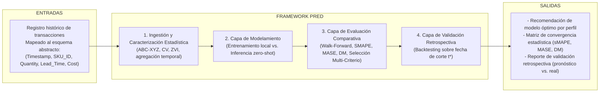
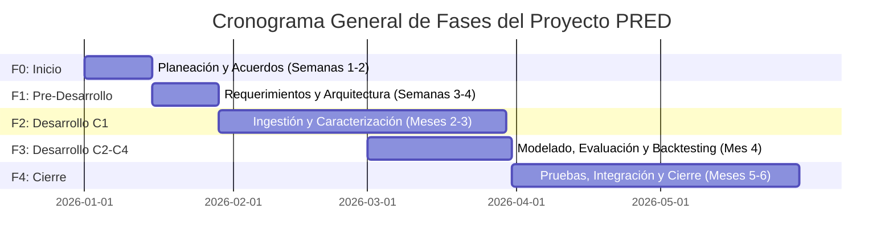

# Propuesta para Proyecto de Grado
**Pontificia Universidad Javeriana**  
**Facultad de Ingeniería – Departamento de Ingeniería de Sistemas**

---

## Ficha del Proyecto

| Campo | Detalle |
| :--- | :--- |
| **TÍTULO** | Framework Experimental de Benchmarking para la Comparativa de Modelos de Pronóstico de Demanda en Evaluación de Inventarios (PRED) |
| **OBJETIVO GENERAL** | Desarrollar un framework experimental parametrizable que automatice la caracterización, el particionamiento temporal y el benchmarking predictivo de familias de modelos estadísticos, híbridos, de aprendizaje profundo y fundacionales sobre series de tiempo de inventario, determinando mediante validación estadística y backtesting retrospectivo qué familia de modelos ofrece el mejor desempeño de pronóstico para el perfil de demanda específico del portafolio analizado. |
| **ESTUDIANTES** | **Juan Camilo Alba Castro** Documento: 1016595634 \| Celular: 3174267283 \| Correo: `alba-j@javeriana.edu.co`  **Tomás Pinilla Florez** Documento: 1013258607 \| Celular: 3162567689 \| Correo: `tomaspinilla@javeriana.edu.co`  **Derek Sarmiento Loeber** Documento: 1000951561 \| Celular: 3246847401 \| Correo: `dereksarmiento@javeriana.edu.co`  **Tomás Ramírez Roa** Documento: 1023242707 \| Celular: 3197096175 \| Correo: `t_ramirez@javeriana.edu.co` |
| **DIRECTOR** | **Andrés Darío Moreno** Correo: `ad.morenob@javeriana.edu.co` |
| **CODIRECTOR** | **Julio Omar Palacio Niño** Correo: `palacio_julio@javeriana.edu.co` |

---

## Índice de Contenido

- [1. Visión global](#1-visión-global)
  - [1.1. Antecedentes, problema y solución propuesta](#11-antecedentes-problema-y-solución-propuesta)
    - [1.1.1. Descripción de la problemática u oportunidad](#111-descripción-de-la-problemática-u-oportunidad)
    - [1.1.2. Formulación del problema](#112-formulación-del-problema)
    - [1.1.3. Propuesta de solución](#113-propuesta-de-solución)
    - [1.1.4. Justificación de la solución](#114-justificación-de-la-solución)
  - [1.2. Descripción general del proyecto](#12-descripción-general-del-proyecto)
    - [1.2.1. Objetivo general](#121-objetivo-general)
    - [1.2.2. Objetivos específicos](#122-objetivos-específicos)
  - [1.3. Entregables, estándares utilizados y justificación](#13-entregables-estándares-utilizados-y-justificación)
- [2. Análisis de impacto](#2-análisis-de-impacto)
- [3. Proceso](#3-proceso)
  - [3.1. Cronograma general de ejecución](#31-cronograma-general-de-ejecución)
  - [3.2. Fase F0 – Inicio y Planeación](#32-fase-f0--inicio-y-planeación)
  - [3.3. Fase F1 – Pre-Desarrollo](#33-fase-f1--pre-desarrollo)
  - [3.4. Fases F2-F3 – Desarrollo Iterativo](#34-fases-f2-f3--desarrollo-iterativo)
  - [3.5. Fase F4 – Integración, Pruebas y Cierre](#35-fase-f4--integración-pruebas-y-cierre)
- [4. Aspectos generales del proyecto](#4-aspectos-generales-del-proyecto)
  - [4.1. Compromiso de apoyo de la Institución](#41-compromiso-de-apoyo-de-la-institución)
  - [4.2. Derechos patrimoniales](#42-derechos-patrimoniales)
- [5. Marco teórico](#5-marco-teórico)
  - [5.1. Fundamentos y conceptos relevantes](#51-fundamentos-y-conceptos-relevantes-para-el-proyecto)
  - [5.2. Estado del arte](#52-estado-del-arte)
  - [5.3. Análisis de alternativas de solución](#53-análisis-de-alternativas-de-solución)
- [6. Referencias](#6-referencias)

---

## 1. Visión global

### 1.1. Antecedentes, problema y solución propuesta

#### 1.1.1. Descripción de la problemática u oportunidad
Se propone el desarrollo de un *Parametric Meta-Benchmarking Framework*, es decir, un framework experimental parametrizable que opera sobre una muestra final cerrada de diferentes productos críticos (a definir) pertenecientes a la clasificación A y B de rotación, los cuales pueden mapearse al esquema abstracto:

$$\text{Esquema Abstracto: } (\text{Timestamp}, \text{SKU\_ID}, \text{Quantity}, \text{Lead\_Time}, \text{Cost})$$

El framework no depende de un sector específico, ya que su flexibilidad proviene de una capa de caracterización estadística que clasifica las series de tiempo usando:
- Taxonomías **ABC-XYZ** (clasificación según importancia económica y regularidad de la demanda).
- Coeficiente de variación ($CV$, nivel de irregularidad de la demanda).
- Índice de velocidad cero ($ZVI$, frecuencia con que la demanda fue cero en un período).

A partir de dichos perfiles, el framework ajusta dinámicamente los límites de los parámetros de configuración de los modelos.

* **Caso de estudio principal:** Empresa que comercializa y distribuye repuestos de filtros de agua industriales en un entorno B2B.
* **Candidatos alternativos (sujetos a disponibilidad y permisos):**
  - Datos de inventario del Hospital Universitario San Ignacio.
  - Inventarios de servicios de alimentación y cafetería de la Pontificia Universidad Javeriana.
* *Nota:* La evaluación final se ejecutará sobre un único candidato para mantener el alcance estrictamente controlado.

El estudio utilizará una ventana histórica de al menos tres años con granularidad diaria para capturar estacionalidades. La operación combina referencias de rotación estable con otras de comportamiento intermitente o *lumpy* (con picos esporádicos), afectadas por mantenimientos correctivos y órdenes de compra que dependen de cronogramas industriales de terceros. Un error de pronóstico no solo inmoviliza capital, sino que compromete la continuidad operativa de clientes que dependen del suministro oportuno de componentes.

**Fuente de datos:** Hojas de cálculo heredadas (*legacy*) usadas históricamente para registrar ventas, movimientos y niveles de inventario. Se plantea consolidar estos históricos en una base de datos relacional estructurada (**PostgreSQL**) para que el flujo de procesamiento de PRED opere sobre una fuente unificada y consultable sin requerir la adopción de un sistema ERP. El problema de ingeniería radica en caracterizar y explotar las series desde esta base relacional, resolviendo inconsistencias históricas y vacíos de calidad.

El problema se agrava al considerar los tiempos de aprovisionamiento (*lead times*) de los repuestos industriales. Cuando este tiempo es elevado o variable:
- Una **subestimación** provoca quiebres de stock con impacto directo en el nivel de servicio.
- Una **sobrestimación** eleva el costo de inventario inmovilizado y genera reposiciones sobredimensionadas.
- El **efecto látigo (*bullwhip effect*)** amplifica estas variaciones a lo largo de la cadena de suministro.

La literatura ofrece diversas familias de modelos cuyo comportamiento difiere según la topología de la serie y el horizonte temporal. Este proyecto evalúa cuatro grupos con distinta naturaleza técnica:
1. **Modelos estadísticos clásicos.**
2. **Modelos híbridos.**
3. **Modelos de aprendizaje profundo global** (entrenados de manera supervisada).
4. **Modelos fundacionales de series de tiempo** (que operan por inferencia *zero-shot*, sin reentrenamiento local).

Sin una evaluación empírica controlada sobre el mismo conjunto de datos, la selección de modelos tiende a fundamentarse en la familiaridad tecnológica y no en evidencia cuantitativa verificable.

---

#### 1.1.2. Formulación del problema
La empresa dispone de un repositorio histórico de demanda que, tras consolidarse en PostgreSQL, constituye la única fuente de entrada del framework. Sin embargo, carece de un sistema analítico que permita comparar familias de modelos bajo un protocolo experimental uniforme. Por ende, las decisiones de reposición dependen de reglas manuales y de la intuición operativa.

El reto técnico no radica únicamente en minimizar el error medio, sino en responder:
- ¿El incremento en complejidad computacional de modelos híbridos, de aprendizaje profundo o fundacionales genera una ganancia estadísticamente defendible frente a modelos estadísticos clásicos más parsimoniosos?
- ¿Dicha mejora se sostiene sobre datos reales no vistos durante el benchmarking mediante *backtesting* retrospectivo?

**Pregunta de investigación:**
> *¿Qué familia de modelos de pronóstico ofrece el mejor desempeño para la demanda de inventarios de una empresa a partir de sus datos históricos, y en qué perfiles de demanda esa superioridad puede verificarse empíricamente mediante backtesting retrospectivo sobre una ventana temporal de validación real?*

---

#### 1.1.3. Propuesta de solución
Se propone desarrollar el **Parametric Meta-Benchmarking Framework (PRED)** (*Predictive Demand Evaluation*), estructurado en cuatro capas funcionales:

##### Detalle de las 4 Capas de PRED:

1. **Capa de Ingestión y Caracterización:**
   - Mapeo de datos al esquema abstracto: $(\text{Timestamp}, \text{SKU\_ID}, \text{Quantity}, \text{Lead\_Time}, \text{Cost})$.
   - Limpieza de datos (registros incompletos, duplicados, inconsistencias de formato).
   - Caracterización estadística por serie: taxonomía ABC-XYZ, coeficiente de variación ($CV$) e índice de velocidad cero ($ZVI$).
   - Parametrización dinámica de límites de configuración para etapas posteriores.
   - Evaluación de agregación temporal (diaria, semanal, mensual) para estabilizar series intermitentes/*lumpy*.

2. **Capa de Modelamiento:**
   - **Régimen entrenado localmente:** Modelos estadísticos clásicos, modelos híbridos y modelos de aprendizaje profundo global ajustados vía Máxima Verosimilitud (MLE) o retropropagación (*backpropagation*) sobre la ventana *in-sample*.
   - **Régimen de inferencia *zero-shot*:** Modelos fundacionales y configuraciones preentrenadas que infieren sobre la ventana *out-of-sample* sin actualizar pesos localmente.

3. **Capa de Evaluación Comparativa:**
   - Esquema de validación temporal: **Walk-Forward Validation** con ventana expansiva (paso $S$, horizonte $h$).
   - Métricas calculadas: $sMAPE$, $MASE$, $MAE$ y $RMSE$.
   
   $$\text{sMAPE} = \frac{100\%}{h} \sum_{t=1}^{h} \frac{|Y_t - \hat{Y}_t|}{(|Y_t| + |\hat{Y}_t|)/2}$$

   $$\text{MASE} = \frac{\frac{1}{h} \sum_{t=1}^{h} |Y_t - \hat{Y}_t|}{\frac{1}{T-1} \sum_{i=2}^{T} |Y_i - Y_{i-1}|}$$

   - Comparativa contra la línea base estacional (*Seasonal Naive*) mediante la prueba de Diebold-Mariano ($DM$), con diferencial de pérdida $d_t = |e_t^A| - |e_t^B|$.
   - **Protocolo de Selección Multi-Criterio en Cascada:**
     1. *Filtro de admisibilidad diagnóstica:* Prueba de Ljung-Box sobre residuos $(\alpha = 0.05)$.
     2. *Score compuesto adaptativo ($C_m$):* Ponderación de rangos de $sMAPE$, $MASE$, $RMSE$ y $MAE$ según el perfil de demanda ($ZVI, CV$).
     3. *Prueba DM con corrección de Holm-Bonferroni:* Control del error familiar en $K$ contrastes simultáneos $(\alpha = 0.05)$.
     4. *Selección final:* Modelo con menor $C_m$ que rechace $H_0$ corregida; si ninguno la rechaza, se adopta el baseline por parsimonia. Ante empate en $C_m$, se selecciona el de menor complejidad computacional.

4. **Capa de Validación Retrospectiva:**
   - Particionamiento temporal con fecha de corte $t^*$:
     - Ventana de entrenamiento/benchmarking: $[t_0, t^*]$.
     - Ventana de validación real (completamente no vista): $[t^* + 1, t^* + h]$.
   - El modelo ganador pronostica $\hat{Y}_{t^*+1}, \dots, \hat{Y}_{t^*+h}$, contrastándose punto a punto contra los valores reales $Y_{t^*+1}, \dots, Y_{t^*+h}$.
   - Se recalculan métricas de error y la prueba DM frente a *Seasonal Naive* para certificar si la superioridad predictiva se preserva en condiciones operativas reales.

---

#### 1.1.4. Justificación de la solución
El framework responde a una necesidad de ingeniería aplicada: distinguir cuantitativamente cuándo un modelo estadístico simple es suficiente y cuándo se justifica la complejidad de modelos híbridos, de aprendizaje profundo o fundacionales en un portafolio de repuestos industriales. 

El desacoplamiento mediante un esquema abstracto permite operar sobre fuentes heterogéneas sin atarse a un ERP comercial. La combinación de *Walk-Forward Validation*, pruebas de hipótesis estadísticas (Diebold-Mariano con Holm-Bonferroni) y la verificación retrospectiva sobre demanda real garantiza que las recomendaciones sean transferibles, robustas y computacionalmente viables en un marco de ejecución acotado a seis meses.

---

### 1.2. Descripción general del proyecto

#### 1.2.1. Objetivo general
Desarrollar un framework experimental parametrizable que automatice la caracterización, el particionamiento temporal y el benchmarking predictivo de familias de modelos estadísticos, híbridos, de aprendizaje profundo y fundacionales sobre series de tiempo de inventario, determinando mediante validación estadística y backtesting retrospectivo qué familia de modelos ofrece el mejor desempeño de pronóstico para el perfil de demanda específico del portafolio analizado.

#### 1.2.2. Objetivos Específicos
1. Elicitar y especificar los requerimientos funcionales, no funcionales y las restricciones de los datos aplicando el estándar ISO/IEC/IEEE 29148:2018, con un submódulo de Análisis Exploratorio de Datos (EDA) que clasifique las series mediante ABC-XYZ. **Entregable:** `PRED-SRS-v1.0`.
2. Diseñar una arquitectura de 4 capas (Ingestión y Caracterización, Modelamiento, Evaluación Comparativa y Validación Retrospectiva) usando UML 2.5.1, que aísle componentes y permita reproducibilidad del flujo de datos. **Entregable:** `PRED-ARQ-v1.0`.
3. Construir los componentes del framework en Python bajo Scrum, con pruebas unitarias automatizadas y cobertura de código $\ge 80\%$. **Entregable:** `PRED-CODE-v1.0` (código fuente con pytest y actas de Sprint).
4. Ejecutar validación cruzada temporal (Walk-Forward) para evaluar el desempeño predictivo ($sMAPE$, $MASE$, $MAE$, $RMSE$) y eficiencia computacional de los modelos, aplicando la prueba de Diebold-Mariano frente a un baseline no paramétrico. **Entregable:** `PRED-PT-v1.0` (Informe de Pruebas).
5. Implementar un protocolo de validación retrospectiva que seleccione una fecha de corte $t^*$ en el histórico, ejecute el modelo ganador para pronosticar la demanda en el horizonte $[t^* + 1, t^* + h]$ y lo contraste con la demanda real observada, generando métricas de efectividad práctica ($MAE$, $RMSE$, $sMAPE$ punto a punto) y una conclusión sobre si la recomendación se sostiene en condiciones reales. **Entregable:** `PRED-INF-v1.0` (Reporte de Evaluación Final).

---

### 1.3. Entregables, estándares utilizados y justificación

#### Tabla 1: Entregables del proyecto PRED y estándares asociados

| Entregable | Código | Estándares asociados | Justificación |
| :--- | :--- | :--- | :--- |
| **Plan de Proyecto** | `PRED-PP-v1.0` | ISO/IEC 12207:2008 + ISO/IEC 29110 (GP.1-GP.4) | Define el ciclo de vida del proyecto, el cronograma de seis meses, los riesgos y los hitos de ejecución. |
| **Especificación de Requerimientos (SRS)** | `PRED-SRS-v1.0` | IEEE 830 / ISO/IEC/IEEE 29148:2018 | Documenta RF, RNF, restricciones de los datos, clasificación de series con ABC-XYZ, criterios de aceptación e interfaces del framework. |
| **Documento de Arquitectura** | `PRED-ARQ-v1.0` | UML 2.5.1 + ISO/IEC 12207 | Describe la arquitectura de 4 capas, el flujo ETL sobre el esquema abstracto de datos y la interacción entre componentes. |
| **Backlogs y Actas de Sprint** | `PRED-SPRINT-vN` | Scrum | Evidencia la gestión iterativa del desarrollo y la trazabilidad entre objetivos, tareas y entregas. |
| **Código fuente + pruebas unitarias** | `PRED-CODE-v1.0` | ISO/IEC 29110 (IS.5) | Consolida la implementación del framework con cobertura $\ge 80\%$ y verificación técnica por capa. |
| **Plan de Pruebas ejecutado** | `PRED-PT-v1.0` | ISO/IEC 29110 (IS.6) | Formaliza las pruebas de integración y adecuación funcional, incluyendo walk-forward, baseline, matriz de convergencia estadística y reporte de validación retrospectiva del modelo seleccionado. |
| **Reporte de Evaluación Final y Guía de Despliegue** | `PRED-INF-v1.0` | IEEE 830 (trazabilidad RF-EVA-01, RF-EVA-02) | Presenta resultados, significancia estadística ($sMAPE$, $MASE$, $DM$), tiempos de ejecución, recomendación del modelo óptimo por perfil de demanda y reporte de validación retrospectiva sobre demanda real. |

---

## 2. Análisis de impacto

* **Impacto Organizacional y Operativo:** Convierte registros dispersos en hojas de cálculo heredadas en un repositorio relacional estructurado. Genera una herramienta de decisión transparente que asocia cada perfil de SKU con el modelo predictivo más adecuado, mitigando el efecto látigo (*bullwhip effect*), optimizando el capital de trabajo y previniendo quiebres de inventario.
* **Impacto Académico y Disciplinar:** Provee un protocolo experimental sistemático y documentado para la comparación de modelos predictivos en escenarios empresariales con sistemas legados, integrando validación *walk-forward*, tests de no-correlación residual (Ljung-Box), pruebas de Diebold-Mariano con corrección de Holm-Bonferroni y contraste retrospectivo real.
* **Impacto Social en la Cadena B2B:** La mitigación de quiebres de inventario asegura la entrega oportuna de piezas y consumibles industriales críticos, evitando paralizaciones en las líneas operativas de los clientes finales.

---

## 3. Proceso

El proyecto adopta una metodología híbrida **Cascada + Scrum** basada en ISO/IEC 12207:2008:
* **Estructura Macro (Fases F0 a F4):** Secuencial para asegurar el cumplimiento formal y documental de los hitos de ingeniería.
* **Construcción Técnica (Fases F2 y F3):** Iterativa mediante Scrum con Sprints quincenales, asegurando la verificación continua de código y modelos.

### 3.1. Cronograma general de ejecución

#### Tabla 2: Cronograma general del proyecto PRED

| Fase | Enfoque principal | Ventana estimada |
| :--- | :--- | :--- |
| **F0** | Inicio y planeación | Semanas 1–2 |
| **F1** | Requerimientos y arquitectura | Semanas 3–4 |
| **F2** | Construcción de ingestión y preparación analítica | Meses 2–3 |
| **F3** | Construcción de modelado, evaluación, validación retrospectiva y prototipo | Mes 4 |
| **F4** | Pruebas de adecuación funcional, benchmarking final y cierre | Meses 5–6 |

---

### 3.2. Fase F0 – Inicio y Planeación

* **Método:** Proceso de Gestión de Proyecto (GP) de ISO/IEC 29110 y procesos de gestión de ISO/IEC 12207:2008 (§6.3).
* **Actividades:**
  - Revisión y adopción de estándares (ISO/IEC 12207, IEEE 830/29148, ISO/IEC 29110, UML 2.x).
  - Redacción del Plan de Proyecto (`PRED-PP-v1.0`).
  - Formalización del caso de estudio y criterios para datasets alternativos.
  - Establecimiento de acuerdos de equipo: Git workflow, revisiones por pares y canales de comunicación.
  - Configuración del entorno de desarrollo analítico y repositorio base.
* **Resultados esperados:**
  - Plan de Proyecto `PRED-PP-v1.0` formalmente aprobado.
  - Caso de estudio y límites del portafolio delimitados.
  - Entorno de trabajo operativo.

---

### 3.3. Fase F1 – Pre-Desarrollo

* **Método:** Estándar IEEE 830 / ISO/IEC/IEEE 29148:2018 para especificación de requerimientos; UML 2.x para arquitectura de software; EDA sobre registros históricos.
* **Actividades:**
  - Levantamiento formal de RF, RNF y restricciones de datos.
  - Perfilamiento y análisis exploratorio de datos (EDA) para identificar vacíos, duplicidades e inconsistencias.
  - Desglose de requerimientos por capa funcional.
  - Redacción del documento SRS (`PRED-SRS-v1.0`).
  - Elaboración de diagramas de arquitectura UML (componentes, secuencia, despliegue lógico).
* **Resultados esperados:**
  - Documento SRS `PRED-SRS-v1.0` aprobado.
  - Documento de Arquitectura `PRED-ARQ-v1.0` validado.
  - Product Backlog inicial priorizado.

---

### 3.4. Fases F2-F3 – Desarrollo Iterativo

* **Método:** Scrum con Sprints cortos, siguiendo el proceso IS.5 de la ISO/IEC 29110. Pruebas automatizadas en `pytest` ($\text{cobertura} \ge 80\%$). Traslape parcial entre F2 y F3 para adelantar la topología de modelado con datos sintéticos en el Mes 3.
* **Actividades por capa:**
  - **Capa 1 (Ingestión y Caracterización):** Mapeo al esquema abstracto, validaciones de integridad, homologación, clasificación ABC-XYZ, métricas $CV$ y $ZVI$, y evaluación de estrategias de agregación temporal (diaria, semanal, mensual).
  - **Capa 2 (Modelamiento):** Implementación de los dos regímenes de ejecución: (1) entrenamiento local con retropropagación/MLE, y (2) inferencia *zero-shot* en modelos fundacionales.
  - **Capa 3 (Evaluación Comparativa):** Implementación de validación *walk-forward*, métricas de error ($sMAPE, MASE, MAE, RMSE$), pruebas de bondad de ajuste de residuos (Ljung-Box, Kolmogorov-Smirnov), prueba DM y Protocolo de Selección Multi-Criterio en Cascada.
  - **Capa 4 (Validación Retrospectiva):** Implementación del backtesting sobre fecha de corte $t^*$, comparación punto a punto con demanda real no vista y prueba DM en la ventana de validación.
* **Resultados esperados:**
  - Product/Sprint Backlogs y actas de cierre por sprint.
  - Código fuente probado y documentado (`PRED-CODE-v1.0`).
  - Prototipo integrado al cierre del cuarto mes.

---

### 3.5. Fase F4 – Integración, Pruebas y Cierre

* **Método:** Proceso IS.6 de ISO/IEC 29110. Validación integral contra el caso de estudio usando *Seasonal Naive* como línea base no paramétrica.
* **Formulación de Métricas sobre la Ventana Retrospectiva $[t^* + 1, t^* + h]$:**

$$MAE_{val} = \frac{1}{h} \sum_{k=1}^{h} |Y_{t^*+k} - \hat{Y}_{t^*+k}| \tag{1}$$

$$RMSE_{val} = \sqrt{\frac{1}{h} \sum_{k=1}^{h} (Y_{t^*+k} - \hat{Y}_{t^*+k})^2} \tag{2}$$

$$sMAPE_{val} = \frac{100\%}{h} \sum_{k=1}^{h} \frac{|Y_{t^*+k} - \hat{Y}_{t^*+k}|}{(|Y_{t^*+k}| + |\hat{Y}_{t^*+k}|)/2} \tag{3}$$

* **Actividades:**
  - Integración final de las 4 capas de PRED.
  - Ejecución integral del Plan de Pruebas (`PRED-PT-v1.0`).
  - Pruebas de aceptación sobre el portafolio representativo del caso de estudio.
  - Ejecución del benchmarking exhaustivo y aplicación del Protocolo de Selección en Cascada.
  - Ejecución del backtesting retrospectivo sobre fecha de corte $t^*$ y cálculo de métricas de validación con prueba DM.
  - Elaboración del Reporte de Evaluación Final y Guía de Despliegue (`PRED-INF-v1.0`).
* **Resultados esperados:**
  - Plan de Pruebas ejecutado con resultados consolidados (`PRED-PT-v1.0`).
  - Informe final con recomendaciones y evidencia de backtesting (`PRED-INF-v1.0`).
  - Sistema PRED validado en producción controlada.

---

## 4. Aspectos generales del proyecto

### 4.1. Compromiso de apoyo de la Institución
El proyecto cuenta con el respaldo de la Pontificia Universidad Javeriana (Facultad de Ingeniería, Departamento de Ingeniería de Sistemas). Los directores asignados guían la metodología y la calidad técnica. Las especificaciones de despliegue, infraestructura y acuerdos con entidades externas proveedoras de datos se oficializarán mediante cartas de compromiso y dentro del Plan de Ingeniería.

### 4.2. Derechos patrimoniales
* **Derechos morales:** Pertenecen exclusivamente a los cuatro autores estudiantes.
* **Derechos patrimoniales:** Se rigen por los reglamentos institucionales de propiedad intelectual de la Pontificia Universidad Javeriana aplicables a trabajos de grado. En caso de convenios contractuales específicos con proveedores de datos externos, estos se definirán mediante un acuerdo bilateral previo.

---

## 5. Marco teórico

### 5.1. Fundamentos y conceptos relevantes para el proyecto

* **Pronóstico de demanda en inventarios:** Estimación cuantitativa de unidades requeridas en horizontes futuros para dimensionar stocks de seguridad, puntos de reorden y lotes de compra, evitando la distorsión del *bullwhip effect*.
* **Series de tiempo:** Observaciones indexadas en intervalos cronológicos uniformes que registran las ventas o consumos históricos por SKU.
* **Familias de modelos analizados:**
  1. *Modelos Estadísticos Clásicos:* ARIMA/SARIMA (modelado autorregresivo, integrado y de medias móviles con estacionalidad) y ETS (suavización exponencial con error, tendencia y estacionalidad).
  2. *Modelos Híbridos:* Prophet (modelo aditivo desacoplado con componentes de tendencia, estacionalidades múltiples y feriados).
  3. *Modelos de Aprendizaje Profundo:* LSTM (redes recurrentes para dependencias de largo plazo), N-BEATS y N-HITS (arquitecturas de interpolación jerárquica y expansión de bases para pronóstico univariado puro).
  4. *Modelos Fundacionales:* TimesFM (modelo preentrenado a gran escala optimizado para inferencia *zero-shot* en series de tiempo).

* **Métricas de Evaluación:**
  - **MAE** (*Mean Absolute Error*): Mide la magnitud promedio del error en las unidades de la serie.
  - **RMSE** (*Root Mean Squared Error*): Penaliza con mayor severidad las desviaciones grandes.
  - **sMAPE** (*Symmetric Mean Absolute Percentage Error*): Métrica relativa acotada entre $0\%$ y $200\%$:

    $$sMAPE = \frac{100\%}{h} \sum_{t=1}^{h} \frac{|Y_t - \hat{Y}_t|}{(|Y_t| + |\hat{Y}_t|)/2}$$

  - **MASE** (*Mean Absolute Scaled Error*): Escala el MAE del modelo frente al MAE in-sample de un pronóstico ingenuo estacional (*Seasonal Naive*). Un valor menor a 1 indica desempeño superior al baseline:

    $$MASE = \frac{\frac{1}{h}\sum_{t=1}^{h}|Y_t - \hat{Y}_t|}{\frac{1}{T-1}\sum_{i=2}^{T}|Y_i - Y_{i-1}|}$$

* **Validación Walk-Forward:** Esquema de validación cruzada temporal expansiva o deslizante (paso $S$, horizonte $h$) que preserva estrictamente la flecha del tiempo y evita la fuga de datos (*data leakage*).
* **Backtesting Retrospectivo:** Simulación de pronóstico ejecutada únicamente sobre el modelo ganador a partir de un punto de corte temporal $t^*$, evaluando su capacidad de generalización sobre la ventana $[t^* + 1, t^* + h]$ con datos completamente inéditos.
* **Prueba de Diebold-Mariano (DM):** Evaluación inferencial de la diferencia de precisión predictiva entre dos modelos con base en el diferencial de pérdida $d_t = |e_t^A| - |e_t^B|$:

  $$DM = \frac{\bar{d}}{\sqrt{\hat{V}(\bar{d})}}$$

  Donde $\bar{d}$ es la media muestral del diferencial y $\hat{V}(\bar{d})$ es un estimador robusto de su varianza asintótica.

* **Protocolo de Selección Multi-Criterio en Cascada:**
  1. *Filtro de admisibilidad diagnóstica:* Se excluyen modelos cuyos residuos muestren autocorrelación residual según la prueba de Ljung-Box a $\alpha = 0.05$. La prueba de Kolmogorov-Smirnov reporta normalidad complementaria.
  2. *Score compuesto ponderado ($C_m$):*
  
     $$C_m = w_1 \cdot r(sMAPE_m) + w_2 \cdot r(MASE_m) + w_3 \cdot r(RMSE_m) + w_4 \cdot r(MAE_m)$$

     Donde $r(\cdot)$ representa el ranking relativo del modelo ($1 = \text{mejor}$). Las ponderaciones se calibran dinámicamente según la caracterización del SKU:
     - **Perfil intermitente / *lumpy*** ($ZVI > \theta_{ZVI}$ o $CV > \theta_{CV}$):  
       $w = (0.25, 0.45, 0.15, 0.15)$ (Prioridad en MASE por resiliencia ante ceros).
     - **Perfil regular** (en caso contrario):  
       $w = (0.40, 0.25, 0.20, 0.15)$ (Prioridad en sMAPE por simetría en series continuas).  
       *Parámetros por defecto:* $\theta_{ZVI} = 0.20$, $\theta_{CV} = 1.00$.
  3. *Prueba de Diebold-Mariano con corrección múltiple:* Para los modelos admisibles ordenados por $C_m$, se evalúa significancia frente al *Seasonal Naive* aplicando la corrección de **Holm-Bonferroni** ($\alpha = 0.05$).
  4. *Selección final y desempate por parsimonia:* Se escoge el modelo admisible con menor $C_m$ que mantenga rechazo de $H_0$. Si ninguno lo logra, se selecciona la línea base (*Seasonal Naive*). En caso de empate en $C_m$, se elige el de menor costo computacional conforme a la escala:
  
     $$\text{Seasonal Naive} \prec \text{ETS} \prec \text{ARIMA/SARIMA} \prec \text{Prophet} \prec \text{LSTM} \prec \text{N-BEATS} \prec \text{N-HITS} \prec \text{TimesFM}$$

* **Sistemas heredados de inventario:** Entornos operativos donde la información reside en planillas electrónicas, lo que exige procesos robustos de limpieza, unificación de SKU y esquematización relacional antes de cualquier etapa predictiva.

---

### 5.2. Estado del arte

* **Fundamentos metodológicos:** Hyndman y Athanasopoulos (2018) sientan las bases del modelado de series de tiempo. Makridakis et al. (2020) en la competencia M4 demuestran empíricamente que el rendimiento de los modelos varía sustancialmente según el horizonte y la naturaleza de los datos.
* **Métodos estadísticos e híbridos:** Rambing et al. (2025) contrastan ETS, ARIMA y reconciliación jerárquica. Quinones-Rivera et al. (2023) confirman la viabilidad de modelos híbridos combinando componentes estadísticos con redes neuronales. Ma et al. (2025) resaltan el valor de incorporar variables de contexto operativo.
* **Aprendizaje profundo:** Oreshkin et al. (2020) introducen N-BEATS y Challu et al. (2023) presentan N-HITS, demostrando capacidades de descomposición e interpolación no lineal. Lingkon et al. (2026) y Krzyzaniak et al. (2026) exploran el impacto directo de redes neuronales profundas sobre decisiones de reabastecimiento en la cadena logística. Raghuram et al. (2023) modelan la incertidumbre en entornos volátiles.
* **Aplicaciones en inventario y cadenas de suministro:** Seyedan et al. (2023) y Kumar et al. (2024) aplican pronósticos a políticas de aprovisionamiento *order-up-to-level* y asignación masiva de SKUs. Herbas-Torrico y Oyola (2021) documentan las dificultades inherentes a la baja madurez de sistemas de datos en contextos latinoamericanos.
* **Tendencias y desafíos éticos:** Saptadi et al. (2026), Babai et al. (2025) y Ferreira et al. (2025) sintetizan el avance del Machine Learning e IA en cadenas de suministro. Duarte y Martinez-Villasenor (2025) enfatizan los retos éticos de trazabilidad, interpretabilidad y responsabilidad algorítmica.
* **Brecha identificada:** La mayor parte de la literatura experimental asume repositorios de datos estandarizados o plataformas transaccionales avanzadas. El framework PRED aborda específicamente la brecha metodológica existente en la transición desde datos históricos legados (hojas de cálculo) hacia un benchmarking predictivo multimodelo reproducible.

---

### 5.3. Análisis de alternativas de solución

#### 5.3.1. Alternativas de solución e impacto
* **Alternativa 1 – Pronóstico manual en hojas de cálculo:** Mantiene el esquema tradicional mediante fórmulas básicas locales. Presenta bajo costo inicial pero nula reproducibilidad, alta propensión al error humano y falta de comparación analítica.
* **Alternativa 2 – Plataformas SaaS comerciales:** Herramientas comerciales de planeación de demanda. Ofrecen rápida implementación pero altos costos de licenciamiento, dependencia tecnológica del proveedor (*vendor lock-in*) y escasa capacidad de adaptación al preprocesamiento de fuentes legadas específicas.
* **Alternativa 3 – Frameworks genéricos de AutoML para series de tiempo (e.g., AutoTS, StatsForecast):** Automatizan la selección de algoritmos con relativa facilidad, pero no resuelven el ciclo ETL para datos heredados, carecen de protocolos de backtesting retrospectivo acoplados y no emiten la documentación técnica formal requerida.

#### 5.3.2. Comparación de alternativas

#### Tabla 3: Comparación de alternativas de solución frente a PRED

| Criterio | Alt. 1: Manual (Hojas de cálculo) | Alt. 2: SaaS Comercial | Alt. 3: AutoML Genérico | PRED (Propuesta) |
| :--- | :--- | :--- | :--- | :--- |
| **Migración y consolidación de datos heredados** | No | Parcial | Parcial | **Sí** |
| **Número de modelos evaluados** | 1 | 5–10+ | 10+ | **Múltiples (4 familias)** |
| **Modelos fundacionales zero-shot** | No | Parcial | Parcial | **Sí** |
| **Línea base y validación estadística (DM + Holm)** | No | Limitada | Parcial | **Sí** |
| **Módulo de alertas operativas** | No | Sí | No | **No** |
| **Validación retrospectiva sobre demanda real** | No | Parcial | No | **Sí** |
| **Evidencia transferible y documentada** | No | No | No | **Sí** |
| **Costo de implementación** | Bajo | Alto | Bajo | **Bajo / Medio** |
| **Ajuste a datos legados / Pymes** | Alto | Medio | Medio | **Alto** |

---

## 6. Referencias

* Babai, M. Z., Arampatzis, M., Hasni, M., Lolli, F., and Tsadiras, A. (2025). On the use of machine learning in supply chain management. *IMA Journal of Management Mathematics*.
* Challu, C., Olivares, K. G., and Oreshkin, B. N. (2023). N-HiTS: Neural hierarchical interpolation for time series forecasting. *AAAI Conference on Artificial Intelligence*.
* Duarte, J. and Martinez-Villasenor, L. (2025). Ethical challenges in demand prediction. *Computación y Sistemas*.
* Ferreira, A. C. A., Francisco, M. B., and Pinho, A. F. D. (2025). The use of artificial intelligence in supply chain management. *IEEE Access*.
* Herbas-Torrico, B. C. H. and Oyola, S. A. (2021). A case study of inventory management system. *International Conference on Industrial Engineering and Operations Management*.
* Hyndman, R. J. and Athanasopoulos, G. (2018). *Forecasting: Principles and Practice* (2nd ed.). OTexts.
* Krzyzaniak, S., Cyplik, P., Bartkowiak, M., Gorecki, T., and Koralewski, A. (2026). Simulation studies on the impact of using demand forecasts based on deep neural networks. *LogForum*.
* Kumar, D., Soni, G., Ramtiyal, B., and Vijayvargy, L. (2024). Data-driven approach for rational allocation of inventory in a FMCG supply chain. *International Journal of System Assurance Engineering and Management*.
* Lingkon, M. L. R., Hossain, M. S., and Chakrabortty, R. K. (2026). An analytics-driven hybrid method for multi-item demand forecasting in supply chains. *Supply Chain Analytics*.
* Ma, B. J., Jackson, I., Huang, M., Villegas, S., and Macias-Aguayo, J. (2025). A data-driven and context-aware approach for demand forecasting in the beverage industry. *International Journal of Logistics Research and Applications*.
* Makridakis, S., Spiliotis, E., and Assimakopoulos, V. (2020). The M4 Competition: 100,000 time series and 61 forecasting methods. *International Journal of Forecasting*.
* Oreshkin, B. N., Carpov, D., Chapados, N., and Bengio, Y. (2020). N-BEATS: Neural basis expansion analysis for interpretable time series forecasting. *International Conference on Learning Representations (ICLR)*.
* Quinones-Rivera, H., Rubiano-Ovalle, O., and Alfonso-Morales, W. (2023). Demand forecasting using a hybrid model based on artificial neural networks. *Journal of Industrial Engineering and Management*.
* Raghuram, P., Bhupesh, S., Manivannan, R., Anand, P. S. P. S. P., and Sreedharan, V. R. (2023). Modeling and analyzing the inventory level for demand uncertainty in the VUCA world. *IEEE Transactions on Engineering Management*.
* Rambing, D. H., Sugiharto, A., and Kusumaningrum, R. (2025). A comparative study of ETS, ARIMA, and reconciliation techniques. *International Conference on Smart Computing, IoT and Machine Learning*.
* Saptadi, S., Budiawan, W., Fadhila, R. N., Sumbodo, R. K., and Saputra, D. W. N. (2026). Machine learning applied to sales prediction modeling: A systematic literature review. *Multidisciplinary Reviews*.
* Schwaber, K. and Sutherland, J. (2020). *The Scrum Guide*. Scrum.org.
* Seyedan, M., Mafakheri, F., and Wang, C. (2023). Order-up-to-level inventory optimization model. *Supply Chain Analytics*.